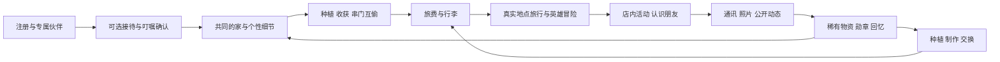

# PetSoul 2.0 总方案与 96 小时执行基线

版本：1.5 · 2026-09-22。本文整合本轮全部产品讨论，作为网页重建的主入口。新增可替换意图判断层与 Jev 候选验证计划，优先接待/通讯，默认不启用新供应商；保留注册叮嘱、寻味、真实交通与地图音符/电视交互。共享身份、记忆、时间与会话契约及 96h 范围如下。

用户已指定 `claude-20260922-014933-307b` 先搭整体框架；后续模块由用户另行分配给不同窗口。本文没有替其他窗口分配职责，也不代表 Claude 已领取或已完成任务。

## 2026-09-22 修订：访客、待领养居民、家庭共同照顾与多宠物（用户新决定，追加）

本节是用户在 2026-09-22 的新决定，**优先于下文与之冲突的旧表述**（旧文保留作历史，不删除）。被本节替代的旧表述包括：
§1 与 §2 中“每账号首发一个家、一只当前宠物”“不采用多人共同领养”的理解方式；§4 中“多宠模型可预留、多宠家庭共享钱包/主宠切换属于后续契约决定”；
§4 中“所有新用户立即与所创建宠物绑定”；以及 §5 中不再讨论的“共同领养”一项里与“家人共同照顾”相混淆的部分。

1. **归属不变，照顾共享**：一只宠物只属于一个家庭，同一只宠物不会同时发给两个家庭；一个家庭可以有多位成员（家庭管理员、共同照顾者），
   称呼（妈妈、哥哥……）与权限分开，称呼不带任何权限。家庭至少保留一位管理员；移除成员立即生效。
2. **多宠物共用一个家**：家园、菜园、家庭仓库是全家的；每只宠物各自有 pet_id、身份卡、DNA、星球账户、证件、驾照、旅程和与每位家人的私聊。
   所有操作都明确指向某一只宠物，没有“全局当前宠物”；后加进家的宠物不重复领欢迎奖励；看家守菜按此刻真正在家的宠物计算。
3. **内容分三层**：公开（家庭同意公开的动态、居民的公开生活）/ 家庭共享（家庭频道的世界来信、明信片、攻略、证件、收藏）/
   个人（每位家人与宠物的私聊、接待叮嘱、称呼与小暗号）。个人内容不出现在其他家人那里，更不公开。
4. **注册不强制建宠物**：三个入口——先逛逛（不登录也能看居民的真实生活）、带我的宠物来、认识一位新伙伴——加上家庭邀请直达。
   注册前选中的伙伴会被记住，但登录后由用户确认才领养；邀请链接有有效期、可撤销、只能用一次。
5. **待领养居民在领养前就真实生活**：有稳定 pet_id，住在世界规则设定的星球居民驿站（不编造人类主人），会自己散步、打工；
   领养只改变归属，不重建身份、不丢弃领养前的公开经历；领养时若 TA 正在外面，不瞬移，等 TA 回来再入住新家。
6. **并发与一致**：领养、邀请、成员变更、家庭仓库、DNA 共用部分都以数据库约束或版本号保证并发安全；旧账号迁成单成员家庭，不丢资产与历史。

工程落地与验收见 `docs/coordination/BACKEND-REAL-EXPERIENCE-ACCEPTANCE.md`，前端对接见 `docs/coordination/FRONTEND-HANDOFF.md`。

## 0. 阅读顺序、决策效力与交付目标

阅读顺序：用户最新指令 → 根目录 `AGENTS.md` 的协作/架构约定 → 本总方案 → 本窗口任务 → 已冻结接口及共享日志。产品冲突以用户最新决定、本总方案为先；仓库工程门禁仍执行。旧专题文档用于理解细节，不得把旧建议恢复成新要求。

本文中的三类内容必须区分：

- **用户确认**：角色反转、永远安全、全部专属、手机网页、96h、香港部署目标、农场互偷、旅行、真实商家地图与到店互动、宠物公开社交、寻味特色、真实交通/独立动物班次/地图一起听看，以及注册时由接待角色帮助主人倾诉、交代宠物和转达记忆等方向。
- **施工默认值**：技术选型、模块边界、首发规模、接口建议与日程。用于直接开工；可依据代码证据调整并留痕，不需要为每个普通实现选择重新询问用户。
- **外部依赖/后续方向**：供应商实际可用性、扫街榜接口、交通运行日数据与实时状态、影音内容权限和平台能力、真实公益执行、影视商业化、文旅合作等；没有证据时不能写成已具备能力。

96h 成果：观众用自己的手机浏览器注册并拥有专属伙伴，经营共同的家、与其他账号互偷、支持宠物去真实地点旅行，看到店内活动，收到照片和公开动态，与其他宠物互动，回家保留物资和记忆。寻味特色用一条路线的小资料集展示“清淡/浓郁”偏好如何改变选店及点单建议，保留依据与未知项；未具备真实资料时明确为演示数据。交通特色以一条核验过的长途路线及接驳展示真实时间推进：地图上的交通工具移动，音符/电视入口打开一首音乐或一段短片的可恢复一起播放；支持范围按实际验收记录。

本方案维护窗口只交付文档与提示词，未修改业务代码或调用付费供应商。2026-09-22 本轮只读检查已见 Claude 登记 R0 START，工作树出现 PetJourneyWeb、后端 Web 模块和契约文件；属于进行中的工作，不等于框架已验收。实时状态以该窗口日志和交接证据为准，不将旧“尚无网页”描述用于否认在建代码。

接待首发目标：主人自愿交代一个具体习惯 → 接待员整理 → 主人确认内容与用途 → 入住后出现一个真实保存、可见且可修改的个性化细节。角色名称与台词是施工建议，不用倾诉字数或失忆威胁作为注册条件。

## 1. 产品定位与世界规则

**品牌表达：这次，换你去看看世界。**

**玩法表达：你负责环游世界，我负责偷菜养你。**

现实中主人出门、宠物守家；在这个平行世界，主人经营家园，宠物拥有自己的旅行、朋友、职业和冒险。主人仍生活在现实，通过网页、通讯器和自己的虚拟形象参与共同生活。

确定规则：

1. 宠物永远不会再次受伤，不因离线死亡、永久失踪或需要付款救命。飞行员、侦探、参军守护等可以刺激、幽默、酷炫；失败可以是闹乌龙或改计划。
2. **全部宠物专属**。自己的宠物、真实原型和原创领养伙伴都只有一个家庭。同一只动物/角色不得复制给多个家庭；领养成功后退出待领养池。公共 NPC 是星球居民，不是发给多个用户的同一领养宠物。
3. 宠物在家守护，旅行时主人接手。保留真实互偷与小恶作剧，不强行改写成互助收菜。
4. 宠物有主动性。主人建议地点、支持旅费、参与事件；宠物的性格影响选择、表达、朋友关系与礼物。
5. 同一次经历在地图、场景、通讯、照片、公开动态与收藏中保持一致。宠物不能同时在家守菜和在外喝咖啡。
6. 地点事实、虚构故事、真实公益记录与生成素材来源清楚区分。模型不能创造金币、伪造商家事实或现实服务成果。
7. 用户暂时不来，宠物仍有家。主动转交/注销后的关系处理另定，当前不提供自动重新发放。
8. 交通按有现实依据的时长推进；默认核验同日计划时刻，自驾为道路预计车程。动物世界承运人与班次身份独立且稳定。暂停媒体不暂停交通，故事不能让宠物提前抵达。
9. 交通主界面就是地图。车辆上的音符/小电视表达实际活动，点击打开对应一起听/看 UI；不另建舱室式空间页面，播放器展开/收起不改变交通状态。
10. 接待内容先由主人确认用途再进入角色记忆；私人倾诉不自动传给宠物、NPC 或公开故事。可跳过、补充、纠错与撤回，接待员不会因角色称呼获得平台管理权限。

不再讨论或恢复的旧方向：共同领养、同一原创角色重复发放、默认将热血冒险全部改成安静救援、将多人互偷一律推到遥远后续、仅以预设 NPC 假装真实多用户社交。

## 2. 完整产品循环



日常循环提供可做的事，旅行提供变化，归家留下关系与记忆。影视和文旅从同一批角色、地点、事件延伸，不另起互不相干的世界。

寻味贯穿旅行选店、到店活动与现实攻略：“它有自己的口味，也记得你的喜好。”宠物根据个性探索，主人可收藏符合自己口味的真实分店/菜品；主人实际用餐反馈与宠物的虚拟经历分别记录，不相互冒充。

交通途中就是一段可参与的生活：现实运行日期/路线/时刻 → 动物世界班次与地图移动 → 点击车辆旁音符/电视一起听看 → 到达后寻味与店内活动。家园、交通、媒体和寻味共享同一宠物与行程，媒体有独立播放时钟。

建议现场故事：注册 → 建立伙伴 → 自愿交代一个习惯并确认 → 进入家看到这个细节 → 收获欢迎作物 → 去第二个真实账号家偷一次菜 → 凑出旅费 → 旅行/地图音符一起听 → 到店与寻味 → 收到宠物照片与公开动态 → 第二只宠物评论 → 带回种子或纪念物，陈列在家。

五分钟是讲解目标，不是已获知的官方展示时长，也不要求长途旅程在五分钟内归家。可验证确实足够短的路线才现场完整走完；长途展示使用提前正常出发的在途演示账号，在地图上点音符/电视直接演示一起听看，完整归家过程可用明确回放。新注册观众仍拥有自己的专属伙伴，不能共同领养展示宠物。所有正式交通按现实时间推进，不以教程名义压缩真实车程。

## 3. 产品功能全景与首发深度

| 模块 | 完整方向 | 96h 核心交付 | 后续扩展 |
|---|---|---|---|
| 账号与身份 | 完整注册、登录、会话与数据归属 | 用户名+密码账号，退出与恢复；既有 Apple 身份兼容 | 邮件验证/找回接入、更多登录方式 |
| 宠物与领养 | 上传自己的宠物；真实原型/原创伙伴专属领养 | 照片/角色、姓名、性格、主人称呼；原子独占领养 | 深层画像、声音生成、多宠家庭体验 |
| 注册接待与叮嘱 | 接待角色倾听、整理、转达与后续补充 | 文字接待/明确引导、可跳过、可编辑叮嘱、用途确认、保存恢复，入住兑现一个细节 | 可选语音、更多可用行为与物件、持续记忆维护 |
| 意图与判断层 | 多意图、否定、时间、主体和用途限制，判断与执行分开 | 可替换接口/开关/离线样例，优先接待与通讯；Jev 默认关闭且需中文对照验证 | 按证据启用低风险分流、寻味反馈与可行活动选择 |
| 共同家园 | 主人和宠物共同生活与收藏空间 | 可互动的家、菜园、信箱/通讯入口、出发站、展示柜 | 自由装修、更多设施与来访事件 |
| 农场与邻里 | 种菜、养鱼、养鸡、互偷与回访 | 一套作物循环、真实账号互访互偷、在家守护 | 鱼塘鸡舍、代管、更丰富的邻里事件 |
| 经济与集市 | 旅费、物资、订单与玩家交易 | 一种主要游戏币、统一账本与库存、物资出售/居民订单 | 条件满足时一种物资固定价寄售；复杂市场后续 |
| 旅行与地图 | 国内高德、国外 Google，城市探索 | 一段真实地点路线，真实来源与移动/停留状态 | 更多城市、攻略、行囊与长途交通深度 |
| 平行交通 | 飞机/火车/轮船/驾车等真实路线与时长，虚构承运人/班次 | 四类方式统一建模；至少一条核验长途路线及道路接驳，稳定动物班次与可恢复时间线 | 更多已核实线路、实时动态与复杂联程 |
| 地图上的一起听看 | 交通工具旁音符/电视、实际播放、共同记忆 | 音符/电视活动入口与播放面板，一首音乐/一段短片的加入/暂停/恢复；驾驶不看剧 | 歌单、更多作品及按权限接入平台 |
| 寻味引擎 | 分店+菜品证据，宠物个性与主人口味分别匹配 | 一条路线的小资料集、两种偏好、可解释推荐与未知项，接入地图和到店 | 获准资料扩展、真实反馈、场景校准与更多城市 |
| 店内互动 | 到达真实商家后的动物世界活动 | 一个咖啡馆模板，选座/游戏饮品/合影等可见反馈 | 餐厅、公园、酒店、商家专属场景 |
| 通讯与影像 | 有生活节奏的来信、照片、明信片 | 可恢复的消息、异步照片与失败恢复，保持宠物身份 | 可选声音上传播放、拟声、短视频 |
| 星球圈 | 宠物自己的公开微博式主页 | 公开动态、宠物主页、两账号点赞评论/回复，最小关注关系 | 更丰富的自主社交、同城发现与推荐 |
| 冒险与纪念 | 飞行员、破案、勋章、特殊职业 | 一段事件模板接入同一故事体系；个性化英雄图按可用预算落地 | 连续剧情、更多职业、短剧 |
| 公益领养 | 真实动物纪念档案、现实善后合作 | 有核实材料才展示真实案例；不足时用明确原创伙伴 | 一个地区的合作试点、火化与服务记录 |
| 公共活动 | 游戏金币/物资建设动物星球 | 可预留活动数据结构，不阻塞核心闭环 | 公共建设、实际配捐与独立兑现记录 |
| IP 与文旅 | 原创公共角色、个人影视、城市故事包 | 角色档案和事件记录可复用；预制试播片单独标识 | 连续 AI 影视生产、城市合作与可核验转化 |

首发数量控制：一个精致家园、一套作物机制、一个咖啡馆模板、一个城市片区、一条长途路线与地图音符/电视播放入口、少量寻味资料/可播放作品/独立领养伙伴与公共居民。少量内容要完整可用，不能只做菜单上大量空入口。交通方式有枚举或 fixture 不等于该方式已真实接通。

市场条件：主线在总时钟 H48 前稳定，才争取一种物资的玩家固定价挂牌/成交；否则交付居民订单/商店并如实说明，不能把 NPC 商店称为已实现玩家市场。

地图架构两端都预留并复用现有适配；两端分别留证。若只验证一个地区，报告另一端未验证，不以同一套界面冒充国内外均可用。

## 4. 用户流程与页面结构

默认四个主入口：**家 / 旅途 / 星球圈 / 通讯**。回忆、相册、勋章、物资与收藏从家园进入；账号和宠物管理从头像进入。

| 页面/路由建议 | 核心内容 | 必备状态 |
|---|---|---|
| `/welcome`、`/register`、`/login` | 简洁品牌入口、账号建立 | 重名、密码错误、请求中、会话过期 |
| `/onboarding`、`/adopt` | 上传/领养、最小身份、关系建立 | 无素材、上传失败、宠物刚被领养、池暂空 |
| `/onboarding/reception`、`/onboarding/notes` | 接待对话、可编辑入住叮嘱、交给 TA / 只留这里 / 不保存；具体路由 R0 冻结 | 跳过、继续草稿、待确认、保存失败/冲突、纠正、已保存；后续从通讯器补充 |
| `/home` | 家园场景、宠物在家/外出、作物、旅费、未读信号 | 加载、空状态、收获成功、守护变化 |
| `/neighbors`、`/homes/:homeId` | 邻居和允许公开的菜园 | 守护中、尚未成熟、可偷额度耗尽、访问受限 |
| `/journey`、`/visits/:visitId` | 地图路线、到店场景、下一站 | 前往、抵达、店内活动、离店、地图/照片失败 |
| `/journey` 的车辆活动入口与播放器面板 | 车辆沿路线移动，音符/电视点击打开音乐/视频 UI；点车辆看班次卡 | 无活动/暂停/候乘/在途/到达、资料陈旧、加入/独立回听/缓冲/失败；深链接定位同一地图，不另建舱室页 |
| `/journey/food`、寻味详情卡 | 让 TA 挑一家、主人/宠物模式、分店菜品与来源；具体路由在 R0 冻结 | 偏好未填、证据不足、需核实、无合适候选、演示资料 |
| `/circle`、`/pets/:petId`、`/posts/:postId` | 关注/发现、公开主页、评论线程 | 无动态、加载更多、已点赞、不可见/已删除 |
| `/communicator` | 主人私密通讯、照片与消息状态 | 待回复、照片处理中、失败重试、重连 |
| `/collection`、`/market` | 回忆陈列与最小商店/条件式交易 | 物品归属、不可交易、已售、余额不足 |
| `/settings` | 账号、公开范围、自主社交、退出 | 保存失败、确认撤下公开内容 |

账号注册与宠物画像分开。施工默认采用用户名+密码，邮箱可后补；不要把未验证邮箱显示成已验证。每账号首发一个家、一只当前宠物，多宠结构可预留，首发不暴露未解决账本归属的切换功能。

首次必需资料限姓名、照片或独立角色、物种等建立伙伴所需信息；称呼、习惯、性格与共同经历可在接待中自愿交代并确认，声音等后补。缺失资料不套上“用户亲口说过”的标签。领养卡先讲名字、性格、梦想，真实离世背景可展开查看；未知来源保持未知。

接待发生在账号/专属归属建立后、第一次进入家之前，可跳过后继续。自己的宠物聊生活细节；领养伙伴聊怎样迎接它，不虚构共同往事。叮嘱确认像可编辑便笺，不把确认页做成字段表或记忆完整度仪表。

视觉默认采用温暖、热闹、带幽默的 2D/2.5D 动物生活场景；沿用 iOS 的信号语言、日夜色彩和纸质纪念物质感。家园与店内操作有明确按钮，手机不依赖悬停。禁止把面向用户的主界面做成管理后台、API 调试面板或一屏数据表。固定样板宠物只能在明确 fixture 中出现。

## 5. 玩法、社交与内容规则

### 5.1 农场与旅行

- 一批作物有统一成熟时间与总可偷额度；访客不能每人都偷同一份。数值集中配置，先不冻结具体比例。
- 宠物在家保护；外出主人可收获、巡院和回访。损失有上限；私人纪念物、已入账旅费不进入偷取范围。
- 旅行带回种子、材料、配方与邀请等不同用途的资源。个人照片、荣誉与关系记忆保持个人归属，宠物不进入交易市场。
- 性格影响获取路径和表达，不将悲惨经历或某种性格设计成收益等级。
- 新手赠品的来源与是否可交易明确，避免重复注册向市场无限注入可流通资产。

### 5.2 地图与咖啡馆

保留真实地点和路线。宠物兴趣、距离、可核实营业信息、预算与最近经历共同影响选店，榜单作为辅助信号。高德扫街榜的公开 API/权限尚未确认，不能把普通 POI 评分伪称榜单名次。

从家点“看看 TA”：路上显示地图，店内显示活动场景和小地图入口。建议到访状态为 `planned → travelling → arrived → active → completed`，另有 `cancelled`；具体枚举由框架阶段一次性冻结。

真实商家名称、地址和资料与原创动物世界内饰分开展示。没有依据时，不编造真实菜单、价格、装修、员工、宠物准入或合作关系。Google 地点内容按其地图展示/署名/保存政策处理，不混贴其他底图。虚拟宠物足迹不是主人手机 GPS。

涉及“吃什么、哪家适合”的判断接入第 5.5 节独立寻味模块；照片、氛围、距离可以影响停留体验，不直接变成菜品品质证据。到店是世界事件，推荐过某店不自动产生到访或现实评价。

### 5.3 公开社交与私密通讯

- 每只宠物有唯一主页；公开动态来自真实游戏事件，普通动作不必逐条发帖。
- 点赞、评论、回复和关注记录明确行动者：其他家庭宠物、公共 NPC 或主人本人，权限与身份不能混淆。
- 主人决定公开范围与是否允许自主社交；AI 只能使用被允许公开的资料与共同经历，私密对话不直接搬到公开动态。
- 只有实际相遇记录才能声称“我坐在你旁边”；远程关注者可以普通留言。
- NPC 是公共居民，不能冒充真实玩家。计数来自已执行动作，不预填随机点赞数。自动回复设频率和链条上限。
- 留言可删除，公开内容可撤下，真实账号社交有屏蔽/举报入口；这些动作同时改变实际可见性。

### 5.4 英雄冒险、公益与影视

英雄剧情可以酷炫；同一宠物外貌、性格和关系保持连续。主人准备的围巾、某次支持和选择可以出现在冒险照片中。任务奖励由规则结算，电影式创作不自动改写职业或奖励。

真实原型记录、现实善后成果、平行世界创作分开。线下善后不以线上被领养或同意商业使用为条件；实际合作与使用授权另行落实，不能伪造事故、火化或救助成果。游戏金币只代表世界内贡献；真实配捐若开展，另列出资方、规则与回执。

公共原创角色可支撑连续剧；用户专属宠物可进入个人故事。公开影视/宣传/商业使用有独立范围确认。文旅单元可为“城市主题 + 动物剧情 + 真实路线 + 带回物 + 有来源的现实资料”。后续商业效果需验证，不作为现阶段成果。

### 5.5 PetSoul 寻味引擎

**特色：宠物有自己的口味，也记得主人的喜好，并且说得出推荐依据。**独立专题和实施边界见 [寻味引擎方案](FOOD-DISCOVERY-ENGINE.md)。

- 判断对象落实到具体分店与具体菜品，区分味道特征和制作评价；不把总店、另一道菜或外卖评价套用到当前用餐。
- 分开计算餐食品质证据、口味匹配、本次预算/行程价值、证据把握。模型提取观察与表达，代码执行可测试的筛选和排序；不展示未经校准的满意概率。
- 宠物虚拟探索与主人现实用餐是两种模式，共用允许使用的资料，分别使用偏好。主人反馈可改进口味档案，虚拟吃饭、AI 照片和星球圈点赞不能回流为真实口碑。
- 真实地图/菜单/评论逐项保留来源、时效、分店对应与使用权限；未知就说明。Google 少量精选评论不代表全量数据；扫街榜仍是未确认依赖。具体来源限制见专题所列官方文档。
- 硬预算、确认关闭、行程冲突及现实饮食限制独立检查，不能被高分覆盖。未知营业或成分不当作已确认满足；本功能不是现实宠物喂食建议。
- 推荐卡回答为什么选、建议点什么、何时不合适、还有什么没核实；数量不足时少给，不编造首选/备选/探索项。
- 首发建议 3–5 家分店，每家仅覆盖实际有证据的 1–2 道菜；这是准备目标而非已具备资料。R0 只建立模块、契约和两组偏好 fixture；后续模块窗口按用户分工实现。
- 同一推荐可进入地图到访、店内场景、通讯和收藏，仍由唯一 Visit/世界事件控制；游戏奖励和赞助不改变现实品质分。

比赛展示可在旅行出发前增加约 30–45 秒的清淡/浓郁对比。这证明推荐逻辑与解释可见；真实准确性须另用实际用餐反馈验证。

### 5.6 真实交通与地图上的一起听看

完整数据、状态、媒体规则与反例见 [交通同行专题](TRANSPORT-COMPANION-SYSTEM.md)。这部分与寻味一起进入框架，不能只给出没有时间/会话语义的播放器按钮。

- **真实路线与时间，虚构身份。**核验的运行实例保存现实参考；票面、通讯、照片与回忆统一展示喵航 Cat222 等原创身份。示例不对应已查得的现实航班，编号按运行实例稳定映射，不能刷新随机生成。
- **首版同日时刻表模式。**有核验日期/节点/计划时刻才称真实班次参考；实时延误需单独接通。驾车标明道路预计耗时；所有模式按真实经过时间推进，跨日/跨时区用完整 UTC 与当地时间处理。
- **门到门时间线。**接驳、候乘、登乘、主交通、出站和后续移动均占时间。下一站冲突就重排，不压短交通；未知中转点不使用插值坐标假装真实枢纽。模拟线路位置与车辆实时定位区分。
- **地图上的活动入口。**汽车/飞机/火车/轮船正常沿路线移动，听歌时旁边出现音符、看剧时出现小电视。点击展开对应音乐/视频面板，可加入、独立回听或邀请重开；保留地图上下文，收起回到原地图，不新增舱室页面。驾驶时仅音频，乘客和停车状态才安排视频。
- **两个时钟。**交通按统一世界时间，影音按服务器锚点、作品版本和会话状态。缓冲/暂停/退出不暂停飞机；到站保存进度、下车，晚些可续看。刷新/离线不重新生成行程或换一首随机歌。
- **真实播放与参与。**首发使用适用授权清楚的音乐/自有短片；实际加载播放并对齐后才显示同行中。外部平台跳转不能冒充同步，实际播放心跳才形成有边界的共同回忆。
- **可扩展但不多造服务。**Transport 与 CompanionMedia 接入同一个 Journey/World；四种交通建模，首发完成一条路线、地图车辆标记与两类活动入口。普通图片生成 MediaJob 与影音会话不是同一实体。
- **与寻味衔接。**推荐消费可行到达时间和行程版本，延误重查营业/候选；不能为了餐厅让飞机早到。给主人现实攻略时用主人自己的出行日期与时间。

### 5.7 接待员与入住叮嘱

详见 [注册接待与记忆专题](RECEPTION-ONBOARDING-MEMORY.md)。对外暂称“星球接待员”，阿灯仅为名字候选；它是公开 NPC，接待后把关系中心交还给主人与专属宠物。

建议开场：“我正在给 {pet_name} 准备入住的小档案。有些只有你知道的小事——它怎么撒娇、习惯睡哪里、听到哪个小名会抬头——我也想替你带过去。有什么想特别交代的吗？一件小事也可以，我们不用一次说完。”

- 保留传送/接站/转达仪式；默认不采用“意识断流会忘记你”的压力话术，不声称真实意识迁移，不将倾诉量与宠物认得主人或传送成功绑定。
- 每次一个问题，承接具体情境；允许少说、跳过和以后补充。更多且准确、可用的细节是目标，不以字数/悲伤深度优化。
- 区分习惯、主人讲述的往事、愿望、信件、私人倾诉与模型推测。担心“它怪我”不转成宠物人格；愿望不转成过去经历。
- 可编辑《入住叮嘱》逐项确认，选择交给 TA / 只留这里 / 不保存；角色使用、公开展示和媒体生成用途分别控制，默认不公开原话。
- 私人内容在检索/摘要/生成输入之前排除，不靠一句“不要说出来”。更正/撤回会使旧投影、索引、缓存与待生成任务失效。
- 保存成功才说“记好了”；转达/应用状态另计，不能承诺不存在的动作。首发用确认称呼、支持的物件或互动文案兑现一个细节，刷新后仍一致。
- 接待不是后台管理员；会话只可由所属账号读取，用户可删除。模型不可用时可采用明确的引导便笺填写流程，不伪装已接自由对话。
- 经确认的习惯可影响家园、旅行与地图影音活动；不改变真实车速，不把私人倾诉传给寻味、广告或公开影视。

### 5.8 意图理解与 Jev 候选接入

详见 [意图与判断层](INTENT-DECISION-LAYER.md)。目标是准确处理主人表达：“想你”是牵挂，“今天别出门”是当下约束，“别告诉它”是使用限制。一句话可以包含多个信号，不强行只返回单标签。

- 判断器识别表达/主体/时间/否定/用途；语言模型或解析器整理细节和表达；代码检查权限、确认、真实时间、资源与执行结果。
- Jev 作为可替换候选，不替换宠物整个语言模型。官方提示英语最好，中文、端到端成本和香港延迟待实测；confidence 不等于用户许可或本场景正确率。
- 优先接待叮嘱与通讯；原文片段和限制范围明确，候选默认未授权。保存、转达、公开按 MemoryPolicy 执行，不能只在提示词里说“别透露”。
- UI 明确点击直接走业务逻辑；音符/电视、浇水、暂停不额外判断。含糊表达不擅自改旅程/卖物资/删记忆；限制冲突先澄清，交通不瞬移。
- 默认关闭新增试验调用，预留 off/shadow/assist 或等价开关。先人工中文样例对比旧规则、已配置主模型、Jev；再按授权影子验证。旧规则不能作为所有高影响动作的自动后备。
- R0 仅接口、配置和离线分支样例；不增加新主页面、不阻塞比赛主线、不要求当前窗口进行付费测试。开启真实评测仍需具体范围/预算与数据处理条件。

## 6. 当前工程基线与必须修的缺口

本轮核对：仓库 `E:\petsoul-audit\petsoul`；分支 `codex/petsoul-web-integration`；HEAD `980feabc7710462a89c5df488c255d04e9e7de08`。先前已从 `30de3ca` 快进同步 45 次提交；本轮未重新访问远程，因此不宣称远程此刻没有新提交。执行窗口开工仍须读实际 SHA/status；共享目录有其他窗口时不得自行拉取切分支。

既有提交含 FastAPI 后端、SwiftUI 客户端、世界模拟、旅行、经济账本、照片任务、通讯与动态；Web 客户端与新门面已由 Claude 在共享工作树中建设，本窗口未验收其实现。后端原有存储使用 SQLite `JourneyStorage`，仅看到 psycopg 依赖不代表已经迁移 PostgreSQL。既有经济表 `pet_wallets` 与 `owner_funds` 都按 `pet_id` 组织。

本机本轮只读版本：Node `22.20.0`，npm `10.9.3`，Python `3.12.2`。先前同 SHA 独立 fixture 验证为 96 项中 95 通过、1 个 Windows 时区测试跳过；本轮没有重跑。历史报告位于 `E:\petsoul-audit\cto-review-20260922\CTO接管与网页版迁移评估.md`。

| 已发现缺口 | 公开使用前的处理 |
|---|---|
| 现有账号主要是 Apple 登录，缺网页完整注册 | 新增网页凭据与会话，复用用户身份；不能用 fixture 假装注册成功 |
| DNA、通讯、回忆等旧入口归属检查不完整 | 所有可达旧/新路由都做用户与资源授权，不能只保护新网页入口 |
| 上传媒体可接受错误类型并被全量公开托管 | 大小/格式校验、安全转码、私有访问和公开素材明确分开 |
| 调度/高成本动作保护不足 | 管理动作与用户操作隔离，未授权不进入供应商调用 |
| 消息重试缺少稳定标识 | 同一动作保持幂等键，断网重发不新增重复消息或费用 |
| DNA 与记忆已有 CRUD/类型/来源，但缺接待确认、逐项用途与私人记录隔离；create_pet 即启动旅程 | 新接待/MemoryPolicy 门面，草稿不直接写宠物记忆；网页确认/跳过后入住再开启生活，保护旧接口兼容 |
| OwnerIntentBrain 关键词单意图、strength 为启发式分数，旅行回应 decision 按字符取模；旧交互的回复/事件/记忆可含完整消息 | 接待/通讯采用多信号与业务决策，检查所有副本/用途/存储结果；Jev 仅候选，四条原方法离线反例已复现，未证明新供应商效果 |
| 高德异常/不足时混入 Mock，部分 source 被改成真实供应商 | 保留真实来源，live 模式不能静默替换成假商家 |
| 当前朋友圈主要是单宠物动态与固定 NPC 回应 | 新增真实跨账号公开关系、独立行动者和评论线程 |
| street_rank 先截取候选、计算分数后未按分数重排，混入照片/距离等停留因素 | 独立 food_discovery 模块，真实筛选/排序与菜品证据分离；现有地点分不能直接改名为品质分 |
| transport_schedule 名称有 WebSearch，实际提示词依赖模型时刻知识且无实时网络 | 使用指定运行日可核验资料；模型给出的号码/URL/置信度不证明真实班次 |
| world_simulation 部分移动结束取下一站与实际时长计算值的较早者；中转节点有插值坐标 | 按交通时长重排后续活动，核验真实枢纽，真实/估算/示意分开 |
| 现实承运人/班次直接展示，缺完整同行影音会话契约 | 持久化动物世界身份映射，新增播放锚点/参与/控制权与恢复边界 |

真实供应商调用、iOS 当前真机画面、网页 E2E、香港部署状态与容量均不能沿用代码存在或历史 CI 当作证明。旧备份 `E:\petsoul-audit\_recover_backup` 不参与实现或打包。

## 7. 默认技术架构

### 7.1 选型

| 层 | 默认方案 | 理由/限制 |
|---|---|---|
| Web | React + TypeScript + Vite，单一 npm lockfile | 移动互动为主，复用 FastAPI；首发不增加第二套业务服务 |
| 路由/远端状态 | React Router；TanStack Query 或等效成熟方案统一一次 | 不在各功能里各写路由、缓存和请求重试 |
| 样式/动效 | 统一 tokens、组件与 CSS/SVG/轻量动画 | 场景感优先，兼顾低端手机与减少动态效果 |
| 后端 | 现有 FastAPI，按仓库分层新增领域模块/适配层 | 保留原有引擎，避免整体重写 |
| 存储 | 首发沿用 SQLite，显式版本迁移、事务、外键与并发测试 | 单实例起步，不声称已具备多实例数据库能力 |
| 异步工作 | 有持久化状态的任务/事件记录、受控单 worker | 图片任务可恢复；首发不必引入复杂消息集群 |
| 部署 | 独立 Web 静态构建 + FastAPI，复用 Caddy/Docker 部署思路 | 香港目标，HTTPS 同源入口，保留现有 API 域名兼容 |

现有 Node 满足本轮核对的 Vite 官方最低要求；具体依赖版本由框架窗口安装时核对、锁定并记录，禁止预览版和后续窗口各自升级。React/Vite 的路由、请求与状态能力须显式补齐，不把空脚手架视为产品架构完成。

参考：[React 构建说明](https://react.dev/learn/build-a-react-app-from-scratch)、[Vite 环境要求](https://vite.dev/guide/)。这些是工具能力依据，选择本方案是针对当前项目的工程判断。

### 7.2 三个共享核心

1. **共同生活状态**：用户、家庭、当前宠物、位置、旅程、到访、家园守护与服务器时间共同形成一个权威快照。
2. **统一物资与账本**：收获、互偷、出售、旅费、奖励、市场成交走同一事务边界，不创建前端钱包或每模块余额。
3. **角色与事件记录**：身份、外貌、性格、关系、来源事件与素材权限为通讯、图像、公开动态和影视提供一致上下文。

接待是角色资料的受控入口：私有会话 → 原文有依据的候选 → 主人确认 → 有用途/版本的记忆。统一 MemoryPolicy 在检索和摘要前过滤；不将私人倾诉混入通用 pet memories 后再用提示词隐藏。习惯投影和真实世界事件保持来源差别。

IntentAssessment 为可替换判断信号，ActionProposal / ActionOutcome 为业务提议和实际结果，两者分开。复用 OwnerIntentBrain 调用位置并维护旧客户端适配，不让模型直接填已授权/已执行或写记忆许可。回复、thought、event、trace 和记忆各副本均须遵守用途；接待原话不能直接复用旧 owner_message 全量流转。

保持模块化单体。首发不搭微服务、微前端、多套数据库或自研完整事件溯源平台。模型负责表达，领域规则负责状态变化；生成失败不会回滚已经正确完成的种植/旅行事实。

寻味作为独立领域接入上述核心：消费地点、画像、行程与允许分析的证据，输出候选与理由；不持有第二份位置、钱包或公开社交计数。证据提取、确定性排序、角色表达分层，资料权限控制进入和保存范围。

交通参考经核验和动物身份映射进入统一旅程，再由活动层选择听看/休息。CompanionMedia 只管理媒体锚点、控制与参与，不拥有第二条交通时间线；抵达后更新寻味上下文，世界事件同时驱动家园守护、通讯、收藏。

### 7.3 数据归属默认值

- `user_id` 是认证身份；`home_id` 是用户的家；`pet_id` 是唯一宠物；`adoption_candidate_id/origin_id` 关联唯一领养来源。公共 NPC 使用独立 actor 类型，不冒充已归属宠物。
- 首发一个家绑定一只主宠物。为兼容当前后端，家园收益通过统一 EconomyAdapter 进入该宠物的既有 `travel_coin` 账本；所有模块只看到统一 Wallet DTO，不直接操作表。
- `owner_funds` 内其他预算字段保留原语义，不等价重命名成新钱包；不得同时再建一份可独立写入的家园金币余额。若实际现有规则不适用，由框架窗口记录迁移决策与单一权威归属后调整。
- 多宠模型可预留；多宠家庭共享钱包/主宠切换属于后续契约决定，不靠前端切 ID 隐式转移资产。
- 所有新用户立即与所创建宠物绑定；领养使用数据库原子更新/唯一约束防竞争，真实来源还需重复核验，不能仅换 ID 重复发放同一角色。
- 接待草稿/私人记录归 user_id，关联 pet_id 不等于宠物可读；CareNote / MemoryGrant 保存确认用途、来源和版本。对话角色没有跨账号权限。

### 7.4 一致性与任务

前端读取统一快照，服务器返回 `server_time`、版本和当前状态；客户端动画插值只用于呈现，不结算金币或决定宠物是否在家。

交通计划、资料更新、媒体会话分别版本化；时刻表/实时/道路预计/演示模式显式区分。媒体状态由服务器时间锚点恢复，浏览器后台回来重新对齐；共同参与依实际播放与有界心跳记录，不能以页面停留时间代替。同一用户多设备控制有版本/租约，抵达优先于媒体控制。

叮嘱确认使用草稿 revision 与幂等键；用户更正/撤回后先停止旧版本使用，再清理衍生物。任务发布前复核记忆版本，避免已删除倾诉从旧摘要/队列重新出现。接待保存、入住激活、转达应用分别有真实状态，不能用模型一句回复代替数据库提交。

每个有副作用的动作有稳定 `operation_id`/幂等键。服务端按用户与操作域绑定请求摘要：同键同请求返回原结果，同键不同请求报冲突。重复 HTTP、并发与后台重放都不能重复收获、偷取、扣费、领养、点赞、发帖或生成收费任务。

核心写入在事务中完成；需要内容生成时同时登记可恢复任务。任务保存去重键、状态、重试次数与错误，发布公开内容前按源事件去重。后台只启动受控实例，不能每个网页标签页各启动一个世界推进器。

私有媒体不全量挂静态公开目录。网页会话默认采用同源 HttpOnly cookie，具备退出/到期和写操作 CSRF 防护；旧 Apple/Bearer 入口保持兼容。用户名密码用成熟口令哈希库，不能明文保存或通过伪造 Apple subject 建本地用户。具体依赖在实现时核实。

## 8. 源码与模块边界

以下是**目标源码结构**，由 Claude 按实际在建工程校准，不能仅凭此树声称已完成。新增仓库内源码目录不等于新建工作副本；禁止另建 checkout/worktree。

```text
PetJourneyWeb/
  src/
    app/                 # 启动、路由注册、providers、全局错误边界
    shared/
      api/               # 唯一 HTTP 客户端与契约适配
      contracts/         # 自动生成或一致性校验的共享 DTO
      ui/                # 通用按钮、弹层、消息/空状态
      theme/             # tokens、字体、日夜、安全区
    features/
      identity/ pets/ reception/ home/ farm/ journey/ venue/ food_discovery/
      transport/ companion_media/ social/ communicator/ collection/ market/
    fixtures/            # 显式 fixture 模式，不能偷偷混入 live
  public/                # 可公开的应用自有素材，不放用户私有上传
  tests/
  README.md
PetJourneyBackend/app/
  routers/web/           # 新网页 API 门面与独立模块路由
  schemas/web/           # 对应公开/私有 DTO；不破坏旧 iOS 模型
  web_adapters/          # 既有旅行/经济/通讯引擎到网页契约的适配
  food_discovery/        # 独立寻味领域，R0 建接入边界，后续按用户分工实现
  companion_media/       # 同行媒体会话，独立于图片生成任务
  reception/            # 私有接待/候选叮嘱/确认，接入统一记忆用途控制
  transport_schedule/ transport_reality/ route_planner/ world_simulation/
                         # 现有领域复用/适配，交通数据与世界时间统一
  ...领域引擎与 repositories 按既有规则新增...
docs/contracts/          # 框架阶段产出的接口和模块接入约定
docs/coordination/       # 现有日志、框架交接和模块开放状态
```

模块只通过明确导出的组件/服务和共享契约交互。`home` 组合 FarmPanel、JourneyStatus 等插槽，农场模块不直接重写 HomePage；`journey` 提供到访状态，`venue` 负责场景呈现；`social` 不复制 communicator 的私有数据源。

`food_discovery` 提供推荐卡/详情与服务，通过旅途和店内的固定插槽接入。现实反馈与虚拟到访分开，推荐 ID 不等于 visit ID；私人偏好不通过公开社交接口泄露。

`transport` 消费 JourneyLeg 并显示地图车辆标记/班次卡，`companion_media` 提供锚定车辆的音符/电视入口和播放器面板；两者不复制 World、通讯器或食品推荐数据。框架统一 VehicleMarker / ActivityBadge / MediaSheet 的接入方式。当前交通段的可行到达时间是寻味输入，素材生成仍走既有 MediaJob。

`reception` 提供对话、便笺确认与补充入口，身份/宠物归属复用已有模块；home 仅消费允许的 HomeWelcome 投影。原始对话、私人便笺不随 Pet DTO 全量下发，其他模块按用途请求最小 MemoryProjection。

意图层复用 `owner_intent_brain.py` 或其受控门面，不强制新增一套 Agent/服务。reception 与 communicator 消费统一信号契约，业务模块仍负责自身权限和执行；供应商密钥、模型与降级开关只在后端配置。R0 中尚不改旧引擎的部分明确记入后续差异。

共享入口在框架阶段由指定 Claude 窗口负责：`package.json`/lockfile、构建配置、`app/`、`shared/`、后端 `main.py`/依赖装配/路由注册、统一认证/错误/配置、迁移登记、部署与契约。模块窗口通过记录提出变更，不顺手改这些文件。框架之后共享入口的接手人仍由用户指定。

## 9. 契约先行：后续窗口靠什么协作

Claude 的框架阶段必须产出并验收 `docs/contracts/WEB-CONTRACT-v0.1.md` 与 `docs/contracts/MODULE-MAP.md`；在建文件不等于已冻结契约。路由、字段、枚举、权限、错误、幂等与 fixture 示例一起冻结，不能只画目录树。以下新增条目是提议，由共享契约唯一写入窗口登记和实现。

默认新网页 API 前缀 `/api/v1/web`，既有 `/api/v1` 旧接口保留，通过后端门面/适配复用逻辑。具体路径在框架阶段统一确认，后续窗口不得各起前缀。不能只在新前缀加鉴权却留下旧入口可越权绕过。

| 领域契约 | 必须明确的内容 |
|---|---|
| Session / Identity | 注册、登录、退出、当前用户；401/会话过期；不含凭据哈希 |
| Pet / Adoption | 私有画像与公开简介分离；候选来源、领养可用状态、409 冲突 |
| ReceptionSession / IntakeCandidate / CareNote / MemoryGrant | 私有会话/草稿、原话依据、习惯/往事/愿望/推测/私人内容、逐项确认和用途、保存目标、版本/幂等、跳过/补充/更正/撤回 |
| MemoryProjection / OnboardingResult / HomeWelcome | 检索前权限与用途过滤、可用记录版本、入住状态与实际支持反馈；原始私密对话不进入家园/公开投影 |
| IntentContext / IntentAssessment / DecisionEvidence / ActionProposal / ActionOutcome | 最小上下文、多信号/片段依据/限制范围、unknown/澄清、供应商/模型/问题版本与概率/耗时/费用依据；判断与授权/实际执行分开，默认关闭、明确降级，不把原文写普通日志 |
| HomeSnapshot | home/pet/location/journey/guard/plots/wallet 摘要、服务器时间与版本 |
| FarmAction | 地块、周期、成熟时间、余量、可偷总额；幂等结算与权限 |
| Wallet / Inventory | 唯一账本口径、整数金额、物品实例/数量、可流通与绑定标识 |
| Journey / Visit | 旅程、地点、停留、选座/活动、返回；宠物唯一位置 |
| TransportReference / WorldService / JourneyLeg | 现实参考与虚构身份、运营实例/运行日/段序、完整日期时区、计划/预计/实际语义、时间/位置依据、门到门换乘、版本与来源状态 |
| TravelActivity / MapActivityEntry / MediaAsset / CompanionSession / Participation | 当前车辆锚点与音符/电视、途中活动/状态/会话引用、驾驶/乘客、作品版本/授权能力、独立媒体锚点、控制租约/命令版本、同步与独立播放、实际参与和到站保存 |
| Place | provider/place_id/坐标体系/来源与更新时间；事实字段可缺省，不编造 |
| FoodPreference / FoodRecommendation / FoodFeedback | 主人/宠物双模式、私人偏好、具体分店/菜品、四类判断、硬约束、证据出处与实际样本量、未知项/版本/fixture 标识；宠物可行到达/行程版本与主人现实时间分开，实际用餐反馈与虚拟到访分开 |
| Message / MediaJob | 稳定消息 ID、待回复/处理中/失败/完成、私有与公开资产范围 |
| Post / Comment / Reaction | 作者与执行者身份、visibility、源事件、回复关系、游标、去重 |
| Market | NPC 商店与玩家挂牌明确不同；库存托管和成交幂等，未实现则能力关闭 |

技术约定：UTC ISO 时间存储、城市时区用于生活表现；ID 为稳定字符串；金币整数；列表分页；错误含稳定 code、可读 message 与 request_id，不泄露内部堆栈。对旧接口的差异放入共享适配层，不让每个页面各自解释。

API 模式显式区分 fixture/live，启动与开发 UI 可判断当前模式。缺密钥、网络失败或功能未完成时返回明确状态，不静默生成模拟商家/用户。未实现功能以 capabilities 控制，不能返回伪造 200 成功。

每个功能按固定接口导出路由组件和服务实现；前端只通过统一客户端请求。跨模块事件/查询失效规则记录在 MODULE-MAP，避免在 farm 成功后忘记刷新旅费、在出发后忘记更新守护。

模块图须包含：模块 ID、允许写入路径、共享依赖、消费/提供契约、注册方式、验收命令、当前开放状态、负责人（用户未分配时留空）。**模块划分不等于任务分派。**

## 10. Claude 第一阶段任务：建立可并行开发的框架

指定窗口：`claude-20260922-014933-307b`。先在自己的现有日志追加领取记录；不得另造窗口身份或覆盖原日志。

建议框架阶段预算为总时钟内的 4–6 小时，不是额外赠送 6 小时。先发布接口与插槽，再完善共用设施；不要无限做架构研究。

### R0-A：基线与接口骨架

1. 核实工作目录、SHA、未提交改动和所有窗口范围，记录共同总时钟，保护现有文档。
2. 确认上述默认选型及兼容性，锁定安装版本；复用现有后端，不为脚手架重写 iOS 或整个数据库。
3. 建立模块目录、路由入口、公共 tokens、统一 API 客户端和共享 DTO；一次性定义模块导出与注册方式。
4. 输出契约 v0.1、模块接入表与已知差异。对能够独立工作的槽位明确开放，其余标等待共享契约，不扩大成所有模块的永久占用。

### R0-B：可运行的网页壳与最小技术链路

5. 在现有仓库内建立 `PetJourneyWeb/`，四主入口和核心子路由可以直接访问、刷新和前后导航。
6. 以明确 fixture 展示在家/旅行/店内/公开动态等状态，统一 loading、empty、error、disabled、pending；寻味增加清淡/浓郁两组偏好卡、依据与未知状态，暂不实现完整提取与排序算法。用户页面表达世界与活动，不展示内部调试字段。
   接待增加自己的宠物/领养两条样例：一句交代→候选便笺→编辑/用途确认→家园欢迎细节，并含跳过、保存失败、私人内容不进入宠物投影的状态；示例与真实持久化区分。
7. 统一提供 Session、World、Economy、Map、Media、Social、FoodDiscovery、Transport、CompanionMedia 服务边界；有一个真实本地 Web→FastAPI 的读取链路，证明连接与错误处理。只有 fixture 的业务仍明确写未接入。交通四种 mode、稳定虚构班次、地图车辆/音符/电视状态 fixture 通过固定组件接入，点击打开播放器面板，至少有音频/视频加载与失败样例；R0 不要求完成真实班次与生产同步。
8. 为真实认证与权限留下统一服务端依赖、会话入口及接入点。R0 不得把开发身份或 fixture 登录当成完整注册，也不得将未保护的旧接口直接变成公开产品入口。
   同时定义 Reception / MemoryPolicy 服务边界、草稿隔离和用途过滤的接入方式，不能让各模块直接检索全量原话。
   意图层仅增加可替换边界、默认关闭开关与否定/混合/用途限制/超时的离线样例；复用现有调用位置，不要求 R0 接通 Jev 或重写旧意图业务。Claude 已开工则登记增量，保留原工程与总时钟。
9. 建立独立测试配置、不会访问生产的数据/上传路径、地图和生图占位 adapter。测试默认不使用真实业务供应商；普通本地安装/构建可直接进行。
10. 完成构建、类型检查、相关测试与浏览器冒烟，记录移动尺寸与已验证边界；准备本地启动说明、环境示例、生产静态构建和部署接入说明。

### R0-C：让后续窗口可以直接接模块

11. 输出 `docs/coordination/FOUNDATION-HANDOFF.md`：命令、实际端口/PID、版本、已实现与 fixture 区别、验证结果、共享文件、阻塞点、逐模块开放/保留范围。
12. 用户可据此分配模块；Claude 不自动替其他窗口安排任务。模块窗口只替换自己已开放的实现，不修改公共骨架。

框架验收必须同时满足：

- 安装、dev、typecheck、build 命令可执行，lockfile 可复现。
- 主要路由与刷新无崩溃，320–430 宽度核心布局可用；浏览器尺寸测试不声称 iPhone 真机已通过。
- 至少一个真实本地 API 读取及错误路径有证据；其余 fixture 有清楚标识。
- 共享 DTO/API 模式/模块边界可供别人直接开发，不能只交付空文件夹。
- 两个预建模块可通过固定导出接入，后续模块不必编辑核心 App 文件才能展示基本页面。
- 寻味插槽与双模式契约可接入，两份偏好 fixture 明确为示例；不得将虚拟经历映射成真实餐厅证据。真实资料准备和算法效果不作为 R0 已完成项。
- 交通/影音具备独立模块与契约：地图车辆正常移动，音符/电视随活动变化且锚定正确车辆，点击只开对应面板；驾驶禁视频、无活动/到站保存/失败状态有 fixture。真实参考/动物身份与交通/播放时钟分离，寻味消费到达上下文；示例不代表真实班次或同步已验收。
- 接待可跳过、便笺可编辑/确认用途，已确认且获准的样例才进入 HomeWelcome；私人记录和未确认候选不进入宠物上下文。说明哪些仅为 fixture，真实保存/检索隔离不能提前报告通过。
- 意图层候选接口与关闭/不可用分支有说明或 fixture，信号不直接扩大授权或执行操作；不把离线示例当作 Jev 中文效果或旧链路权限问题已经修复。
- 本地配置不自动连生产或触发付费模型；密钥不进入 `VITE_*` 或客户端 bundle。
- 交接列明可开放的具体路径，已结束部分追加 RELEASE；共享范围不因“框架大致完成”被全部含糊释放。

达到以上才可报告 `FRAMEWORK_READY`。这只证明框架可用，不证明农场、地图实时调用、跨账号社交或整站已完成。

## 11. 后续并行开发与共享副本规则

建议模块切面：身份/专属领养、接待与记忆交接、家园/农场、经济/物资、旅行/地图、平行交通、同行影音、寻味推荐、店内场景、公开社交、私密通讯/影像、收藏/剧情、部署/验证。它们是接入单元，负责人全部由用户安排。

先并行于稳定契约：身份服务稳定后接入真实归属；统一 Wallet/World 契约稳定后农场、旅途、场景和社交可分别推进。各模块用同一套契约 fixture，不各自发明字段。

共用一份工作副本时：

1. 先读全部 WINDOW 日志，再登记任务和文件范围。每个窗口只追加自己的日志；暂停/过期不自动释放，失联接管交用户协调。
2. 单个文件同时只有一个写入者。共享入口在任一阶段必须有已记录的唯一写入窗口；后续窗口不能因自己负责整个模块而覆盖共享文件。
3. `package.json`、lockfile、依赖安装、迁移序号、全局 CSS、路由注册与共享 DTO 由该阶段共享入口窗口集中处理；不要多个 npm install/pip upgrade 并行改同一环境。
4. 同目录的分支和暂存区共享。未经用户指定和协调，不 pull/checkout/rebase/merge/reset/clean/stash/commit，不 `git add .`。常规本地实现不需重复确认。
5. 测试数据库、上传目录、服务端口/PID要登记并隔离，不能停别人的服务。运行文件放 E: 工作区内并忽略于 Git；不创建额外源码工作副本。
6. 共享文件有变更需求时，在自己的日志写提议、所需接口和影响，由共享写入者实际修改；可以提交单独的接入说明，不通过“临时复制一套客户端/钱包”绕过。
7. 完成一个可验收片段即可交接；每次写清文件、实测命令、结果、未验证项。报告与验证分开，记录本身不是成功证据。

日志是协作机制，不是自动锁；并发登记仍可能碰撞，发现重叠先暂停重叠部分。无需为本项目另建大型黑板程序。

## 12. 96 小时里程碑与降级顺序

T0/截止时间只使用一份记录，放入框架交接。已开始的总时钟不能因新窗口启动而重置；未知确切截止时间时记录“待用户给定”，按剩余预算推进本地工作，不把本轮时间自动算作新 96h。

| 总时钟 | 阶段出口 | 不达标时 |
|---|---|---|
| H0–6 | 框架、契约、路由、服务边界、可运行 fixture 和一个真实本地读取链路 | 缩减通用组件数量，先解决启动/契约，不能继续扩展概念 |
| H6–18 | 真实注册→上传/专属领养→可选接待/叮嘱确认→家里体现一个细节；统一授权/用途/媒体边界 | 接待可降级为明确引导与直接便笺确认，不阻断入住；先保真实保存，暂停长对话/声音/新动画 |
| H18–36 | 两账号种植/互偷、收益结算与旅行出发；按用户分工推进一条核验长途路线/稳定班次与音视频会话 | 去掉复杂经济；交通先一条路线，不能用模型记忆补班次 |
| H36–60 | 地图车辆音符/电视→加入听看→按时到达→寻味→店内活动→通讯/照片→公开动态→第二账号回应→归家 | 保留一城一店、车辆活动入口与播放面板；砍额外交通/实时动态/热门影音平台、寻味大规模提取/学习；缺真实能力如实列缺口 |
| H60–78 | 功能冻结，手机适配、并发/权限/恢复，部署包与回滚方案 | 停止新功能；市场、声音、更多农场设施优先让路 |
| H78–90 | 获得具体发布授权与必要配置后香港部署、实际手机预演 | 保持可复现本地/演示版本，准确列出外部阻塞，不能谎称已上线 |
| H90–96 | 发布版本、复盘记录、演示脚本与回滚包 | 只修阻断缺陷，保留最后已验证版本 |

付费图像/地图/模型测试必须有明确范围与预算；未具备时继续使用显式 fixture 做结构验证，真实能力标为未验证。香港服务器/生产数据库/公开发布按具体授权执行，本方案不是自动上线许可。

Jev 实验在同一预算内：R0 留边界，H6–60 有余量再由用户安排窗口准备对照集和获准评测；H60 后不新增供应商。无法证明收益就保持关闭，不让新增模型阻断接待便笺、家园、交通或社交主线。影子运行同样需要数据与费用边界。

## 13. 验收矩阵

| 层 | 必须证明 | 不可替代它的东西 |
|---|---|---|
| 代码/契约 | 类型与构建通过，契约匹配，旧客户端未被无意破坏 | 文档说已设计 |
| 本地持久化 | 注册、领养、家园、库存、行程、帖子重启可恢复 | localStorage 假存档 |
| 授权与媒体 | 匿名拒绝、A/B 隔离、公开投影、上传类型/大小、安全访问 | 只测自己的账号 |
| 接待与记忆 | 自愿可跳过、情境不误解、确认用途后保存、私人内容检索前隔离、重复确认幂等、更正/撤回阻止旧任务发布，入住实际兑现 | 聊天回复“我记住了”、字数、未经确认的标签或仅一次 fixture 复述 |
| 意图与执行 | 中文否定/多意图/引用/愿望/用途限制反例、保留集对照、分场景错误与澄清、拒绝错误副作用、供应商关闭/超时恢复；香港完整链路的耗时/成本另验 | 单一标签、类型安全、未经验证的 confidence、旧规则回退或英文示例 |
| 并发与幂等 | 双人抢同一宠物最多一人成功；收获/互偷/交易/点赞重发不重复 | 按钮禁用或单请求测试 |
| 场景一致 | 唯一宠物位置，同一 visit 贯穿地图、店内和故事，返回家后守护恢复 | 各页面独立 mock 状态 |
| 交通真实与连续 | 核验运行日/真实节点/完整时刻、稳定虚构班次、门到门可行、不压缩时长；离线/重启不重开且抵达幂等 | 模型记忆、随机号码、插值枢纽、fixture 或两分钟压缩航程 |
| 一起听看 | 地图车辆与音符/电视正确关联，点击面板/缩放/收起不中断交通；可用音视频、版本/锚点对齐、加入/暂停/退出/恢复、到站保存、驾驶限制与实际参与记录 | 作品标题、外链、装饰性图标、打开页面或未验证的锁屏承诺 |
| 寻味 | 分店/菜品对应、硬条件过滤、真实重排、未知与来源样本量诚实、双偏好分离、虚拟内容不回流品质证据 | 生成诱人照片、fixture 对比或模型自评不能证明实际用餐准确性 |
| 跨账号社交 | 两个独立会话看到同一公开动态并真实回应 | NPC 自动填充的数字 |
| 真实供应商 | 在授权范围内证明地图/生成实际调用、来源、失败与成本边界 | 存在 API key 或适配代码 |
| 手机体验 | 实际 iOS Safari、Android Chrome 的操作/键盘/安全区/权限/弱网验证 | Windows 尺寸模拟 |
| 部署 | 实际版本 SHA、HTTPS、登录/媒体/重启、备份恢复与回滚 | 本地 build 或历史 CI |

新业务测试优先覆盖真实反例和关键结算，不为简单文案或可逆样式镜像写无意义测试。后台变更跑相关 unittest；共享组装与提交前跑仓库架构/契约/依赖门禁。Windows `TZ=UTC` 不等于实现 POSIX 时区切换，跳过项如实记录，必要项在 Linux 环境补验。

建议框架提供 npm 的 `dev`、`typecheck`、`test`、`build` 脚本；实际存在与通过情况以框架交接为准，不能凭方案直接宣称已跑。后端使用实际虚拟环境：

```powershell
$env:TZ = 'UTC'
python -m unittest discover -s tests   # 在 PetJourneyBackend，使用已登记的解释器
```

根目录门禁：`python scripts/arch_gate.py`、`python scripts/contract_diff.py`、`python scripts/dependency_gate.py`。针对新网页契约另有匹配检查；不得为过门禁删除旧测试或压掉未理解的错误。

## 14. 香港部署与运行边界

现有 `deploy/docker-compose.yml` 为 backend + Caddy，`Caddyfile` 当前服务 `api.petsoul.games`。Web 部署方案在此基础上设计新的入口/同源代理，不能凭想象修改当前线上域名或覆盖现有服务。

本地先准备：静态构建、SPA 深链接回退、API 反代、环境示例、受控 CORS/CSRF、持久化卷、进程与任务启动策略、日志、健康检查、备份恢复、回滚说明。真实域名、服务器地址、容量和并发目标待运行条件明确后核实。

SQLite 首发按单实例设计、事务写入并实测竞争；开多个独立数据卷/多副本不是扩容方案。预计流量超出实测容量时再基于证据选择 PostgreSQL 等迁移，框架阶段不做无理由的全面存储重写。

浏览器地图加载、模型生成与香港 API 服务分别检查；服务器在香港不能替代观众网络验证。用户私有素材、账号信息与供应商密钥不出现在公开静态包或日志。

影音另检查实际内容权限、目标地域可用性、媒体 Range/seek、带宽与访问控制；控制面传会话状态，浏览器播放合法媒体，服务器不替每只虚拟宠物持续拉流。世界与播放锚点持久化，服务器时间可靠，重启后按版本恢复。

## 15. 未决项与不阻塞框架的默认处理

| 未决项 | 框架处理 |
|---|---|
| 首发城市/商家 | Place adapter + 显式 fixture，内容可配置，不冒充已核实真店 |
| 寻味菜单/评论与分析权限 | FoodDiscovery 契约和双偏好 fixture；资料不足保留未知或明确演示，真实资料由后续模块任务补足 |
| 真实班次与枢纽资料 | Transport 契约/四类 fixture，独立现实参考与动物身份；首发默认核验时刻表，不用模型编同日班次 |
| 音乐/短片与播放权限 | CompanionMedia/播放器接口、适用测试素材、失败状态；公开授权与实际同步另验，外链不当产品内同步 |
| 最终画风/独特素材 | 统一 token、场景插槽与素材接口，先做可替换原画占位；不硬编码样板宠物 |
| 可用真实领养案例 | 独立候选池 + 原创 fixture；不编造现实案例，数据来源字段必留 |
| 接待角色形象/名字/模型与语音 | 使用可替换接待角色和文字入口、两类 fixture；不影响账号/归属，模型不可用可用明确便笺填写，语音后补 |
| 同时在线人数与服务器规格 | 记录待定，先跑单实例本地链路，部署前测实际目标 |
| 模型/地图预算与凭据 | adapter/任务/错误路径就绪，未授权真实调用关闭 |
| 扫街榜接入 | 可选信号，不阻塞 POI 搜索与旅行 |
| 邮件找回与声音复刻 | 能力开关与说明，首发不伪装支持 |
| 其他窗口分工 | MODULE-MAP 提供边界，负责人空置，等待用户安排 |

## 16. 文件与交接入口

当前已存在：

- `docs/product/PETSOUL-2.0-MASTER-PLAN.md`：本总方案，产品与阶段实施主入口。
- `docs/coordination/CLAUDE-FOUNDATION-PROMPT.md`：给指定 Claude 窗口的具体任务提示词。
- `docs/coordination/WINDOW-START-PROMPT.md`：所有窗口通用留痕规则。
- `docs/product/WEB-REBUILD-BRIEF.md`：产品思想与已确认方向细节。
- `docs/product/MAP-VENUE-SOCIAL.md`：地图、到店与公开社交细节、官方来源和代码证据。
- `docs/product/FOOD-DISCOVERY-ENGINE.md`：寻味特色、证据/双偏好/排序、框架接入、首发范围与验收反例。
- `docs/product/TRANSPORT-COMPANION-SYSTEM.md`：真实交通与动物班次、门到门时间、地图音符/电视与播放 UI、影音会话、寻味衔接及验收。
- `docs/product/RECEPTION-ONBOARDING-MEMORY.md`：注册接待、主人叮嘱、用途确认、私人记录、可见个性化与记忆更正/撤回。
- `docs/product/INTENT-DECISION-LAYER.md`：旧意图方法反例、多维判断/执行分离、Jev 候选边界、中文对照与默认关闭的框架接入。
- `docs/product/96H-PLAN.md`：此前阶段计划；与本总方案冲突时以本方案为先。

框架阶段需完成并验收的交付物（部分已在工作树中建设，状态以 Claude 日志/交接为准）：

- `PetJourneyWeb/README.md` 与可运行网页源码。
- `docs/contracts/WEB-CONTRACT-v0.1.md`、`docs/contracts/MODULE-MAP.md`，以及与实际类型一致的接口样例/生成文件。
- `docs/coordination/FOUNDATION-HANDOFF.md`，含可开放范围与验证证据。

本方案覆盖全部长期方向，但阶段交付只按真实结果计数。完成框架之后由用户安排各模块窗口，不能把整份长期路线图当作一个窗口本轮必须全部实现的任务。
