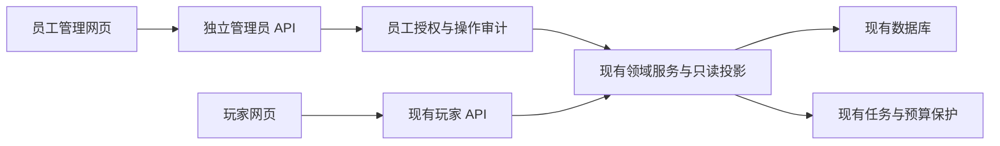

# PetSoul 游戏运营后台方案

状态：2026-09-23 的建设建议，尚未实现、派发或部署。依据当前工作区和产品要求编写。后台服务已经存在；本方案建设供平台员工使用的管理控制台。

## 1. 为什么现在要做

目前排查用户问题依赖工程师查数据库、日志和多个 agent 的交接。随着真实用户、公开内容和供应商调用增加，必须能通过一个有权限控制的界面回答：谁遇到问题、宠物实际在做什么、哪一步失败、有没有消耗额度、能够怎样恢复。

玩家端继续围绕宠物生活、旅行和陪伴。运营后台独立承载表格、筛选、记录、发布和问题处理，不把运营术语和平台 API 费用放进玩家主流程。

首版衡量标准是运营人员能够完成真实工作流，不是菜单数量或大屏图表数量。

## 2. 当前基础与实际缺口

| 已核对的源码 | 已有能力 | 本次需要新增 |
|---|---|---|
| `app/routers/web/meta.py`、`app/schemas/web/ops.py` | `/api/v1/web/ops/status` 与 `/ops/runtime/{pet_id}`；供应商、任务、租约、宠物活动和安静原因 | 可检索的员工界面、员工身份及权限、业务级诊断流程 |
| `app/web_identity/**`、`app/web_household/**` | 玩家账号、家庭、多宠、成员角色、用途授权 | 平台员工账户/权限；用户支持视图和受控处置命令。家庭管理员不是平台管理员 |
| `app/web_platform/{tasks,budget,lease,uow,outbox}.py`、`app/web_journey/illustrations.py` | 任务恢复、幂等、预算预占、结果未知、事务与执行者保护 | 管理员操作预览、权限检查、审计、可以恢复和必须保留待确认的状态区分 |
| `app/web_social/service.py`、迁移 `m1000_social.py` | 举报记录写入 `web_reports`，既有用户侧社交动作 | 人工审核队列、处理记录、下架/恢复、处理结果反馈 |
| `web_journey/catalog.py`、`adventures.py`、`web_residents/**`、`web_driving/**` 等 | 游戏目录、活动和居民等业务实现 | 逐类内容的草稿、结构化校验、发布版本与消费者接入；现有目录不能一概视为数据库 CMS |
| `app/routers/economy.py` | 旧接口有开发开关与静态令牌保护的 grant | 正式游戏补偿流程；不得直接把开发发币接口包装成生产后台 |

现有 ops 在生产/反向代理访问时要求管理令牌。这可以作为运维接口基础，不能把同一个令牌打包进浏览器代替员工登录。现有页面/接口盘点没有发现完整平台管理后台。

## 3. 全量能力地图

| 模块 | 运营人员能做什么 | 关键边界 |
|---|---|---|
| 运营首页 | 看真实注册/活跃、在线世界状态、任务积压、异常、当日调用用量；点击指标进入明细 | 没有事件来源的指标显示未接入；明确统计时区、时间窗、更新时间，不用页面轮询次数冒充活跃 |
| 用户与家庭 | 按用户/家庭/宠物编号搜索；看账号状态、家庭关系、最近活动；冻结账号、解除冻结、撤销登录会话 | 冻结单个账号不删除家庭、不取消其他家人的权利；账号状态和宠物维护状态分开 |
| 宠物与世界 | 看身份、所在地/当地时间、行程、上次决定、下次检查、安静原因、授权状态和事件时间线 | DNA、叮嘱、私聊正文默认不展示；不能直接改位置/行程表伪造一次旅行 |
| 游戏内容 | 管理地点模板、原创居民、剧情/活动、作物/物品/奖励配置、公告和素材 | 每类内容有 schema、来源与版权、可用事实、版本；真实地点与虚构场景明确区分 |
| 游戏经济 | 查星币流水、库存与发放记录；按原因做一次可追溯补偿；查重复领取和异常资产 | 补偿走原账本和库存领域命令；不用 SQL 覆盖余额；纠错用冲正/补偿记录 |
| AI 与照片 | 查供应商/模型、用途、操作号、发送次数、耗时、失败/unknown、重画链、每宠与全局额度 | 参考图仅按权限临时访问；unknown 不是未发送；不能无条件批量重画 |
| 平台 API 成本 | 分供应商、用途、模型看调用/计量；分别显示估算费用、账单确认费用与未确认费用 | 人民币/美元与星币完全分账；无价格时费用未知；中转请求模型与可确认的实际模型分列 |
| 社区审核与客服 | 举报分派、查看获准的证据、撤下/恢复公开内容、回复处理结果、关联故障工单 | 私人原文不因进入后台自动公开；移除公开展示不删除应保留的审计依据 |
| 系统运营 | 看环境/版本、任务线、到期延迟、供应商健康、限额、开关与备份状态；受控暂停新增调用 | API 在线不代表 worker 正常；关新增调用不抹掉在途调用或费用；不提供任意 SQL/命令终端 |
| 员工权限与审计 | 分配角色、撤权、查登录/查看/操作记录与版本发布历史 | 每个员工独立身份；角色只是一组权限，还要检查具体对象、数据范围和字段 |

AI 成本示例：星币补偿 +20 只记游戏资产账；一次 GPT 成图记平台调用账。两者没有默认兑换关系。供应商次数额度不是人民币预算，价格/币种/生效日未配置时不得显示“实际花费 0 元”。

## 4. 分三批落地

**P0：能查清问题并安全处理的运营台。**

- 独立员工登录、初始管理员安全引导、角色与权限、审计基础；公网正式使用前管理员启用 MFA。
- 运行首页、用户/家庭搜索、宠物详情、任务/照片详情、调用额度视图、审计查询。
- 首批写动作严格枚举：冻结/解冻账号和撤销会话、举报内容下架/恢复、暂停/恢复新增 AI 调用、符合明确条件的失败任务恢复。每项分别实现服务端授权、原因、幂等、并发版本检查与结果回执。
- `unknown`、已发送后失联、预占过期等先只读排查；没有外部确认证据时不能以“修复”名义改为未发送或自动重试。
- 不加全站数据导出、宠物转移归属、硬删除账号/家庭、无限发币和一键重跑所有任务。

**P1：真正可以发布游戏内容和补偿。**

- 先做公告及一种现有活动模板的完整发布闭环，然后扩到物品/作物/原创居民；不能只做“保存成功”但玩家端根本不读取。
- 草稿 → 校验 → 预览 → 审核/确认 → 发布 → 到期/撤下；每次发布有不可变版本、操作者、差异和生效时间。
- 玩家/任务按明确的发布版本消费内容；既有旅程、已发奖励、已领养宠物不被新模板静默改写。回滚是发布一个采用旧内容的新版本，不回滚世界时钟或抹掉历史。
- 游戏经济先做单用户、有上限、有原因的补偿；大额/批量动作独立权限、影响预览和审批，额度数值配置后才开放。
- 素材记录原件、缩略图、来源、使用范围、哈希；用户参考照不能被运营随手复用成公共素材。

**P2：规模化运营。**

- 活动日历、有限批量操作、用户分群、留存/漏斗、异常自动提醒、运营实验。
- 定时对账与供应商账单导入。先明确供应商是否提供查询/账单能力；查不到就保留待确认，不能伪造对账成功。
- 积累真实数据后再评估独立分析库、队列和缓存；不要为了后台先迁移整个游戏存储。

第一版完成条件是 P0 加 P1 的第一个真实内容发布闭环；其余 P1/P2 是后续范围，不能用空入口表示已完成。不按 agent 数量预估工期，按上述可演示里程碑验收。

## 5. 界面与架构

建议独立前端 `PetSoulAdmin/`，沿用当前 React/TypeScript/Vite 技术栈；独立构建和部署入口 `admin.petsoul.games`（拟定，不表示域名已经创建）。后台可以采用清晰的数据表与详情面板，不重做玩家端视觉系统。

界面骨架：左侧业务导航；顶部全局检索及醒目的环境/版本；主区为筛选、表格、详情。用户详情贯穿账号 → 家庭 → 宠物 → 行程/任务 → 游戏账本/平台调用账两个独立标签。错误要有原因、影响、允许的下一步，不把 Python 堆栈或原始 JSON 当日常界面。

建议管理员 API 前缀 `/api/v1/admin`，后端包 `app/web_admin/**`，DTO `app/schemas/admin/**`，路由 `app/routers/admin/**`。这些都是待登记的新范围。路由装配、迁移编号、共享领域扩展仍由实际文件持有人协调。

不复制第二套宠物、家庭、行程、钱包或供应商计量真相。读端消费现有投影/明确的只读查询；写端用显式的管理员领域命令，复用事务、幂等、版本及任务语义。不能伪装某个玩家 user_id 来绕过权限，不能让管理前端直连数据库或持有供应商密钥。

当前 SQLite 可以先服务小规模运营；审计与内容操作用短事务，列表分页，分析查询有边界。是否迁移 PostgreSQL另按负载评估，不绑在这轮后台建设上。

## 6. 权限、数据与操作模型

建议角色：平台负责人、客服、内容编辑/发布者、经济运营、技术运维、只读审计。首发只有一名员工也保留每动作权限，后续加人无需重写身份模型。

| 能力 | 默认开放给 | 限制 |
|---|---|---|
| 查账号与脱敏状态 | 客服、运维 | 不默认开放私聊、叮嘱原文和参考图下载 |
| 编辑游戏内容 | 内容编辑 | 发布权限单独给，不能改资产或真实地点事实 |
| 发放游戏补偿 | 经济运营 | 原因、限额、同请求不重复、账本可追溯 |
| 改供应商限额/暂停新调用 | 运维 | 白名单配置；显示受影响用途/环境；不给密钥读取权限 |
| 审核公开内容 | 审核员 | 限举报目标与明确公共范围 |
| 管员工角色 | 平台负责人 | 强认证、审计、不得通过玩家家庭admin继承 |

管理员使用与玩家隔离的会话；HttpOnly/Secure Cookie、CSRF和精确来源校验；服务端默认拒绝、逐请求核权，员工离职/撤权后会话立即失效。host-only cookie不共享到玩家站。MFA恢复流程和初始账号创建不得成为万能后门。凭据只走服务器配置与秘密存储。

建议新增最小数据：员工/角色绑定、管理员会话、管理员操作与审计、内容实体/修订/发布、审核处理记录；在持有人确认迁移编号后实施。审计记录 actor、permission、target、reason、operation_id、request_id、脱敏变更摘要、状态、时间与版本。审计按权限仅追加；SQLite内日志本身不是不可篡改证明，后续需独立留存/备份。

关键写操作：影响预览 → 明确动作 → 提交时重新核权/版本/配额 → 业务事务与审计一起提交 → 展示真实结果。异步操作分别记录已受理/执行中/成功/失败/结果未确认；“任务已入队”不得显示成“问题已修好”。

内容审核针对不可信文本/图片：富文本消毒、结构校验、禁止执行上传脚本；上传受大小/类型/来源约束。只允许受控媒体引用，不开放任意URL由服务器抓取。敏感数据导出、私密内容查看和参考图访问需单独权限及理由，不能藏在通用详情查询里。

## 7. 四个必须演示的工作流

1. **用户说宠物没有动静**：搜索用户 → 选择宠物 → 看到所在地/当地作息、任务、上次决定和下次复查 → 区分睡觉、留家、额度不足、依赖不可用、积压。整段查询不推进世界或触发模型。
2. **用户说照片一直没出来**：关联照片请求/任务/操作编号 → 分辨 processing、unknown、failed、ready → 看调用事实与用量 → 对可恢复失败执行一次受控恢复；unknown保留待确认，不能因预占过期自动补发。
3. **运营发布一项活动**：创建草稿 → 缺必要事实时校验失败 → 预览并发布版本V2 → 新事件实际消费V2 → 回到V1内容时保留发布历史及既有活动事实。
4. **客服补偿一次游戏奖励**：选对象、看影响、填原因 → 受控发20星币或物品 → 同键重放仍只有一次账本/库存变化 → 平台调用用量不因此改变。数值仅为验收样例，不是默认生产权限上限。

## 8. 验收与分工建议

专门设一位运营后台负责人作为交付窗口；这不意味着本次已创建或唤醒 agent。它承担新前端和后台领域模块；I负责共享装配/契约/迁移接入；A审查补偿/计量/重试；B提供运行投影；C审核世界内容/事务边界；Q独立验收；r7k继续玩家端。先批量定接口与所有权，后续只等真正重叠的文件，不恢复“所有任务都等I动手”。

验证必须覆盖：普通玩家和家庭管理员均不能进入平台后台；角色/对象权限拒绝；会话撤销；并发重复补偿/重试；业务与审计事务；内容版本冲突和回滚；读取不改变游戏业务/调用账（合法访问审计可以写）；unknown费用与历史保留；玩家实际读取已发布内容；Windows与Linux输入一致性。

浏览器交付至少包括员工登录、用户定位、宠物诊断、任务处理、内容发布与审计六条。使用独立测试账户与假供应商，测试不自动产生真实费用。截图/构建不等于真实服务接通；生产发布单独留版本、迁移、备份与回退记录，不用恢复整库来撤回单条运营操作。

首批排除：自动化营销群发、任意查看私人记忆、支付/退款系统、复杂玩家交易市场、任意改DNA/归属/世界时间、模型自动执行管理动作、浏览器执行SQL/Shell、一键修复全部unknown。

## 9. 参考

- 本地实际代码：`PetJourneyBackend/app/routers/web/meta.py`、`app/schemas/web/ops.py`、`app/web_platform/**`、`app/web_social/service.py`、`docs/product/PETSOUL-2.0-MASTER-PLAN.md`。旧MODULE-MAP的完成状态可能过时，本方案以当前源码为依据。
- [OWASP Authorization Cheat Sheet](https://cheatsheetseries.owasp.org/cheatsheets/Authorization_Cheat_Sheet.html)：最小权限、默认拒绝、逐请求检查。
- [OWASP Logging Cheat Sheet](https://cheatsheetseries.owasp.org/cheatsheets/Logging_Cheat_Sheet.html)：审计与敏感信息排除。
- [OWASP Multifactor Authentication Cheat Sheet](https://cheatsheetseries.owasp.org/cheatsheets/Multifactor_Authentication_Cheat_Sheet.html)：员工强认证设计参考。
