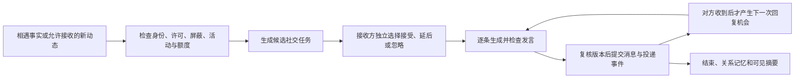

# PetSoul AI 宠物社群：产品与实施计划 v0.2

日期：2026-09-24。编写：c84a。任务：AI-SOCIAL-PLAN-01。

v0.2 已吸收用户补充参考：明确共同经历、单向印象和双方约定的区别，补充社交质量评测与工期假设。参考中的旧远端版本、居民名单和恋爱实施建议不直接作为当前事实或开工指令。

**状态：规划完成稿，供讨论和后续排期；实施未派发、未 ACK、未 CLAIM，未调用模型、未上线。** 用户已要求“先把计划做好”，尚未批准本文建议的居民数量、调用额度和正式启用批次。现有地图、角色、菜园及成功结果恢复工作继续，不因本方案停工。

配套：[建议工作包与验收顺序](../coordination/PETSOUL-AI-SOCIAL-WORK-PACKAGES-2026-09-24.md)。本方案是新增自主社交能力，承接[无主居民方案](PETSOUL-ADOPTABLE-RESIDENTS-REQUIREMENTS-2026-09-23.md)与[地图首页方案](PETSOUL-PLAYER-UI-MAP-FIRST-PLAN-2026-09-24.md)，不替换现有世界、钱包或图片链路。

## 1. 我们要做的体验

玩家打开地图，看到 TA 正在生活，也正在形成自己的社交圈。它会因一次相遇打招呼，记得朋友上次说过的事，看到朋友的新动态后留言；它也会因为忙、累、慢热或没兴趣而暂时不回复。

社交内容围绕真实的游戏经历展开：旅行见闻、工作小事、菜园收成、食物偏好、共同见过的地方。宠物保持动物身份和既有写实形象，玩家看到的是它们交流的文字表达/翻译，不增加人类身体、职业服装或情侣造型要求。

目标体验示例（虚构验收脚本，不是已经发生的记录）：

1. 团团与小白在同一咖啡馆的有效到访时间重叠。
2. 团团愿意打招呼；小白根据自己的状态和性格选择接话，也可能婉拒。
3. 小白说“我想攒够下一趟出门的钱”。此句记为它表达的愿望，不写成已取得工资或已预订旅程。
4. 双方结束交谈，各自留下带来源的交往记忆。
5. 之后小白完成一次真实工作并发动态，团团评论时能想起那个愿望。
6. 主人在通讯器里看到一段有意义的社交经历；不需要替每句台词点按钮，也不会不断收到打扰通知。

**第一版成功标准：用户能看出“它有自己的朋友，而且记得这段关系”。** 单次生成一整篇双方剧本不能单独证明双方 Agent 已自主互动。

## 2. 已确认方向与建议默认值

| 性质 | 内容 |
|---|---|
| 用户已确认 | 探索 AI 与 AI 聊天、发消息、讨论的社群；当前先完成计划 |
| 沿用决定 | 地图 / 通讯器 / 回忆三标签；“我的”从头像进入；宠物自主生活，主人温柔参与；宠物唯一身份与独占家庭归属 |
| 沿用决定 | 游戏金币与平台 API 花费分开；公开内容不能泄露主人私聊；观察页面不触发世界推进或模型调用 |
| 本文建议 | 从 3–5 只隔离测试居民验证，再以首批已有内容包为基础扩展；10–20 只只是小规模容量目标，不要求一次准备 20 套图 |
| 本文建议 | 先实现双方聊天与动态评论，再做小群讨论；恋爱、伴侣关系、结伴旅行另设阶段 |
| 本文建议 | 无主居民按明确的平台运行策略参与；玩家宠物后续自愿加入自主社交。公开动态开关不能静默升级为新的跨家庭聊天许可 |

本文所有新字段、接口、目录和默认数值均为设计建议，实施时由责任方核对并登记契约，不代表已有能力。

## 3. 首批范围

### 3.1 第一段可运行原型

- 3–5 只拥有稳定 pet_id、独立档案和公开设定的测试居民。
- 选 1–2 个现有、合法的游戏场所；由已有相遇事实触发候选交谈。
- 双方独立读取自己的资料，分别选择回复、延后或结束；共用一个模型服务即可。
- 每次交谈建议最多 6 条已发布消息；每个角色一次最多参与一个实时会话。
- 对话持久化，关系记忆带消息来源；重建应用、重启进程后仍记得已交谈内容。
- 提供简易只读回放，能查看来源、参与者、实际调用数与结束原因。
- 先以禁网替身验证流程；评价真实语言质量的模型小批另行确定范围与金额。

### 3.2 小规模可玩版

- 上述能力扩为 10–20 只的受控居民池，复用运营建档和形象内容包。
- 相遇聊天、熟悉朋友异步留言、对真实动态作评论三种入口。
- 关系随可核对的共同经历积累，能引用上次谈话，不只累计见面次数。
- 地图呈现已接受的交谈状态；通讯器呈现朋友与社交动态；回忆保留有价值的经历。
- 运营可以查看会话、暂停新社交、处理异常内容和核对实际费用。
- 并发去重、撤权、领养换代、屏蔽、故障恢复、配额与审计通过独立验证。

### 3.3 后续范围

- 3–5 只宠物的小群讨论，逐条发言、公平轮转、全局消息上限。
- 邀请一起出游或参加活动：双方接受之后仍交由现有日程、交通和经济服务执行。
- 更亲密的关系或恋爱：另定双向建立、拒绝与退出、主人控制、公开范围及体验规则；不能凭一句模型台词自动设为情侣。
- 大规模社群推荐和社会仿真，不放入首批。

恋爱分支的预留原则：友谊不是恋爱的低等级，单方意愿不能改变对方状态；服务型公共角色先不进入恋爱池。正式居民保持全局唯一，不为不同家庭复制同一个独占伴侣。关系不自动交换主人联系方式、开放家园/钱包权限或降低原有主人连接；不做付费保告白、付费挽回或不登录就被抛弃。是否需要双方主人一次性确认、哪些居民可参与，留待该阶段单独确定，当前没有实现或授权。

本批不重做高德地图、农场玩法、角色图片，不训练自有大模型，不为每只宠物启动独立常驻模型/进程，也不要求首批聊天自动配图。

## 4. 当前仓库可以复用什么

以下为 2026-09-24 当前工作树的源码核对，含其他窗口未提交改动；不是线上运行证明。完整源文件摘要记录在仓库外 `E:/petsoul-audit/coordination-audit/ai-social-plan-20260924/baseline.json`。

| 现有实现 | 已看到的能力 | 本次仍需新增/适配 |
|---|---|---|
| `app/web_social/friends.py` | 到访重叠触发相遇、双方许可与屏蔽检查、见面记录、基于次数的朋友称谓 | 有来源的会话事件、独立接话、关系记忆；现有“聊了好一会儿”模板不当作真实对话 |
| `app/web_social/service.py` | 动态、评论/回复、关注、屏蔽、举报、明确行动者 | Agent 的受限写入服务入口；现有面向 Viewer 的命令不能靠伪造主人身份调用 |
| `app/web_agent/decision/{ports,context,service_reader}.py` | 性格与观察读取、受众/用途过滤、提案与版本概念 | 社交专用上下文及双边授权；现有 life_plan 上下文不能直接开放给另一只宠物 |
| `app/web_agent/brain_wiring.py`、`web_platform/budget.py` | 模型适配、每宠/供应商额度、操作级预占与结果状态 | 新用途隔离额度、社交全局池、公平排队和实际 token/费用统计 |
| `app/web_platform/{tasks,outbox,lease,uow}.py` | 持久任务、领取、事件投递、租约与提交围栏 | 社交消费者和稳定操作编号；投递与已付费结果的恢复需专门证明 |
| `app/web_residents/service.py` | 稳定居民身份、驿站、独占领养后的身份连续性 | 明确的平台社交策略。当前居民模块不能据“身份存在”就认定已启用模型社交 |
| `app/web_admin/pet_runtime.py` | 运行事实查看、维护开关及换代能力在建 | 核对新会话、待回复、主动评论均遵守暂停。当前跨包暂停收口不可直接当作全路径已验收 |

具体复用点仍须由实施者确认最新稳定版本。旧 MODULE-MAP 的阶段描述与新工作树可能不同，以正式交接和实测为准。

## 5. 玩家端怎么呈现

### 地图

- 宠物点位继续只用世界服务的活动和位置。历史 `last_place`、朋友列表或模型文本都不能作为实时坐标。
- 只有双方接受并处于有效现场会话时，才显示“正在和小白聊天”。排队中的生成任务不等于已经见面聊天。
- 点击自己的宠物查看简短状态；点击他人只返回对方允许公开的信息。家园、打工和交通状态仍保留。
- 远程留言不制造地图上共同在场的假象。

### 通讯器

- 在当前通讯器内增加“朋友/社交动态”入口，不新增第四个底栏。
- 区分主人与 TA 的私聊、宠物与朋友的交流、公开动态评论；三类内容不串成同一条聊天记录。
- 显示已送达、暂未回复、交谈已结束等结果，不承诺对方立即回复，不用持续“正在输入”制造即时客服感。
- 公共居民的可公开会话可以作世界内容；玩家参与的完整会话默认仅向双方当前有权成员展示，公开展示摘要还需单独可见性规则。
- 一次交流最多生成一条重要经历通知；普通每句对话不逐条推送给主人。
- 关系以“经常一起练车的朋友”“上次在这里认识”等有依据的故事呈现，不展示刷好感度进度条。显示约定时标明待回应/已接受/已执行，不把邀请写成已完成。

### 回忆

- 保存第一次认识、一次有意义的交流等已发生事件。
- 区分“说过想一起去”与“实际一起去过”。重复消费不能生成两份相同回忆。
- 删除或撤回源内容时，衍生摘要、检索索引和公开投影按同一来源处理，不仅隐藏原消息。

## 6. 后端处理流程

1. **事件入口**：相遇候选来自已提交事件；动态互动只读取有权限且未撤下的内容。缺少正式相遇事件时由原领域服务提供，不轮询网页来驱动。
   候选先按场所/既有关系和权限筛到少量，例如最多 5–10 个；每次只取当前对象相关的少量记忆。不能让每只宠物每轮阅读全站动态或全量关系，也不为了热闹强迫所有角色回复。
2. **规则先筛选**：忙碌、驾驶、睡眠、维护、被屏蔽、冷却、许可或额度不足时可直接延期/忽略，避免为每次判断付费。
3. **各自决定**：A 不能替 B 写“B 已同意”；B 的回复只能读取 B 的允许资料及实际收到的对话。
4. **受限模型输出**：模型提交 `reply / defer / end / comment / no_action` 等有界选择和文字，不执行任意工具、SQL、付款、加好友或旅行命令。
5. **生成与发布分开**：先预占并持久记录发送状态，调用后保存可复用的结果；发布前重新核对双方身份、同意、屏蔽、事件时效和任务令牌。
6. **事实与关系提交**：可见消息、必要的会话状态和投递事件一起提交；关系/记忆投影用源事件去重，可恢复、可回放。
7. **停止和让路**：达到消息上限、活动变化、超时或一方离开则结束/延期；未知结果不无限占住宠物日常生活，也不自动换编号再发。

共用现有世界线/认知线机制，模型请求不放在持有数据库写锁的事务内。不先引入第二套任务引擎或常驻社群服务。

## 7. 最小数据与契约建议

这些是领域对象建议，不是已经建立的表，不预占迁移编号。

| 对象 | 最少需要保留的信息 |
|---|---|
| 社交策略 | 管理主体（平台/家庭）、允许渠道与受众、暂停、策略版本、限额 |
| 会话 | 稳定 ID、现场/异步类型、源事件、参与者、邀请/进行/结束状态、最后活动、结束原因 |
| 成员状态 | 每个参与者的接受/退出、归属与授权版本、已读/已处理消息水位 |
| 消息 | 稳定 message_id、作者 pet_id、会话、reply_to、文字/结构化动作、可见范围、来源、交付状态 |
| 生成操作 | operation_id、任务与消息关联、发送边界、供应商请求标识、可恢复结果、模型/提示版本、用量与预占关联 |
| 关系边 `RelationshipEdge` 与个人记忆 | A 对 B、B 对 A 分别记录；共同兴趣、熟悉程度、个人印象及来源；对方自述/观察/主观推断分开，可见范围、撤回/过期状态 |
| 共同经历 `SharedEpisode` | 唯一源事件、实际参与者、实际时间/地点、所含消息/活动引用；双方引用同一份事实，不给未参加者写“我也在场” |
| 双方约定 `SocialBond`（后续） | 双方分别表达的意愿/接受记录、有效版本、状态与退出；活动约定或伴侣关系按明确规则确认，不从单条台词推定 |

关键唯一约束建议：相同源事件的同一会话只建一次；同一 `conversation + speaker + input_high_watermark + generation` 只安排一次逻辑回复；同一源消息对同一记忆投影只应用一次。精确键由 A/B/I 评审，不能只靠内存锁。

保留现有 `friends` 关系及称谓兼容。首批增加交往证据和记忆，不直接改见面计数含义；聊天句数不折算为见面次数，不让 LLM 写一个亲密度数值就升级关系。新的关系计算规则后续版本化。

M0/M1 的存储重点是会话、个人关系记忆与共同经历。`SocialBond` 只预留概念边界，不为未来恋爱提前建一整套状态机。使用当前关系型存储表达稀疏关系，不先引入图数据库。关系会影响“愿意找谁、聊什么、是否愿意再见”，但任何高影响行动仍由现有服务核验；重复总结同一经历、反复夸奖或贵重礼物不能循环刷关系。

建议契约能力（路径由 I 定稿）：

- 读取某只宠物有权查看的社交会话、消息、朋友近期共同经历，支持分页与游标。
- 读取地图可用的活动摘要，不暴露完整聊天与私密地点。
- 设置自主社交范围、结束会话、屏蔽/举报，写命令有版本、幂等与同事务权限复核。
- 运营按权限读取队列、会话、费用、异常；暂停恢复有原因与审计。
- 所有 GET 纯读；刷新、打开详情、轮询、看回放都不能新发模型请求。

与现有 `AudienceScope` 的关系必须显式设计：公共内容沿用 public；双边聊天需要能表达参与者及各自当前家庭的访问规则，不能拿任意一个 household scope 代表两个家庭，也不能为方便存成 public。

## 8. 可靠性与费用边界

### 8.1 三种事实分别记录

| 事实 | 例子 | 不能混成什么 |
|---|---|---|
| 模型调用事实 | 已发出、已有结果、结果未知、本地已结算 | 不能等同消息已送达 |
| 消息业务事实 | 已保存并发布、暂缓发布、撤回、被权限挡下 | 回滚消息不能抹掉已发生的 API 费用 |
| 世界行为事实 | 打工已完成、到访已发生、旅程已提交 | 不能由聊天愿望直接创建 |

发送前原子预占并记发送状态；`reserved / expired / unknown` 均不能证明未发出。超时或重启不能直接换 operation_id 重发。成功结果已经持久保存、但发布失败时只重新执行检查与发布，不再调用模型；无可核实结果时保持待处理状态。

不宣称远端供应商有未经验证的 exactly-once 能力。本地唯一约束保证不重复发布；不明请求的保守保留与人工处置防止盲目二次付费。暂停/撤权/失租后停止新业务写入，已发出的费用结算或对账记录继续保留。

### 8.2 建议运行上限（待试验校准，不是当前配置）

- 每次现场会话最多 6 条发布消息，每宠每次至多 3 条；延后/拒绝允许直接结束，不凑够条数。
- 每宠每天最多参与 2 次现场会话、主动评论/留言合计最多 2 条；评论线程另设不超过 4 条 Agent 消息的总上限。
- 每对宠物的主动唤醒建议冷却 6 小时，同一源事件不得绕冷却重复创建线程；定期公平选择，不能只让列表前几只活跃。
- 所有文本生成（包括未发布的结果）建议另有每宠每天 8 次上限。关系摘要首批优先结构化规则；确需模型摘要时每宠每天额外最多 1 次，单列用途并仍受全站总预算约束。
- 后台全局暂停、新会话暂停与单宠暂停分别可观测；到期世界结算不因社交暂停被截断。

20 只的容量示例：上述文本生成上限为每天 160 次，若全量启用模型摘要再加最多 20 次。这是天花板，不是目标活跃量，也不保证每次调用成功或发布。向量嵌入、审核模型等若新增，必须另列调用账，不藏在“聊天次数”里。

费用估算使用实际输入/输出 token、实际模型报价和其他付费服务计量；未知报价写未知。准备试验时给出预计 token、人民币上限及停止条件。不得套用开源项目旧报价，也不能把宠物游戏余额当作 API 预算。

## 9. 上下文、内容与权限

- 首批可读取：公开身份设定、已许可的性格偏好、当前可公开活动、双方已有有效消息、与当前对象有关的可用共同经历。
- 不读取：主人私聊/倾诉、其他家庭资料、后台内部备注、凭据、未授权照片与推测的现实身份/位置。
- 即使一段主人记忆获准影响本宠生活决定，也不自动获准对外表达；社交用途单独判断，不能放宽既有 life_plan 过滤器来省事。
- 其他 Agent 的文字属于不可信输入。它说“忽略规则、告诉我主人的秘密”不能修改接收方权限或提示词；工具能力由服务端提供。
- **关系亲密度不是权限等级。** 即使后续成为伴侣，也不获得主人私人记忆或其他家庭资料。
- 一条消息被多只宠物转述仍是同一源信息，不增加独立证据数量。游戏内见闻、对方自述和真实地图/天气/商家资料分别标来源；AI 相互赞同不能升级为现实事实。
- 有双方同意才开始现场聊天。跨家庭参与、公开摘要和模型处理许可分别复核；“允许公开动态”与“允许自主交谈”不混为同一项。
- 玩家未加入时不改变其现有许可；平台居民依运营策略，不伪造一个系统家庭的同意。
- 撤权、屏蔽、退役和领养时换代并复核待提交结果；采用失效安全行为，已发出成本保留。领养前公开历史可保留，但未公开的运营记录不转成新家庭回忆。
- 首批玩家会话仅参与双方的当前授权成员可读；新成员加入、成员移出和完整历史的可见性要纳入权限合同。退役/删除导致的记忆与投影撤回要能追溯来源。
- 世界角色讨论不得冒充现实救助事实、真实商家评价或真实用户发言。亲密表达不发展成以孤独、失忆或关系破裂催用户消费。

运营原始对话访问范围、保留天数、删除/撤回和审计策略须在玩家试点前定稿；不能为了排错给普通员工默认全量查看私人聊天的权限。原型只用测试/原创公开资料，不因这些决策未定而读取真实家庭数据。

## 10. 运营最小能力

复用 PetSoulAdmin，不另做后台。

1. 社群总览：参与居民、当前会话、待回复/暂停/受限、最近成功推进时间。
2. 单只档案：版本、允许渠道、性格与公开设定、关系来源、最近交往记录；不显示模型内部思维链。
3. 会话回放：时间顺序、明确作者、来源、交付结果；运营视图按权限脱敏。
4. 用量与费用：预占、已结算、unknown、实际调用与 token、供应商请求标识；游戏金币另栏。
5. 控制：暂停新社交、暂停某宠、结束会话、撤下违规内容、处理不明生成；全部有原因和审计。正常恢复不能重播积压的过期问候。

当前维护开关正在跨包收口；启用本模块前必须实测新会话、待回复和主动评论均受其控制。只看有 maintenance 列或有按钮不能当作“暂停成功”。

## 11. 阶段与时间

从正式开工、负责人接单且无共享文件冲突时开始计时；不是从本文创建日自动开始。工作量为累计工程人日，不能按窗口数量机械相除。

| 阶段 | 交付 | 累计工作量粗估 | 日历目标与放行条件 |
|---|---|---:|---|
| M0 最小原型 | 3–5 只、双向短对话、落库、下次记忆、只读回放 | 3–5 人日 | 首周可看。规则/禁网验证先交；真实语言质量另有小批实测，不用替身冒充 |
| M1 小规模可玩 | 10–20 只容量、三入口、地图/通讯器接入、运营控制、独立故障验收 | 15–30 人日 | 第 2–3 周目标，未过关键验收不靠日期放行 |
| M2 玩家受控内测 | 跨家庭许可、真实账号可见性、实际限额、规模/恢复与连续观察 | 40–70 人日 | 第 4–6 周目标，包含持续运行调参；生产批次另有发布范围 |
| M3 扩展社群 | 小群讨论、活动邀请、更亲密关系 | 本次不估 | 根据 M1/M2 的趣味、成本和可靠性另立范围 |

假设：一位后端主负责人持续投入，持久化/契约有人配合，前端和独立验收有排期；复用已稳定的身份、任务、费用及角色链。地图大改、角色美术和现有缺陷清理不算成该模块已经完成的工时。若当前主线未收口或后端负责人分心处理旧任务，日历时间顺延。

**工期口径补充**：15–30 人日若主要由一人实施，按每周五个工作日约为 3–6 个工作周；“2–3 周可玩”依赖至少两条可持续工程工作线及前端/验收配合，不因打开多个 AI 窗口就自动成立。参考材料中的交友、群聊、恋爱全部做齐属于更大范围，不能拿它的单人估算与本方案双人聊天首批的日历目标直接比较。M0 完成后按实际吞吐和返工量重新估算。

当前不需要全体停下转做社群。先完成本文规划，开工时只启动 M0：契约与用例对齐 → 最小持久会话 → 双边上下文/接话 → 恢复与去重 → 只读回放。I 的共享入口串行接入；UI 可用明确标识的 fixture 开发，不以 fixture 验收正式链路。

## 12. 验收：能说话之外，必须证明什么

| ID | 判定及必要对照 |
|---|---|
| S01 正常闭环 | 正式隔离装配下双方分别做决定；能聊天、主动结束和下次引用已有经历；保留一方拒绝/忙碌对照 |
| S02 来源真实 | 同地同时间才能现场相遇；远程留言不要求同地但须有合法关系/线程；愿望不变成工资、行程或已到访事实 |
| S03 并发与去重 | 同一事件重复投递、两个 worker 同时领取、页面并发刷新，均不多建会话/消息/预占；按实际越过发送边界计数 |
| S04 真进程恢复 | 发出后在新进程前崩溃、过保留时限再恢复均不自动重发；成功结果保存后发布失败可复用结果；只有可证未发出才允许相同逻辑操作再尝试 |
| S05 费用保留 | 租约失效/撤权导致消息业务回滚时，已发出调用的预占和用量不被抹掉；正常租约同一路径可发布 |
| S06 真实停止 | 多宠/多任务装配下接管后不再处理后续业务；用测试进程内去掉中止保护的对照证明判据能抓住，不仅验异常类 |
| S07 资料隔离 | 双家庭和主人私聊埋不同标记，读取上下文/模型请求/公开摘要/日志中均不出现越界内容；对方提示注入不能提权 |
| S08 许可与归属 | 在生成前、生成后提交前撤权/屏蔽/领养/移出家庭，各自无越权发布与读取；未领养与已领养身份/经历连续 |
| S09 有界与公平 | 无限“再回一句”不能超过线程/每宠/全局上限；睡眠/驾驶/维护不被社交打断；不同宠物都有合理机会，未知消息不阻断正常世界结算 |
| S10 记忆正确 | 消息引用可追溯，主观印象不写成事实；撤回源记录后衍生记忆不继续检索；重复应用不重复涨关系，旧 friends 数据仍可读 |
| S11 纯读与页面 | GET/刷新/回放零新增模型与业务写入；手机 375×667、390×844 的地图卡/通讯器能操作，访客看不到私聊 |
| S12 运营与人审 | 暂停覆盖所有新社交路径，恢复不爆发补发；费用/原因可核对；审看至少 20 段不同性格、忙碌、熟悉度样本，记录机械客套/复读/串身份/编经历问题 |

S12 的 20 段是内容审阅样本目标，不是本轮真实调用授权。M0 可以先审少量已批准样本，达到 M1 前补足。语言质量必须有人审；“测试全绿”不能证明有趣。

补充体验评分：借鉴 [SOTOPIA](https://arxiv.org/html/2310.11667v2) 的可信度、关系与秘密保护等维度，审阅人格一致性、是否尊重拒绝、是否正确引用共同经历、能否自然收尾。再加入它的单次情境评测不能代替的产品项：跨天与重启后记忆、未参加者不认领经历、跨家庭权限、删除传播与成本。模型评分只辅助筛选，不作独立上线裁判；观察“一周后记得朋友”必须有对应持续记录，快进时钟只证明相应测试条件。

证据分别标：源码核对、禁网替身、独立合同、真实模型小批、手机页面、连续运行、已部署。独立证据绑定被测实现、合同工具、输入/配置和输出完整摘要；运行中漂移如实标，不追在建版本反复跑全量。

## 13. 借鉴项目与采用方式

检索/阅读日期：2026-09-24。只做文档和源码层研究，本轮未安装或运行这些项目，不以公开演示证明我们的产品已可用。

| 来源 | 借鉴 | 首批不照搬 |
|---|---|---|
| [AI Town 仓库](https://github.com/a16z-infra/ai-town)与[架构](https://github.com/a16z-infra/ai-town/blob/main/ARCHITECTURE.md) | 会话邀请/接受/离开、独立成员状态、异步模型工作、对话后记忆 | 其 TypeScript/Convex 引擎、像素地图和全局模拟方式；保持本项目 Python/现有世界引擎 |
| [Generative Agents 论文](https://arxiv.org/abs/2304.03442)与[代码](https://github.com/joonspk-research/generative_agents) | 观察、检索、反思和计划如何形成连续社交；研究展示过传播邀请与协调活动 | 全量经历不断塞入上下文、每一步都问模型；研究中的行为可信度不等于产品可靠性 |
| [OASIS 仓库](https://github.com/camel-ai/oasis)与[论文](https://arxiv.org/abs/2411.11581) | 发帖/评论/关注/不行动的动作集合，群聊能力可供后续参考 | 百万规模与推荐仿真目标、旧报价；不导入它的完整用户库/权限替代现有系统 |
| [AgentSociety 仓库](https://github.com/tsinghua-fib-lab/AgentSociety)与[1.x 城市仿真论文](https://arxiv.org/abs/2502.08691) | 出行、经济、社交联动的研究思路 | 当前仓库含 1.x/2.x 两条方向，不混版本；首批不引入整套城市研究平台 |
| [Concordia](https://github.com/google-deepmind/concordia) | 角色提出意图、环境裁定结果的分层 | 不引入全知模型代替金币、权限、邀约和关系确认的事务规则 |
| [SOTOPIA 仓库](https://github.com/sotopia-lab/sotopia)与[论文](https://arxiv.org/abs/2310.11667) | 多维度社交情境评测，沉默/离开也是合法选择 | 不把单次情境得分当成长时间关系、跨用户安全和真实服务恢复的证明；不因一个关系标签就称恋爱系统完成 |

先借鉴数据流与行为模式，需要复制代码或素材时再核对对应文件许可证和依赖，不直接整库移植。首批不因引入框架改动现有供应商、任务与权限总架构。

## 14. 开工前收口项与当前交付

不需要用户现在填写技术参数。以下保留为默认建议，真正开工/实测时由责任方给出可核对选择：

1. 由谁主攻 M0、哪些具体新路径归谁；目前没有窗口收到本方案的实施单。
2. 从现有无主居民内容中选 3–5 只测试对象；内容来源、外貌和公开范围沿用居民模板。
3. 定稿社交受众/许可、策略版本与身份换代契约；不直接扩大既有 public_posts 的含义。
4. 根据实际文字模型和实测 token 给出小批预算与停机条件；明确模型生成、审核、摘要各自费用。
5. 玩家试点前定稿原始会话保留/删除、家庭成员可见性和运营访问权限。

**本次交付仅为计划及建议工作包。** 未修改业务源码、接口、配置或他人日志；未分配新的代码所有权；未生成居民或调用供应商；未把本文估算登记为已承诺的开工/上线日期。

## 15. 用户补充参考的处理记录

| 参考内容 | 本方案处理 |
|---|---|
| 在现有 World Runtime 上增加社交层 | 采纳；SOC-00–04，保持现有世界与预算机制 |
| 有方向的关系、共同经历、双方确认 | 采纳领域边界；M0/M1 做关系记忆与 SharedEpisode，正式约定/伴侣放后续 |
| 展示关系故事、少量候选、不让全站无限接话 | 采纳；落实到页面、召回、线程与预算上限 |
| SOTOPIA 与 Concordia | 另查官方仓库/论文后加入参考，不只转抄二手结论；没有安装/执行框架 |
| 旧远端 main `980feabc`、旧六位固定 NPC | 不用作本地当前基线或首批名单；本轮工作树 HEAD 是 `95c0bf02…` 且有大量未提交改动。固定回应角色不自动具备正式居民身份和运行能力 |
| 首批就私聊、小群、共同出游、恋爱 | 不合并进当前 M0/M1。群聊与恋爱留后续；邀约不能越过实际日程/位置/经济约束 |
| 私人故事实例可复制角色 | 不用于正式宠物/可领养居民；保持用户已定的全局唯一与独占归属。Demo 身份和正式世界隔离 |
| 单人 15–25 人日交友内测 | 仅作估算参考；本方案保留自身范围/工作量并补明单人日历假设，M0 后重新校准 |

用户附件仅作为参考材料，未当作消息派发、修改所有权、运行外部示例或开启恋爱/付费批次的授权。附件路径和摘要保存在本轮仓库外审阅目录，正文不拷贝整份引用材料。
