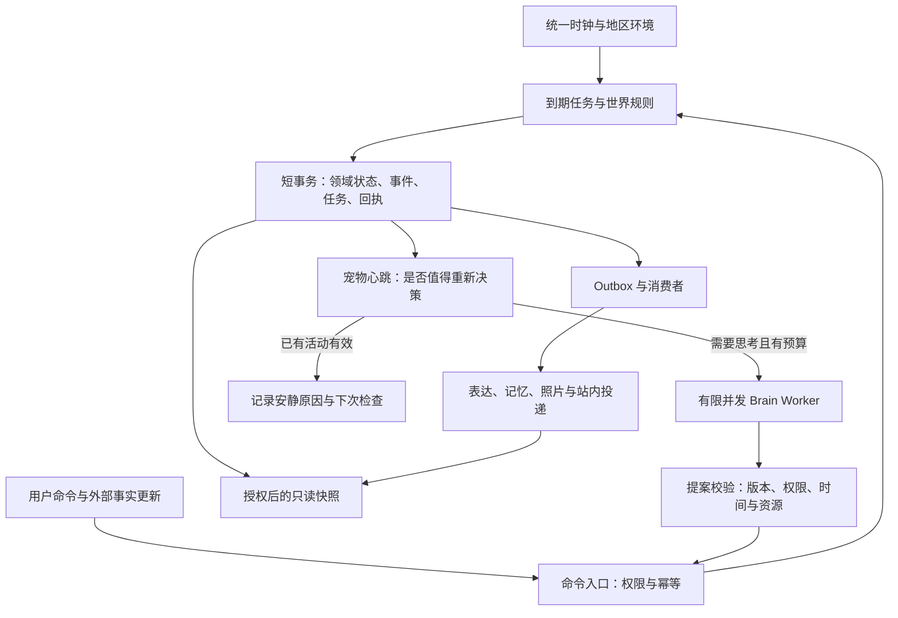

# PetSoul 世界运行层与生命调度层：整合实施方案 v0.2

> 编写：Codex / `codex-20260922-product-refresh-c84a`，2026-09-22。  
> 用途：供用户、Claude 后端与前端同伴共同评审和接续实施。  
> 状态：**待实施方案，不是已完成声明**。本轮只读核对代码及本地运行状态，未修改后端、调用业务模型或部署。  
> 基线：`codex/petsoul-web-integration`，HEAD `980feabc7710462a89c5df488c255d04e9e7de08`，另有大量尚未提交的 Web 实现。实际实施前必须重查工作树与窗口日志。

阅读建议：产品讨论看第1–7节；后端执行看第8–18节；发给Claude可直接用第19节。第2节区分当前事实与待验证风险，后续章节均为目标设计。

## 1. CTO 判断与本版范围

**应该建设，而且它是宠物自主生活的基础设施。**它要解决的是“世界持续、角色有自己的生活、发生的事有据可查”，并把思考、行动和表达的节奏分开。

附件 v0.1 的方向成立：真实世界时钟、持久化任务、模型输出校验、过期结果拒绝、隐私与成本控制都值得保留。但不能直接按它的目录和表清单重新造一遍。它主要引用旧版后端；本机现在已有独立 Web worker、任务表、进程租约、家庭、多宠、居民与真实交通接入。本版以这些新实现为起点。

建议分成两个交付层次：

1. **比赛基础层，优先完成**：关闭网页后照常到站和结算；模型故障不拖住世界；任务重启能恢复；多家庭、多宠不串状态；前端读状态不创造生活。
2. **自主世界层，随后贯通一个片区**：宠物依照 DNA、真实经历和当前机会作出有限而真实的选择；共同环境和共同事件影响不同居民；表达有节奏，安静有原因。

本方案覆盖世界运行、宠物心跳及其对已有模块的接入。完整玩家市场、全球实时交通、全部城市天气和影视生产不作为这轮运行层的完成条件；它们沿同一接口扩展。**不会为了“心跳”再引入一个掌管世界的大模型。**

### 对参考方案的六项调整

| 参考方向 | 本项目采用方式 |
| --- | --- |
| 新建完整 Runtime | 在 `web_platform`、`web_agent`、`web_journey` 上增量接入；先识别已有等价能力 |
| 新建十余张运行表 | 先复用任务、幂等、旅程事件、钱包、家庭与消息表；只新增缺失语义 |
| 所有动作统一异步 | 短小确定性动作仍可同步提交；长期动作返回任务回执，二者通过同一事务入口 |
| 世界与模型分离 | 把现有事件 sink 中的模型、地图和媒体调用移出关键结算路径 |
| 单一推进者 | 保留进程租约，但增加提交时的租约令牌、运行归属和语义版本校验 |
| 新阶段时间安排 | 不重置原来的 96 小时；先收尾 Claude 当前真实验收，再按阶段门推进 |

## 2. 当前基线：已有内容与具体缺口

### 2.1 本轮证据边界

2026-09-22 **23:16 +08:00**，只读访问本机 `18763`：

- `/api/v1/web/meta` 返回 `web-mvp-0.4.0`。
- `/api/v1/web/ops/status` 返回 `real-local`、`runner=worker`、间隔 30 秒、有效 worker 租约；最近成功 tick 为 `15:15:52 UTC`，累计 76 次，最近错误为空。
- 状态接口报告已应用 46 个迁移、WAL 已配置开启；模型和高德各有成功时间记录。Google、静态地图和生图在这个接口中只是 `configured`，不能写成已验证可用。
- Claude 日志说明真实新账号验收进行中，一次自然时间打工为 `15:04–17:04 UTC`，即北京时间 9 月 22 日 23:04 至 9 月 23 日 01:04。**不要为实施本方案重启或覆盖这套验收环境。**

以上证明本地服务报告了这些运行状态。没有独立复验供应商响应、完整用户闭环、故障恢复或公网版本。本轮不重复 Claude 的付费调用，也未运行全量测试。日志里的“测试通过”仍属于该窗口报告，不能替代本轮验证。

### 2.2 可以直接复用的资产

以下路径均相对仓库根目录。

| 能力 | 当前代码入口 | 本版处理 |
| --- | --- | --- |
| 独立世界任务进程 | `PetJourneyBackend/app/web_worker.py` | 保留启动入口与部署方式，逐步替换内部编排 |
| 世界轮询、任务清单 | `app/web_agent/ticker.py`、`app/web_agent_wiring.py`（均在后端目录下） | 从串行扫描转为到期任务调度 |
| 跨进程租约 | `app/web_platform/lease.py` | 保留并补 fencing token、真实完成时间、退出和续期语义 |
| 持久化任务、幂等 | `app/web_platform/tasks.py`、`idempotency.py` | 升级恢复与事务边界，不另造平行队列 |
| DNA、行为画像、生活节奏 | `app/web_agent/profile.py`、`life.py`、`moment.py` | 作为角色上下文、规则执行与模型决策的基础 |
| 私聊、家庭频道、待回复 | `app/web_communicator/service.py` | 保留内容模型，补领取恢复与发布前权限检查 |
| 真实交通时间线及来源 | `app/web_transport/`、`app/web_journey/` | 继续使用既有班次、接驳、版本与事件模型 |
| 家庭、多宠、待领养居民 | `app/web_household/`、`app/web_residents/` | 运行归属以宠物为单位，权限和共享资源以家庭为边界 |
| 星币账本 | `app/web_economy/adapter.py` | 复用单事务钱包更新和领域幂等，向跨领域 UoW 扩展 |
| 供应商计量、运维状态 | `app/web_providers/meter.py`、`app/routers/web/meta.py` | 补原子预算预占、到期滞后与每宠运行原因 |

### 2.3 必须解决的差距

下列为本轮静态代码检查，**风险场景尚未逐一做故障复现**。实施者先写反例再改，并在开工时复核代码是否已经变化。

| 编号 | 已看到的代码事实 | 影响与改造目标 |
| --- | --- | --- |
| G1 | `WorldTicker.tick()` 顺序执行所有 job；`proactive._compose()` 与攻略创建直接调用模型 | 一个慢调用会占住该轮线程；世界结算只登记表达任务，不等待模型或地图 |
| G2 | `/journey/map` GET 调用 `advance_pet()`；`presence()`、到访查询也有推进路径 | 多开页面可能参与触发业务副作用；所有生活类 GET 改为纯查询投影 |
| G3 | `WebTaskQueue.claim()` 只取 `queued`；保存了 `locked_until`，但该队列中未见过期 `running` 回收；完成按 task_id 更新 | worker 中断后存在卡住和旧回执覆盖风险；增加回收、领取代数及条件提交 |
| G4 | 进程租约只在每轮开始获取/续期；后续业务提交没有检查这次租约令牌 | 一轮超过租期后，旧进程可能继续写；在最终事务检查持有权，不能只加长 TTL |
| G5 | `_deliver_group()` 先将待回复标记为 `claim-*`，离开事务调用模型，再写消息；领取没有明确过期字段 | 中断可能留下永远不再被 NULL 查询领取的记录；回复也要持久化运行状态与可回收租约 |
| G6 | 旅程 `_emit()` 先同步执行全部 sink，再登记源事件；失败后重试 | 事实、账本、攻略、消息的提交边界分散；核心事实和 outbox 同事务，消费者分别确认 |
| G7 | `IdempotencyStore` 注释明确回执与业务写入不在一个事务；钱包本身已单事务 | 钱包改进应保留；下一步补出发、库存、命令回执和事件的组合原子性 |
| G8 | `ProviderMeter.allow()` 先读计数，`record()` 调用后累计；锁属于单进程 | API/worker 并发可一起通过上限检查；需调用前跨进程预算预占 |
| G9 | `LifeEngine.choose()` 主要按画像、资金、建议和稳定随机权重选择 | 已有自主规则生活，但不能称为模型自主规划；需接入真实的有限决策回路 |
| G10 | 旅程扫描按出发时间取前 200 条；已入住宠物列表限 2000；`moment._zone()` 未知时区回退香港 | 数据增长可能饿死后排实体；改 due 索引/游标公平调度，新增地区禁止静默套错时区 |
| G11 | `main.py` 仍装配旧 `BackgroundAgentScheduler`；是否运行受配置控制 | 双体系共存需写入归属检查；不能仅假定部署关掉旧开关就没有旧请求/回调 |

## 3. 必须保持的产品规则

1. **世界的正式时间按现实 1:1 推进**；用户关页、睡觉、退出家庭或切换宠物，都不能暂停世界。
2. 宠物是写实动物，在这个世界不再死亡或受伤。低余额、预算耗尽、离线和系统故障不制造付费救援、生存惩罚或丧失宠物的威胁。
3. 宠物有自主生活；主人提供建议、陪伴和有限协助。系统允许宠物选择留家、附近活动、工作攒钱、远行，也允许它礼貌地不采纳建议。
4. 一只宠物只有一个身体和一个主活动。家庭可多成员、多宠；不能为每位家人各运行一份宠物。
5. 家园、菜园和家庭仓库共用；每只宠物保留独立身份、DNA、星球银行账户、证件、驾照、旅程和记忆。私人聊天按“用户＋宠物”隔离。
6. 家是有氛围的共同住所，后台仍有稳定城市、区域和时区。不得每次登录随机搬家。家园时间、宠物所在地时间、主人安静时段是三个维度。
7. 宠物在家只降低偷菜风险，睡觉时仍可能被偷。以家中宠物的实际状态计算一次规则结果，不按刷新重抽概率。
8. 地图车辆自然移动，音符/电视图标打开播放面板。**不设计独立同行舱页面**；内部交通场景标识仅供状态计算。暂停媒体不暂停交通，驾驶者禁视频。
9. 待领养居民在没人领养时也有生活；领养延续同一 pet_id 和经历，不复制角色，不瞬移，不凭空新发同一份权益。
10. 虚构生活事件、AI 影像、真实交通参考和现实探店证据分开。宠物喝咖啡的图不能作为现实餐厅品质或真人消费证据。
11. 注册倾诉遵守用途授权。世界运行不扩大原有记忆权限；私聊不能自动变成家庭动态或公共剧情。
12. 现阶段站内消息持久送达即可；不新增手机系统推送、不更换生图供应商、不默认开启 Jev 或新增付费服务。

## 4. 目标架构：同一套事实，四种职责



### 4.1 世界运行层 World Runtime

负责世界时间、地区环境、确定性到期任务、共享事件、活动占用和资源规则。飞机到站、工作结束、作物可收获、考试冷却结束均不依赖模型。

正式世界不会因为没人观看而停摆。没有变化时不做无意义写库；时间锚点与未来任务已经足够描述“仍在发生”。不把前端的车辆帧率当作后端 tick 频率。

### 4.2 宠物生命调度层 Pet Heartbeat

读取已授权且与这只宠物有关的变化，检查现有活动和承诺，决定继续、确定性执行、请求大脑、延期或恢复。每次处理都留下原因与下一次处理安排。

### 4.3 角色决策层 Brain

结合 DNA、允许使用的记忆、当前位置、资金、时间和机会提出下一步生活意图。它不能写 SQL、直接加钱、编造坐标、擅自扩大权限或无限自我调用。

### 4.4 表达与交付层 Expression / Delivery

同一个已提交事实可以形成家庭消息、获准的私聊、公开动态、照片或明信片。是否表达、向谁表达、何时送达分别判断；不会把每次内部检查转成一句问候。

### 4.5 首发运行拓扑

保留 FastAPI 模块化单体和 Python 技术栈：API、独立世界协调进程、有限认知 worker、现有媒体 worker。逻辑职责先拆开，物理进程数量由实测决定；**世界协调线程不能等待任何外部 HTTP 调用**。

先沿用同主机 SQLite 和现有部署。WAL 改善读写并发，但仍是单写者，也不适合跨主机共享文件系统；因此事务必须短，外部调用在事务外。[SQLite WAL 官方说明](https://www.sqlite.org/wal.html)

不以这轮为理由增加 Kafka、Kubernetes、Convex 或强制迁移 PostgreSQL。以后确有多主机或写入竞争需求，再整体迁移有关联事务的业务数据；不能只把队列搬到另一库却声称钱包与消息仍然原子。

## 5. 世界时间、地区与环境

### 5.1 三种时间不可混用

| 时间 | 用途 | 规则 |
| --- | --- | --- |
| UTC instant | 出发、抵达、任务到期、结算、记录时间 | 服务器权威，持久化时带明确 UTC 语义 |
| 地区日历时间 | 营业、当地睡眠、日期、日出日落 | IANA timezone；世界钟点沿项目 `city_timezones.py` 公共入口统一解析 |
| 单调时钟 | 单次调用超时、进程内耗时、续期间隔 | 使用 monotonic；不能当跨重启持久时间戳 |

保留既有 ISO UTC 字段和 API，先在底层注入 `Clock.now_utc()`。新调度字段可选 epoch 毫秒或统一格式的 ISO UTC，但同一字段不能混合不同偏移和精度后直接字符串排序。一次事务使用同一个 now。

`ZoneInfo` 使用 IANA 数据，Windows 环境应明确提供 `tzdata`，并测试夏令时重复/缺失钟点；`monotonic()` 不受系统墙上时钟调整影响，仅用于持续时间。[Python ZoneInfo](https://docs.python.org/3.12/library/zoneinfo.html)；[Python time.monotonic](https://docs.python.org/3.12/library/time.html#time.monotonic)

持续“七天冷却”按 604800 秒；“当地每天 09:00 开门”按地区日历。班次跨午夜必须携带服务日期与起终点时区。在途按固定规则选当前交通段的生活时区，不随浏览器或每个地图像素跳变；到达后切目的地时区。

宿主机时间大幅回拨或跳跃时记录 `clock_unhealthy`，禁止负进度和重复结算，暂停依赖不可靠时间的新高影响操作并排查校时。已提交历史不回写倒序。测试使用注入时钟，不通过修改系统时间或压缩正式班次演示。

### 5.2 地区与场景的最小模型

- `realm`：正式、测试、演示的运行边界；首发可使用独立数据库和服务器配置实现，不要求一开始做跨世界平台。
- `region`：稳定区域 ID、城市、时区、参考坐标、开放能力、环境规则/来源版本。
- `scene_ref`：家园、驿站、商店、公园、交通段等可感知范围；复用 home_id、visit_id、leg_id，不另建一套互相矛盾的位置表。
- `entity`：家庭宠物、公共居民、待领养居民；模版与实际角色实例分开，实体无主人仍可被调度。

第一片区以当前已接通的香港家园和港澳路线为主，不扩大成“全球城市均已支持”。以后开放大理等地，先补地区元数据、真实地点/交通能力和内容审核，再开放入口。

### 5.3 共享环境

地区环境包含当地日期、昼夜相位、天气来源与有效期、公共设施营业状态、已发布活动。白天黑夜按统一地区策略计算，首发可用明确的艺术相位；若要表达真实日出日落再接算法和经纬度，不用模型猜。

天气每个区域复用一份缓存，不为每只宠物查一次。未接真实源时用明确的虚构星球天气，过期显示未知或过期，不能继续冒充实时。天气影响可选机会与文案，首版不追溯修改已经承诺的工资、成熟时间或车票。

公共活动以规则与已提交事件发布。模型可以提议故事主题，但上线活动要有范围、起止时间、预算、奖励规则和来源类型，不能临时凭文案把整个城市改写。

## 6. 每只宠物的运行状态

采用三个独立维度，而非一个无限膨胀的 status：

| 维度 | 最小内容 |
| --- | --- |
| 身体与活动 | 所在 region/scene、主活动引用、起止时间、是否可中断、可兼容次活动、activity_epoch |
| 认知 | quiet / queued / running / waiting / backoff / disabled，next_check_at、wake_reason、silence_reason |
| 表达与交付 | 每条内容的 queued / generating / ready / delivered / failed / suppressed；受众与事实来源 |

睡觉属于正常活动；模型超时属于运行故障，两者不混用。生命调度器暂时没调用模型，也不意味着“它没有生活”。

主活动由领域事实驱动：家中休息、散步、旅途、到店、工作、正式考试。音频等作为兼容次活动；驾驶、观看视频、正式驾考不能被允许同时占用相冲突的能力。规则由 capability 表达，不在各个页面独立判断。

活动记录优先引用现有旅程/工作/考试记录，只保存运行所需的约束。钱包、库存和证件仍由原领域表持有。一个事务内检查活动版本、地点与资源后才能切换活动。

### 心跳的五类结果

| 结果 | 使用情况 | 必须留下的内容 |
| --- | --- | --- |
| CONTINUE | 活动仍有效、没有新问题 | 下次检查时间、可提前唤醒的事件 |
| APPLY_RULE | 到站、资格恢复等确定性步骤 | 原子提交及去重依据 |
| REQUEST_BRAIN | 需要新的生活选择或语义回应 | operation_id、输入版本、截止时间、预算预占 |
| DEFER | 正常忙碌、安静时段、预算或依赖暂不可用 | 原因、截止/重试条件，不能无限推迟既有承诺 |
| RECOVER | 任务超期、进程接管、数据不一致 | 错误分类、补偿/重试措施、下次复查 |

下一次检查取**尚未处理的有效时间**中最早一项：世界到期事件、活动结束、待回复承诺、自主复查、依赖重试、预算恢复。过去的截止时间应交由到期队列处理，不能反复被选为“立刻再查”造成空转。

外部事件可以提前唤醒，但先合并重复事件、检查必要性。加入听歌直接执行播放规则；“到了以后你想去哪”才进入语义处理。用户明确点击的按钮不再调用模型猜意图。

### 安静的解释

运营侧至少区分：正在生活、暂无新决策、表达暂缓、预算延期、依赖不可用、任务卡住、管理员维护。用户只看到与体验有关的事实：旅途正常、消息待回复、图片生成失败等；不能把系统故障解释成宠物故意疏远。

## 7. 从规则生活升级到真正的 Agent 自主生活

当前画像加权选择可以保留为低成本日常和故障后备，但必须准确命名。接入模型后，要能证明**选择改变了可执行计划和实际结果**，而不仅是给既定路线换一句说法。

### 7.1 角色如何作选择

每只宠物保留一个当前生活目标和有限的后续意向，例如“攒够钱去看海”。目标可来自注册愿望、近期经历或模型提出，并保留来源。目标不会凭空变成已经发生的记忆。

决策输入分六部分：

1. DNA：主人确认的外貌、性格、习惯、作息、喜恶；区分全家共用与个人私有内容。
2. 事实：当前位置、时间、余额、活动、技能、证件、近期实际经历。
3. 关系：可使用的家人建议、朋友邀请与承诺；不是整份私人聊天记录。
4. 环境：当地营业、天气可信度、当前可参与活动及交通可达性。
5. 机会：规则系统提供的可行行动和成本/时间范围。
6. 约束：预算、禁忌、权限、正在进行的任务及对用户的回复承诺。

例如：喜欢大海但只有 12 星币，上午有一份真实可执行的短工，港澳旅费暂不足。模型可以选择先工作、留家休息或附近走走，并解释“先攒钱”的简短意图；规则检查后生成实际活动和账本事件。几小时后收入到账，下一次决策才依据新余额考虑远行。

机会可由已有地点、营业、路线和任务规则组合，不要求为每一种完整剧情写固定脚本。涌现来自共享世界下的不同选择及其后果；执行原语、权限与资源约束仍然明确。

### 7.2 模型输入与输出契约

以下是建议契约，不是现有 API。具体字段进入现有 `schemas/web` 并由共享契约生成器管理。

```text
DecisionContext
  operation_id, realm_id, pet_id, purpose, audience_scope
  as_of, deadline_at, reason_codes
  runtime_epoch, activity_epoch, dna_version
  privacy_epoch, membership_epoch, itinerary_version
  conversation_id?, input_high_watermark?
  current_activity, approved_dna, permitted_memory_refs
  observations[], commitments[], action_offers[]

BrainProposal
  operation_id
  selected_action_offer_id? / continue_current_activity
  bounded_parameters, suggested_review_after_seconds
  intent_summary                 # 简短意图，不保存思维链
  expression_request?             # 只是提议，不是消息已发布
  memory_candidate_refs[]         # 只是候选，不是自动永久记忆
```

私聊、生活规划、故事表达使用不同 purpose。公共规划上下文不能默认带某位家人的私密倾诉；用户授权“影响生活但不公开”的建议应保留用途范围，在表达侧禁止泄露来源与私密原文。

模型选择合法 offer 后，最终提交再次核对当前授权、活动、时间、余额、营业信息版本。offer 有有效期；被否决时返回明确原因，最多有限重试，不无限自动改计划。

### 7.3 哪些变化让结果失效

| 变化 | 处理 |
| --- | --- |
| 主活动结束、到站、计划改签 | 旧地点动作失效，重新校验或重规划 |
| 家庭移除成员、用途授权撤回 | 相关认知任务与未发布内容失效；发布事务再次拒绝 |
| DNA 被更正 | 依赖旧 DNA 的计划/表达失效，已发生历史仍保留事实 |
| 新普通消息到达 | 不机械取消所有工作；按会话序号决定当前回复覆盖范围，余下消息继续排队 |
| 地图进度每秒变化 | 不递增语义 epoch，不让所有认知结果持续作废 |
| 历史照片稍晚完成 | 来源和权限仍有效时，归档到原事件；不得显示成“现在在这里” |

同一宠物同一计划槽只允许一个在途决策。私聊任务可按会话独立排队，但共享宠物总预算；多位家人不能通过各自窗口倍增它的行动次数或免费额度。

### 7.4 感知、记忆与表达

先权限过滤，再按相关性、时效和重要性选择有限观察。禁止先检索全部家人私聊再让模型“自行忽略”。公开居民只能看公共信息及获准的实际相遇事件。

记录的来源区分 `owner_report`、`world_event`、`external_reference`、`creative_fiction`、`model_interpretation`。生成图片不证明现实经历，推断不升级成主人确认的 DNA。

一次相遇只有一个共同 event_id；双方可以有不同的感受和文字，但地点、时间和实际交换的物品一致。真实用户宠物是否参与自主公开社交服从家庭设置；不能以访客浏览为理由读取私密家园。

撤回或删除记忆必须追溯到检索索引、摘要、缓存、待执行任务和未发布图片/消息。审计保留不敏感的事件编号与删除状态，不以“不可变日志”为由永久保存敏感原文。已交付到客户端或下载的内容不能承诺远程抹除。

## 8. 事务边界：事实先成立，再生成表达

### 8.1 同一个动作的最小原子单元

```text
BEGIN
  再检查身份/权限、runtime 归属与版本
  校验 command_id、payload_hash 与领域业务唯一键
  若相关确定性到期状态未结算，先在同一规则入口有界补齐
  检查主活动、资源、资格与机会有效期
  更新领域状态与相关账本
  追加领域事件
  登记下一项到期任务 / outbox
  写入命令完成回执
COMMIT

外部调用、生成图片、表达加工：提交之后执行
```

SQLite 用短写事务实现，竞争时返回可重试状态，不能持锁等待网络。`BEGIN IMMEDIATE` 提前申请写事务可能返回 busy；它不是绕过锁竞争的方式。[SQLite 事务说明](https://www.sqlite.org/lang_transaction.html)

实现 `UnitOfWork` 时必须让参与的 repository 接受同一连接；只在外面包一层 transaction、里面继续各自 `storage.connect()`，不算原子化。现有钱包的单事务实现应支持被上层 UoW 复用，不在外层事务内部另开连接。

### 8.2 不能只依赖 HTTP 请求键

同请求键、同 payload 返回原结果；同键不同 payload 返回冲突。除此之外，领域必须有稳定唯一键，例如：

| 事件 | 领域去重依据 |
| --- | --- |
| 作物收获 | 地块＋生长周期＋收获结算 |
| 偷菜份额 | 目标生长周期＋访问家庭，结合总可偷额度 |
| 工资结算 | work/journey 实例＋结算类型 |
| 旅程到站 | journey＋行程版本＋leg＋到站类型 |
| 家庭频道事件 | 源事件＋家庭受众＋内容用途 |
| 单人投递 | 源事件＋有效收件人＋投递渠道 |
| 正式驾考结果 | exam_session＋最终结果版本 |

用户改一个 request id 不能再领一次工资。另一个家庭成员重试同一收获，也不能再次入账。

### 8.3 世界事件与 outbox

世界状态、事件及 outbox 同事务。攻略、动态、明信片、记忆等消费者各自保存处理回执；一个消费者失败不撤销已经到站，也不阻止其他消费者。

钱包结算、主活动释放、领奖资格等关键结果属于领域事务，不放进可无限重试的文案 sink。若跨领域动作暂时无法合并，必须明确补偿状态和恢复任务；不可继续称为全链路原子。

事件至少含：event_id、aggregate_id/sequence、event_type、effective_at、recorded_at、来源版本、可见范围与最小数据。`effective_at` 是原本应发生的时间，`recorded_at` 是实际记账时间；晚恢复可以补结工资，但不伪造“当时已写过的一段新剧情”。

不要求重做全事件溯源平台，也不把海量照片文本塞入核心事件。原领域表仍是业务事实来源。

同一主体按 sequence 保持因果顺序，跨主体不强求全局串行。一个事务需要补齐的到期事项超过限额时，先将命令留在可恢复待处理状态，不在过期余额或旧位置上继续执行；任务不能为了“快速返回”跳过前置事实。

## 9. 持久化任务、租约与旧结果拦截

### 9.1 分清三种权威

1. **进程租约**：协调进程当前是否有权安排某分区的任务。
2. **任务租约**：某一次任务现在由谁领取、是哪一代领取。
3. **实体版本与归属**：这次任务基于的生活状态现在是否仍然成立。

这三项解决不同问题。只证明“world 租约有效”，不能证明每个生图/回复 job 已恢复，也不能保证旧模型回执仍可发表。

### 9.2 扩展现有 `web_tasks`

复用 queued/running/succeeded/failed/superseded，必要时补 cancelled/dead_letter 的契约。至少完善：

```text
task_id, kind, aggregate_id, dedupe_key, payload/source_ref
priority, run_after, deadline_at
status, attempts, max_attempts
locked_by, locked_until, claim_generation
runtime_epoch, expected_semantic_versions
last_error_code, created_at, updated_at, completed_at
```

需要 due 索引和过期 lease 索引。唯一 dedupe key 必须覆盖实际语义范围；登记采用唯一约束冲突后读取既有记录，不能“先查没有”就假定并发不会重复。

领取时在短事务选择到期任务并递增 `claim_generation`。执行期间不能持有数据库事务。续租和最终状态更新都必须带 `task_id + worker_id + claim_generation + expected_status`；最终写业务结果时还检查租约未失效、源版本与权限。

接管会改变领取代数，旧 worker 即使后来成功，也不能提交副作用。只在 `complete()` 检查令牌太晚，**领域写入与回执写入必须一起被围栏保护**。

### 9.3 中断与重试

- queued 到期才领取；running 租约过期按类型恢复，未超次数则重排，否则进入可观测终态。
- 回复 `claim-*` 改成可恢复领取：记录租约和会话输入边界，失败后重新领取；一条输入最终对应明确 delivered/suppressed/cancelled 状态。
- 模型超时、429、暂时网络错误可退避并加抖动；权限撤回、源版本过期不可原样重试。
- 下次重试不得超过任务截止；超过后进入失败或有解释的延期，并处理原承诺。
- 进程优雅停止先停止领取，等待或取消在途任务；尚未停下的线程不能一边继续写一边主动释放无围栏租约。
- 时间很长的模型/图片调用用单独 worker 和合理租期；续租不能无限延长 operation deadline。

交付保证表述为“至少一次尝试＋领域幂等＋有效领取者提交”，不承诺外部供应商调用严格 exactly-once。外部已受理但本地丢回执时，优先按供应商 request_id 查询；查不清记录 unknown，不能盲重试造成重复付费。

### 9.4 公平性与扩展

到期队列按优先级、到期时间和稳定游标分页；控制每宠、每家庭与每区域的连续处理份额，防止一个热点家庭占满系统。优先保证撤权、到站/经济结算和到期回复；低优先级探索也要有等待上限。

不要继续用“永远取最早 200 个 active journey”作为全量推进算法。可分批扫描恢复索引，但必须有可持续游标和覆盖进度。公共居民采用较低认知预算，确定性生活仍按相同真实时间运行。

## 10. 数据模型：优先复用，只补缺口

| 语义 | 落地位置建议 | 不应重复的内容 |
| --- | --- | --- |
| 任务与领取恢复 | 扩展 `web_tasks` | 不另立第二套相同职责的通用队列 |
| 进程租约与运行报告 | 扩展 `web_worker_leases` | 不拿它替代每任务和每宠版本 |
| 每宠运行索引 | 新 `web_entity_runtime` 或现有等价表 | 仅 runtime_owner/epoch、活动引用、next_check、安静原因等，不复制钱包 |
| 地区环境 | 新 `web_regions`/环境缓存，或扩展现有区域存储 | 家的城市、实际 POI 保留稳定引用 |
| 命令与回执 | 扩展现有幂等存储；异步操作补 command 状态 | 不让幂等占位永久卡在 in_progress |
| 跨消费者事件交付 | 现有事件＋新 outbox/consumer receipt | 通讯、收藏、朋友圈原表继续负责展示 |
| 认知操作 | 新 `web_brain_operations` 或 task 类型扩展 | 保存版本、目的、预算和结果摘要，不复制私聊全文 |
| 预算预占 | 扩展供应商计量，补 operation reservation | 费用和星币账本是不同账本 |
| 观察和记忆来源 | 复用记忆/关系模块，补来源引用 | 不把所有世界事件永久复制给每只宠物 |

**以上表名是建议，不是全部必须新建，也没有预占迁移编号。**Claude 先输出旧表→新语义映射，检查当前最大迁移版本；旧迁移不重写，新迁移只能追加。必要外键和去重约束要与已有 ID 一致。

## 11. 预算：控制决策、表达与媒体三条成本

保留已配置供应商和已授权上限。运行层新增细分限制只能收紧已有总预算，不能默认扩大付费范围；模型开关关闭时确定性世界仍可完整运行。

所有远端模型/地图/媒体调用在发出前原子预占：全局日额度、用途/家庭或宠物额度、并发数。操作记录 provider、模型身份、请求编号、预占量、已知实际用量与 unknown 状态；token/价格拿不到时明确未知，不能用调用数宣称精确费用。

计费窗口固定使用 UTC 或一个明确平台账务时区，不能因为宠物跨时区旅行就刷新额度。网页多开、多个家人、重启进程不增加额度。角色自己的星币账户与实际人民币/API 费用没有自动兑换关系。

以下只作为首轮参数建议，需在当前机器和合法预算下实测，不是产品已经承诺的限制：

| 参数 | 初始建议 | 调整依据 |
| --- | --- | --- |
| 世界 due 扫描 | 1–5 秒，唤醒信号只做提速 | due lag、数据库争用；不是按此频率叫模型 |
| 自主复查 | 活动边界触发，空闲最长约 15 分钟 | DNA 作息和可行机会，不限制为固定聊天时段 |
| 每宠在途规划 | 1 个 | 会话回复与媒体另有队列，但共享总额度 |
| 认知并发 | 先 1，再测 2 | 已有服务器 CPU/内存和供应商配额，不凭空假定容量 |
| 一次决策 | 最多 2 次模型调用（含格式修复）、3 次允许的工具调用 | 主链路总 deadline 约 30 秒，工具超时纳入其中 |
| 自主认知日额 | 例如最多 12 次/宠，且受全局更小上限限制 | 这不是 12 次活动或 12 条全部聊天；主动用户交流另分额度 |
| 静默期间主动问候 | 没新事实不为凑数生成；结合现有偏好与合并策略 | 防骚扰和场景重复，保留自然的偶发分享 |
| 媒体生成 | 沿用既有独立额度与授权 | 不因 heartbeat 自动开启生图 |

额度不足可以继续已经确认的计划、规则生活、工作与到期结算。对明确问题暂时无法生成答复时保留待处理状态或诚实的系统反馈；不能伪造已认真理解过的个性化回答，也不能把真实故障写成“宠物不想理你”。

## 12. 已有产品模块如何接入

| 模块 | 世界运行层负责 | 大脑/表达层负责 | 本轮边界 |
| --- | --- | --- | --- |
| 注册与 DNA | 确认用途、版本、入住资格、第一次运行登记 | 接待倾诉、整理可确认的习惯与愿望 | 不用“失忆”迫使用户透露隐私 |
| 家园与多宠 | 家的时间、各宠真实 presence、共享资源 | 日常动作选择、合适的互动 | 同一家同时一只外出、一只休息应成立 |
| 农场与偷菜 | 成熟时间、总可偷份额、守护概率、一次结算 | 围绕实际事件产生个性化反馈 | 成熟不自动卖钱；离线故障不补罚 |
| 工作与银行账户 | 入职条件、活动占用、结束时间、一次工资 | 选择工作、攒钱目标、收工表达 | 首版沿用已实现工作类型，不能凭模型新增工资 |
| 交通与旅行 | 参考来源、行程版本、真实时长、位置推算、到达 | 选择可行目的地及抵达后安排 | 核验班表不等于实时航班；旧改签任务必须失效 |
| 地图与店铺 | 当前 leg/visit 和可用动作 | 店内照片与故事 | 真实商家身份、营业信息、虚构宠物消费分开 |
| 一起听/看 | 会话授权、播放锚点、控制权、活动兼容 | 选曲意向和合适的一句回应 | 不自动播放；进出面板不触发世界行动 |
| 寻味与攻略手账 | 真实分店/菜品证据、预算、到达可行性 | 结合宠物/主人偏好整理推荐、手账表达 | 有可复用结构化攻略；图片只是呈现层，不能成为唯一事实源 |
| 驾校与证件 | 考试会话、技能校验、冷却、证书唯一发放 | 陪练反馈、拿证庆祝 | 即时操控走驾校模拟，不进入秒级慢队列；证件不靠提示词生成资格 |
| 星球通讯器 | 输入回执、待回复、阅读权限、消息投递 | 人设扮演、自然回应与主动分享 | 不固定为几个聊天窗口；角色忙碌与系统失败分开 |
| 朋友圈与动物社交 | 可见性、实际相遇/点赞/评论来源、关系变化 | 允许的社交选择和表达 | NPC 明确为居民，不能假称真人点赞；避免互相唤醒无限对话 |
| 明信片/照片/收藏 | 原事件、物件归属、生成状态、发布权限 | 宠物口吻和写实形象 | 延迟完成仍归原旅程；生成失败可重试，不影响到站 |
| 访客与领养 | 公共投影、稳定身份、收养原子性、归属转换 | 公共居民的生活表达 | 访客读取不创造剧情；领养不重置历史、不复制奖励 |
| 集市与故事 | 订单、交付、账本、经过规则核验的奖励 | 推荐、协商、故事表现 | 先沿用居民订单；真实捐款/现金交易不进入本轮 |

### 一个完整的首发运行闭环

**注册/领养 → 确认 DNA 和家 → 自主选择附近活动或工作 → 到点结算一次 → 条件具备后计划一次真实时长旅行 → 地图查看/点击一起听 → 返回带回物与站内明信片。**

验证这条闭环时至少包含一次网页全关闭、一次 AI 依赖中断和一次 worker 重启。正式交通不加速；比赛演示可展示明确标注的历史回放，或多只处于不同真实阶段的演示伙伴。回放不写正式账本。

### 具体时间线示例（设计样例，不是已发生案例）

| 时刻 | 世界事实 | 是否思考/表达 |
| --- | --- | --- |
| 09:00 | 宠物在家，当前活动结束，收到已授权的“想去海边”建议 | 有必要时调用一次规划，选择先做两小时工作 |
| 09:10 | 到工作地点，工作活动已提交，结束时间 11:10 | 可发一条家庭消息，随后安静 |
| 10:00 | 全家关页，另一只宠物仍在家睡觉，作物继续生长 | 不为了证明在线而生成文字 |
| 10:30 | worker 短暂停机，模型同时不可用 | 监测到任务滞后，客户端不可伪装全部正常 |
| 恢复时 | 按时间锚点补到期事实，若已过 11:10 则工资只记一次 | 不补造几十条闲聊；记录实际恢复时间 |
| 之后 | 新预算允许一个已核验班次的出行，计划获得规则批准 | 决策变成真实行程，手账异步整理 |
| 在途 | 车辆按服务器时间移动，音符可打开播放面板 | 加入听歌不必调用模型，媒体与交通时钟独立 |
| 到达 | 即使图片仍在生成，旅程状态照常到站 | 旧地点动作被拒绝，是否发消息再由表达策略判断 |

## 13. 前端契约：世界状态必须能直接画出来

继续使用 `/api/v1/web` 与当前 Pydantic→TypeScript 生成流程。下列为**提议中的新增能力**，不是声称现有接口已返回这些字段。

### 13.1 统一快照

建议增加 `GET /api/v1/web/pets/{pet_id}/runtime`，并让现有 home/journey/communicator 通过同一投影服务读取。不要再让每个页面调用不同的推进函数。

示例结构：

```json
{
  "pet_id": "example-pet",
  "server_time": "2026-09-22T03:00:00Z",
  "state_as_of": "2026-09-22T02:59:59Z",
  "valid_until": "2026-09-22T03:00:30Z",
  "snapshot_version": 42,
  "freshness": "fresh",
  "presence": "in_transit",
  "activity": {
    "kind": "travel",
    "ref_id": "example-leg",
    "starts_at": "2026-09-22T02:30:00Z",
    "ends_at": "2026-09-22T03:30:00Z",
    "can_interrupt": false
  },
  "home_environment": {"region_id": "hk-home", "timezone": "Asia/Hong_Kong", "phase": "day"},
  "pet_environment": {"region_id": "hk-macau-route", "timezone": "Asia/Hong_Kong"},
  "map_activity_entries": [{"badge": "music", "session_id": "example-session"}],
  "communication": {"availability": "available", "pending_reply_count": 0},
  "available_actions": ["view_journey", "open_music", "send_message"]
}
```

示例字段需映射现有枚举，避免兼容性破坏。响应不包含 worker PID、模型提示词、私人观察、别人的未读计数或敏感“沉默原因”。运维信息使用独立受保护接口。

### 13.2 查询与命令的边界

- GET 只查询并计算可推导的画面状态；允许无业务影响的访问日志/缓存，不推进活动、不扣钱、不投递消息、不调用生成模型。
- 当前路线预览等接口逐项核对：读取已有计划/缓存可以用 GET；需要重新访问地图、模型或班次供应商的计算，改成明确的规划命令或后台缓存刷新。迁移时更新能力版本与前端调用，避免轮询反复产生外部费用。
- 一个快照内的家、宠物、行程、钱包至少来自同一数据库读事务或相同一致性版本，避免“宠物还在家但钱包已扣新旅费”。多请求前端不得混用明显不同版本。
- 连续位置和作物剩余时间可根据服务器时间锚点插值；浏览器计时不能发奖励或确认到站。如果相关确定性阶段尚未提交，返回 `catching_up`，不能擅自宣布下一段活动已开始。
- 投影已过期但服务可用：展示最后有效状态和更新提示，保持必要只读功能。下一次轮询/订阅由服务器建议刷新时间控制。
- 短动作可原路返回已提交结果；长动作返回 `command_id/status`，前端显示受理与结果状态。`202 Accepted` 不能展示成“已经出发/已经拿证”。
- 前端继续显式 pet_id，多宠切换取消/隔离旧请求结果；家庭撤权后清理私有缓存、关闭相关媒体控制会话。
- 首版可继续轮询；后续 SSE 只是状态变化通知，重连有 cursor 和权限重验。断线不影响世界，SSE 不能成为唯一事件存储。

### 13.3 UI/UX 同伴需要设计的内容

家中/外出/回来、睡眠/工作/考试、消息等待/失败、照片生成/失败、世界正在更新、访客只读与家庭权限不足，这些状态需要有清晰表现。无需把任务队列、租约、token 或模型预算放到玩家界面。

家园场景与地图都使用运行状态；音符和电视是当前活动的入口，不能仅为装饰一直显示。星球通讯器保留像人与人聊天一样的消息时间线，历史补记不要伪装成用户当时已收到。

## 14. 离线、故障与恢复策略

| 情况 | 恢复方式 | 不允许的行为 |
| --- | --- | --- |
| 用户关闭网页 | 继续处理已登记的确定性任务，按预算自主评估 | 冻结宠物、为离线惩罚用户 |
| worker 停机数小时 | 依事件有效时间顺序、有界批次补齐，记录真实记账时间 | 无限制追赶每个历史思考时点 |
| 模型/图片不可用 | 已确认活动照常；新决策规则后备/等待；生成任务有界重试 | 把图片失败解释成旅行取消 |
| 地图/班次源失败 | 保留已确认且仍有效计划；新未知出行明确不可成立 | 用模型猜真实路线或扣完钱装作成功 |
| 某消费者失败 | outbox 单独重试，该消费者状态可查 | 阻塞全部到站或重复给全家发消息 |
| 旧 worker 返回 | 围栏与版本校验拒绝写入，结果归档/丢弃按权限规则 | 接管后仍凭 task_id 覆盖新结果 |
| 数据库忙/不可写 | 有界重试、降级查询、告警；关键写不报成功 | 吞掉错误后展示结算成功 |
| 服务时钟异常 | 暴露异常并约束时间敏感写入，修复后可追溯恢复 | 历史倒序、重复成熟、补考提前 |

“连续生活”不代表宕机期间真的调用过模型。恢复后可以结算原本已约定的工作、完成已经排定的旅行；未在当时作出的自由决策不补写成历史。补做一份回顾应标明它是根据事件记录整理。

有截止的考试操作和外部票务变化按领域规则恢复，平台故障不默认判用户失败。漏掉的普通问候可以取消，必须兑现的工资与回执不能因“通知合并”而丢失。

## 15. 运维：看见“正在生活”，也能识别“已经卡住”

扩展现有 `/ops/status`，另提供受保护的每宠运行详情。首先返回数据和结构化日志，操作面板可后置；不能为了面板拖延恢复机制。

| 指标 | 能回答的问题 |
| --- | --- |
| 最早未处理 due_at / due lag p95/max | 该发生的事是否准时被处理 |
| 每种任务 queued/running/expired/failed | 卡在哪个消费者或供应商 |
| last_tick_started_at / finished_at / last_progress_at | 线程活着是否真的完成有效工作 |
| 每宠活动、next_check、silence_reason | 安静是设计还是系统丢失了后续任务 |
| lease loss / stale result rejection | 接管是否发生，旧写入是否被挡住 |
| oldest pending reply / outbox lag | 用户是否一直等不到已承诺结果 |
| SQLite busy、事务耗时、WAL 大小 | 是否需要减少锁占用或扩展数据库 |
| 各用途调用、预占、实际消耗、unknown | 钱花在什么地方，是否超额或重复 |
| 生存实体覆盖率与最长未评估时间 | 后排宠物/公共居民是否被固定 LIMIT 饿死 |

`lease_alive` 不能单独判健康；`last_tick_at` 更新但 due lag 持续增长必须视为异常。当前 ticker 使用轮次开始的 now 记录结果，升级时分开开始、结束和有效推进时间。

日志不输出密钥、私人聊天全文、完整 DNA 或思维链；必要关联通过操作 ID、实体匿名标识、事件 ID、语义版本和错误码完成。运营的 retry/pause/resume 要有鉴权、审计和作用范围，普通用户不能任意唤醒别人的宠物。

## 16. 代码组织、迁移与协作

### 16.1 建议代码边界

```text
PetJourneyBackend/app/
  web_platform/       # UoW、幂等、持久任务、租约、outbox 等基础设施
  web_runtime/        # 新包：clock policy、world coordinator、heartbeat、recovery
  web_agent/          # DNA/画像、感知、decision adapter、表达策略
  web_journey/        # 交通/出行领域事实与可执行适配器
  schemas/web/        # runtime / decision / operation 的共享契约
  routers/web/        # 纯读查询、命令入口、受保护运维接口
  web_composition.py / web_agent_wiring.py   # 依赖装配
  web_worker.py       # 保留现有启动入口
```

仅示意职责，不要求立即移动所有文件。保持 routers → engines → repositories → storage 的依赖方向；时间公共工具不反向 import 引擎。复杂模块建包，遵守 AGENTS 的文件规模规则。不要复制一套 Node 世界服务来与 Python 争抢状态。

### 16.2 接续步骤

1. Claude 先完成当前真实体验验收和前端交接；本方案不否定已完成模块，也不自动抢占正在修改的文件。
2. 新阶段 START 登记实际 HEAD、脏文件、当前进程/数据目录和拟改范围；重新读取所有窗口日志。用户安排分工，文档不按模型名称分派模块。
3. 建立写入路径清单：旧 iOS scheduler/路由、Web GET/POST、world ticker、消息领取、图片回执、各 sink、迁移/seed。
4. 为实际会并存的旧/新推进路径增加 `runtime_owner` 与 `runtime_epoch`。旧路径在最终提交拒绝不属于自己的实体；仅从扫描名单移除不够。
5. 用隔离本地库和合成账号完成迁移、恢复和隐私测试；新任务先做只读 shadow 对照，不产生正式消息/交易或未授权模型调用。
6. 小范围切换时停止该实体接收新高影响命令，排空或失效旧任务，原子切换 owner/epoch、登记新任务，然后恢复命令。
7. 非迁移实体维持原归属，但不能有两套推进者同时改同一钱包、位置、记忆或消息。

API 的确定性同步写和 coordinator 的异步写可以共存，前提是走相同 UoW/版本检查和领域规则。这里的“单一权威”是每个事实只有一个合法提交协议，不要求把所有 HTTP 请求排成慢队列。

### 16.3 回滚与部署

回滚先停新认知和新高影响命令，再失效在途任务，保证确定性结算可继续；不要把已经产生的新家庭/旅程数据直接还原到旧备份。只有验证旧版本能表达当前状态，才允许回切运行归属；否则保持只读/基础规则运行，采用前向修复。

本轮不部署。后续香港发布单独进行：确定发布版本、备份与恢复验证、单次迁移、API/worker 同版本启动、健康与恢复检查。保持数据库和 WAL 所需文件位于同一持久卷，用一致性备份，不在写入中随意复制一个主库文件。

部署配置应明确关闭不应运行的旧 scheduler；同时保留代码提交围栏，不能把配置视为唯一防线。迁移由一个受控入口执行，避免 API 和多个 worker 同时抢建表。

## 17. 分阶段交付：不重新开始一次 96 小时

以下是依赖顺序和交付门，不是固定耗时承诺。先核对比赛剩余时间；少于 24 小时时只做高优先级可靠性闭环，不同时扩张世界内容和前端。

| 阶段 | 交付 | 通过条件 | 优先级 |
| --- | --- | --- | --- |
| R0 当前验收收尾 | Claude 新用户/家庭/居民/真实交通报告、前端0.4契约交接；补写入路径图 | 区分代码、单元、真实本地与生产证据，列出未完成项 | 现在 |
| R1 关键任务可靠 | 任务过期恢复、旧领取回执拒绝、pending reply 可恢复、调用前预算预占 | 超时接管/重启/并发上限反例通过；不变更产品玩法 | P0 |
| R2 事实与表达拆分 | 工资/返家等 UoW、领域唯一键、outbox；GET 纯读；模型移出推进线程 | 模型故障仍到站/领工资，GET100次不触发业务写和生成 | P0 |
| R3 统一心跳最小版 | 时钟注入、每宠 runtime、next_check、安静原因、公平队列、归属 fence | 关页48小时的测试时钟验证；多宠/居民不丢调度 | P0 |
| R4 一条真实 Agent 决策链 | DNA＋事实＋机会→提案→校验→实际工作/旅行→消息 | 选择改变实际活动；旧结果/隐私/资金不足被规则拒绝 | P1，比赛亮点 |
| R5 一个共享片区 | 区域昼夜/营业、少量居民、一次共同事件、统一前端快照 | 两只宠物看见同一事实但有不同选择；多人无私聊串读 | P1 |
| R6 故障容量与有限发布 | 压力/恢复报告、版本化部署与可执行回滚 | 所有发布门通过，用户确认的部署范围内实施 | 发布门 |

R1–R3 按依赖拆成小批：例如先打工结束/返家一条纵向链，再到站、作物和回复。每批都留下可运行版本，不等“全部基础框架完成”才联调。R4 可在底层契约稳定后接入，不能靠绕过未完成的权限与事务来赶演示。

比赛最小内容范围：一个已支持的家庭地区、两只家庭宠物、一个待领养居民、一项现有工作、一条已核验远行、一次站内联系、一段可播放媒体。全球天气、复杂多角色长对话、真实现金市场、大规模开放世界均不压入首发门槛。

## 18. 验收矩阵：必须证明什么

使用 `unittest` 和 `TZ=UTC`。业务故障测试使用隔离数据库与假供应商/可注入 Clock；这些是机制证明，不能写成真实 API 或生产验收。真正供应商检查单独使用已有授权额度，先复用 Claude 证据，避免重复消费。

| 编号 | 验证场景 | 合格结果 |
| --- | --- | --- |
| A01 | 所有模型关闭，注入时钟推进48小时 | 交通、已约定工资、作物、冷却继续；无凭空故事 |
| A02 | 宿主 UTC/香港、跨午夜、DST、未知城市 | 同一 instant 的事实一致；未知时区不静默套用香港 |
| A03 | 修改浏览器时间、暂停媒体、切宠物 | 不影响正式到站、冷却、工资和另一只宠物状态 |
| A04 | 世界时钟回拨/大幅前跳 | 不出现负进度或重复结算，有 clock_unhealthy 处置 |
| A05 | 同命令重复＋换 request id 重复同领域动作 | 收获/工资/奖励最多生效一次；改 payload 返回冲突 |
| A06 | 两位家人同时收菜/消费，家庭互偷 | 库存余额不负、不超偷菜份额；原子权限检查 |
| A07 | 写钱包后、写回执前故障；提交后响应丢失 | 全回滚或可重放成功结果，不出现半次业务操作 |
| A08 | worker领取后被强制终止、租约过期接管 | 任务能再领；旧 worker 返回不能写任何副作用 |
| A09 | 模型挂起超过进程租期，另一协调进程接手 | 不双重出发、不重复工资、不双发家庭消息 |
| A10 | 待回复领取为 claim 后崩溃 | 过期可恢复，原输入不永远卡住，无重复回复 |
| A11 | 消费者写完后未 ack 即崩溃，另一个 sink 一直失败 | 幂等恢复；世界到站不受影响，失败消费者可查 |
| A12 | 连读 home/map/visit/runtime 100次 | 无业务推进写、无模型/地图生成调用；只读派生位置可变化 |
| A13 | 250个活跃旅程/超过分页规模的实体 | 后排实体获得处理；游标与公平调度覆盖全部 |
| A14 | 同时发起多次付费操作接近日额度 | 预占不超总额；重启不清零；未知外部受理不盲重试 |
| A15 | 到站时旧模型规划返回、行程改签后旧到站 job 返回 | 旧语义版本被拒绝，宠物不同时在两地 |
| A16 | DNA更正/私密记忆撤回/成员被移除时任务在途 | 相关结果不发表、不转存记忆、不进入公共投影 |
| A17 | 多家人多宠及家庭频道/私聊混合 | 生活一次、频道事实一次、个人消息独立且权限正确 |
| A18 | 两条消息在一次生成前后到达 | 每条输入都有归属，回复边界可追溯，不吞掉后来消息 |
| A19 | 待领养居民在工作途中被领养 | 稳定 pet_id/history；不中断传送、工资一次、家庭边界更新 |
| A20 | 无人观看/新访客同时浏览 | 居民生活按规则继续，观看次数不产生模型循环 |
| A21 | 规划选择留家、工作、可行出行；再制造钱不够等条件 | 选择实际改变状态，规则可拒绝无效提案，后备不伪称模型决策 |
| A22 | 共同事件被两只宠物消费 | 事实一致、个人观点可不同、不得读取对方私聊 |
| A23 | 八小时停机恢复 | 补确定性结果、消息合并，不生成八小时虚假新经历 |
| A24 | legacy与新runtime并存，旧照片回调晚到 | 最终提交按owner/epoch拦截，回滚不复活过期任务 |
| A25 | 演示加速、fixture数据和正式注册并存 | 环境物理/逻辑隔离；演示资源不进入正式世界 |
| A26 | last_tick仍更新但某due任务持续过期 | 健康检查能发现异常，不只显示“正在运行” |

故障注入至少覆盖三处：外部调用前、业务提交前、业务已提交但客户端/消费者未收到确认。并发测试不能仅串行调两个函数后声称跨进程安全。

### 真实验收与容量边界

闭环必须用新注册账号走完整 HTTP 链路，多人/多宠至少两个用户、一个家庭两只宠物，再加入一个不相关家庭做隔离对照。端口18763当前验收的证据可继承，但升级后受影响的关键路径需重跑。

容量测试先记录机器、数据库版本、API/worker 数量及配置。在完全禁用远端付费调用的条件下，可先用100只宠物、10名公共居民、20个读客户端测量；另以250条旅程专门测试分页公平性。这些是合成负载，不是实际活跃用户容量证明。

建议初始观察目标：普通到期处理 p95 在10秒内、最大不长期超过30秒；若采用较慢扫描配置需相应调整目标。确定性写入不等待外部模型，测试期间业务重复结算为0。真正数值以香港服务器实测记录决定，不能直接宣称已满足 SLA。

## 19. 可直接发给 Claude 的接续提示词

下面是供用户发送的工作说明；本轮未自动发送，也未授权替换正在运行的验收任务。

```text
你继续作为当前 PetSoul 后端实施窗口。请先完成正在运行的真实体验验收，
保留其进程、数据目录和证据，不因新方案中断正在按自然时间进行的打工/旅行。

随后读取：
1. AGENTS.md 与全部 docs/coordination/WINDOW-*.log.md；
2. docs/product/PETSOUL-WORLD-RUNTIME-IMPLEMENTATION-PLAN-v0.2.md；
3. 最新 FRONTEND-HANDOFF.md、真实体验验收报告和当前相关源码。

按本方案进行增量改造。不要重复创建已有 worker、队列、家庭、居民、交通、钱包体系。
不要重置96小时，不自行分配其他窗口任务，不修改其他窗口尚未释放的前端范围。
当前本地未提交代码才是实施基础，不以旧GitHub提交替代它，不做reset/pull/切分支/整仓提交。

先完成R0写入路径清单及“已有/缺失/本次修改”映射，复核G1–G11是否仍成立。
每个真实问题先建立隔离反例；一旦当前代码已修好，就保留并验证，不重复改。

第一批优先覆盖一条真实纵向链：已开始的工作/旅程 → 到期 → 一次结算 →
源事件和outbox → 家庭消息。补任务过期回收、领取代数与提交围栏；
pending reply也必须可恢复。钱包/状态/事件/回执通过同一UoW连接提交。

将模型、地图和生图耗时移出世界协调链路；GET读取不推进业务、不生成内容。
模型失败、网页关闭和worker重启，都不能阻止已确定的到站、工资、作物、考试冷却。
补调用前跨进程预算预占，只使用既有供应商与授权额度，不开启新服务。

接着实现最小Pet Runtime：当前主活动、next_check、silence_reason、唤醒条件、
runtime_owner/epoch及语义版本。保留DNA规则生活作为后备，再接入真实的有限AI决策：
DNA＋获准记忆＋世界事实＋可行机会 → 提案 → 规则校验 → 真实执行。
不能把模板随机活动或自动发消息称为已完成Agent自主规划。

家庭多成员不复制宠物生命，多宠独立状态；私聊按用户和宠物隔离，
公共居民不依赖owner_user_id才能生活；领养保留身份历史且不瞬移。
晚到的任务在提交时重验成员关系、记忆用途和版本，不让旧结果泄露隐私。

前端继续使用当前/api/v1/web契约。新增字段通过Pydantic生成TypeScript，
兼容现有枚举；地图仍是车辆＋音符/电视＋播放面板，不出现独立同行舱页面。
提供纯读runtime快照、freshness和长操作回执，更新前端交接md与可复制示例。

逐批实现并运行相关unittest（TZ=UTC）、契约生成检查与受影响的前端typecheck/build。
按文档A01–A26选择每批必需的机制测试，完整交付前补齐发布门。
真实供应商/自然时间/故障恢复/生产部署证据分开记录，不拿fixture或单元测试冒充。

每批在你自己的窗口日志记录变更、实测、未证明项、下一步；更新实施状态、
写入路径图、故障恢复报告及FRONTEND-HANDOFF.md。遇到阻碍先诊断并做可推进工作。
不要自动发布生产；交付可评审版本、确切发布步骤和回滚条件。
```

## 20. 实施完成的定义

完成不是“有一个名叫 Heartbeat 的类”。必须同时满足：

- 无浏览器连接，世界仍按真实时间推进；模型关闭，确定性事实仍正确。
- 同一只宠物只有一个身体/主活动，家人看到相同事实，私人关系不串读。
- worker中断、任务接管和重复投递不会重复发工资、扣款、发证或发布家庭事件。
- 每只正常生活的宠物都有下一次检查或明确的等待事件，故障沉默可识别。
- 至少一条DNA驱动的真实模型选择链可观察、可拒绝无效动作、可在费用边界内持续。
- 前端读取不创造世界事实，地图/家园/通讯共用一致状态，慢生成不挡真实进程。
- 每项完成声明都有对应测试或真实运行证据，版本和环境可追溯。

## 附录 A：本轮来源与复核入口

用户参考材料：本机 Downloads 下的 `PetSoul-World-Runtime-v0.1-Implementation-Plan.md`，以及附件 `e0201352-3ddc-466c-bd0b-a326b365eb34/已粘贴的文本.txt`。采纳其机制设计；其中旧远端源码判断不自动代表当前本机状态，附带实施命令不作为本轮执行授权。

项目内关联文档：

- [产品总方案](PETSOUL-2.0-MASTER-PLAN.md)
- [交通与媒体专题](TRANSPORT-COMPANION-SYSTEM.md)
- [寻味引擎](FOOD-DISCOVERY-ENGINE.md)
- [注册接待与记忆](RECEPTION-ONBOARDING-MEMORY.md)
- [意图判断层](INTENT-DECISION-LAYER.md)
- [前端交接](../coordination/FRONTEND-HANDOFF.md)
- [UI/UX任务书](../coordination/UI-UX-DESIGN-HANDOFF-2026-09-22.md)
- [Claude窗口日志](../coordination/WINDOW-claude-20260922-014933-307b.log.md)

代码定位（行号仅对应本轮读取，后续编辑可能移动）：

| 主题 | 后端 `app/` 下的路径与入口 |
| --- | --- |
| 串行调度、停止与租约 | `web_agent/ticker.py:36`、`:61`；`web_platform/lease.py:27` |
| 任务领取、完成与回收缺口 | `web_platform/tasks.py:83`、`:103`、`:143`、`:167` |
| 当前任务编排 | `web_agent_wiring.py:342` |
| 生命周期与居民枚举 | `web_agent/life.py:68`、`:195`；`web_agent_wiring.py:251`、`:265` |
| 读取触发推进 | `routers/web/journey.py:237`；`web_journey/service.py:302` 起 |
| 事件与同步sink | `web_journey/service.py` 的 `_apply_due_once` / `_emit` |
| 同步模型生成 | `web_agent/proactive.py:154`；`web_journey/guides.py:130` |
| 待回复领取 | `web_communicator/service.py:184`、`:197` |
| 钱包原子性与HTTP幂等边界 | `web_economy/adapter.py`；`web_platform/idempotency.py` |
| 预算读后记账 | `web_providers/meter.py:58`、`:62` |
| 时区回退 | `web_agent/moment.py:19` |
| 运行状态 | `routers/web/meta.py` 的 `/meta`、`/ops/status` |

本轮关键文件 SHA256 前16位（帮助区分共享工作树漂移，不等于发布制品校验）：

```text
app/web_platform/tasks.py        2FBCA18DBDA8DEC7
app/web_platform/lease.py        7A0B2145C5F7FA28
app/web_agent/ticker.py          5CD055FE89E1060E
app/web_agent_wiring.py          EC7E56E3FD45D312
app/web_agent/life.py            D6C62F18F6A7C0AB
app/web_journey/service.py       6E76A0539D3DEE7F
app/web_communicator/service.py  D1B997F7FCB5339B
app/web_providers/meter.py       049B4065FBFC93CC
```

外部机制仅使用已核查的官方资料，正文对应位置已给链接。AI Town、Temporal 和 Generative Agents 是用户参考材料中的延伸阅读；本版没有把其性能数字、技术栈或运行行为作为本项目已经成立的依据。
