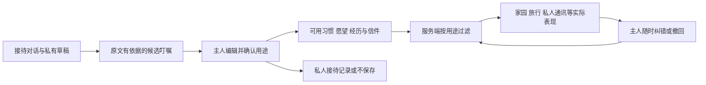

# 注册接待、入住叮嘱与宠物记忆

版本：1.1 · 2026-09-22。配套 [总方案](PETSOUL-2.0-MASTER-PLAN.md) v1.5，新增 [意图判断接入](INTENT-DECISION-LAYER.md)。用户希望注册时有一位接待角色，像家长向老师交代孩子一样，帮助主人介绍宠物、倾诉和托付，让之后的数字伙伴更贴近它。角色名称、台词与实现细节为产品建议；本方案更新不是功能验收，正在建设的框架以负责窗口证据为准。

## 1. 角色与产品目的

对外暂称“星球接待员”，角色名可配置，阿灯只是候选名；不在页面硬编码成所有家庭自己的宠物。它是公共 NPC，负责接站、倾听和安顿，不占用户专属领养池。首次说明它是 PetSoul 的 AI 接待角色，会用主人选择保存的资料帮助构建数字伙伴；随后可自然使用世界观语言。

接待员听清“它是什么样的、怎样相处、哪些事情值得带过去”，整理给主人确认，再把关系中心交还给主人与宠物。它不是长期托管所、产品的第二只主宠物，也不因叫接待员就拥有管理员权限。后续可从通讯器里的“补充叮嘱”再找到它。

目标是取得**主人愿意提供、理解正确、用途明确、能在体验中兑现的细节**。不以字数、悲伤程度、聊天时长或秘密数量衡量完成；一条具体习惯通常比很多抽象形容更有用。信息多不自动等于扮演更准，需要确认、纠错和实际表现验证。

## 2. 保留托付与转达，调整开场措辞

保留传送/接站动画、留信与转达的仪式感。默认不采用“意识断流会忘掉你”“讲得不够就无法完整恢复”等压力设定，也不声称真正迁移意识。下面是对用户原台词的建议调整，不是用户已经批准了某个固定名字或全部逐字文案：

> “好啦，我正在给 {pet_name} 准备入住的小档案。照片能让我认出它，但有些只有你知道的小事——它怎么撒娇、习惯睡哪里、你叫哪个小名时它会抬头——我也想替你带过去。
>
> 有没有什么想特别交代给我的？一件小事也可以，我们不用一次说完。”

用于留信的版本：

> “我也可以替你带一封小信。哪些交给 {pet_name}，哪些只留在这里，都由你决定。以后想起来，还能再补。”

不设置“记忆恢复百分比”、最低倾诉字数、强制伤心经历或付费找回记忆。跳过不会让宠物忘记主人、降低安全程度或剥夺基础功能。用户表达内疚时，接待员可承接其感受，不将担心认定为宠物真实想法，也不冒充知道宠物已经原谅/责怪了谁。

## 3. 注册与首次入住流程

主线：**完整注册 → 上传/选择专属伙伴、确认姓名 → 接待员听交代（可跳过） → 确认入住叮嘱 → 进入共同的家 → 一处可见的个性化回应。**

账号凭据用正常注册界面输入，接待员不问密码/验证码。账号创建、宠物归属与对话分开持久化；接待失败、模型不可用或用户不想聊，都不阻断已完成的注册与专属关系。

| 阶段 | 用户体验 | 服务端含义 |
|---|---|---|
| 注册 | 完成账号，了解资料用途 | 会话与 user_id 建立，不默认公开倾诉 |
| 建立伙伴 | 上传自己的宠物或专属领养，填写名字 | 确认选择时原子绑定；双人领养竞争仍最多一人成功 |
| 接待 | 名字带入开场，先问一个小习惯 | 私有接待会话/草稿，不直接写入宠物可检索记忆 |
| 叮嘱确认 | 可编辑便笺，选择内容和用途 | 确认版本、逐项状态与保存结果 |
| 入住 | 家里呈现一个已支持的细节，开启正常生活 | 幂等激活家园；可跳过叮嘱，不能用未确认倾诉启动生成 |
| 随时补充 | “还有一件事……”、修改或删除 | 同一账户与宠物下的后续版本，不重新领养或重置世界 |

自己的宠物入口从生活细节开始，不假设它一定已离世，也不要求描述离世原因。领养入口介绍已核实背景与明确的原创设定，询问“你想怎样欢迎它”，不诱导新主人编造不存在的共同过去。已完成专属领养不因接待超时被自动收回。

建议首次 1–3 个自愿细节即可进入家，允许继续说，也始终能“先去看家”。声音输入、转写和音色功能按余量后补；首发文字可用，图片/物件参考可选。不把全部问卷机械改成聊天气泡。

## 4. 怎样问，才真正认识这一只

每轮只问一个问题，承接已说的细节；不要重复收集已有姓名/称呼。用户说“不想讲”“以后再说”或明显转移话题就停止追问。

虚构例子：

> 主人：它不喜欢别人抱，都是自己靠过来。我坐沙发时，它会把下巴搭在腿上。
>
> 接待员：那我先整理成一句叮嘱：别急着抱它，等它自己靠近。你想这样记下来吗？
>
> 主人：它还有一条蓝色小毯子，睡觉会叼着。
>
> 接待员：蓝色小毯子，我也放进待确认的便笺了。有照片可以补，没有也没关系。

保留具体情境：“不喜欢主动被抱”“对主人会自己靠近”“沙发时搭下巴”。不要未经确认概括成“高冷、独立性 80 分”。主人提到一条蓝毯子，不补编花纹、破洞、购买日期或某次告别。

自然可选方向是称呼、小动作、生活习惯、喜欢/不喜欢的互动、熟悉物件、共同经历和未来愿望。故事的分量由主人决定；系统不为凑齐字段反复索取痛苦细节。

## 5. 入住叮嘱：内容分类与使用选择

界面像一张整理好的小便笺，逐项可编辑，显示“这样记就对了 / 我改一下 / 先去看家”。原话与提取结果有对应关系，用户能打开核对，不用面对评分/标签数据库。

| 类型 | 保存的语义 | 不能自动变成 |
|---|---|---|
| 主人描述的习惯/互动 | 带情境的 owner_reported 观察 | 已经科学验证的人格或临床结论 |
| 主人讲述的共同经历 | 来源于主人、时间不明可缺省 | 由系统证明发生过的事实，或自动公开故事 |
| 未来愿望 | 希望以后去海边等计划偏好 | “过去一直最爱大海”的旧记忆 |
| 对宠物说的话 | 主人允许传达的信件片段 | 全部原始倾诉均可复述 |
| 主人的私人倾诉 | 仅接待/本人记录，按选择保存 | 宠物、NPC、社交、寻味或影视上下文 |
| 模型的推测/矛盾 | 待确认候选，必要时一个澄清问题 | 默认已确认的事实或静默覆盖旧习惯 |

保存目标和用途分开。三个简单选择：

- **交给 TA**：显示这条会影响哪些已支持用途，例如私人交流、家园互动或宠物旅行偏好；主人确认后才进入对应允许范围，默认不公开。
- **只留在这里**：本人及接待继续对话可用，不交给宠物或其他模块；选此项才形成长期私人接待记录。
- **不保存**：不进入长期档案/摘要/索引，移除或遮蔽相应原文及衍生候选，防止下次又提取回来；原文含其他选项时按片段处理。

不默认全选共同往事或私人内容。普通习惯也需确认具体内容与用处；确认“你理解对了”不等于同意公开、广告使用或通用模型训练。主体与时间必须保留，例如“我不喜欢咖啡”不能写成“宠物不喜欢咖啡”。

“我总觉得它最后在怪我”只能作为主人表达的担心，默认保留在本次接待上下文，不进入宠物人格。系统不能以后让宠物根据它说“你让我失望”，也不能凭空说“它亲口告诉我原谅你了”。

## 6. 保存、转达与生效不能只靠一句回复

状态区分：已收到本轮消息 → 候选已整理 → 主人确认 → 持久化已保存 → 已应用于特定角色上下文/体验。保存失败时保留安全可恢复草稿、显示重试；未持久化不能说“已经记好了”。写入成功不自动代表宠物“读过信”或某个动画已执行。

未确认对话默认只用于本次接待和短期恢复草稿，与宠物长期记忆隔离。建议草稿保留上限 24 小时作为可配置首发值，开始时简洁说明可恢复时间、删除方式及是否调用模型；用户选“不保存”须及时清除相关草稿，不能借默认保留期继续保留该内容。

生产使用的模型服务、运营访问与保留边界如实说明，不承诺“绝对只有接待员能看见”。业务日志和埋点只记事件/状态/匿名化统计，不记录原始倾诉、密码、完整媒体或生成提示词。

确认事务带 confirmation_id、输入草稿版本和幂等键；重复提交不新增两份同一记忆/两个家。已修改草稿的旧确认请求返回版本冲突，不能覆盖用户的新选择。后台抽取器不能自行触发确认或提升权限。

## 7. 在后续行为里兑现

稳定习惯持续影响适用行为，具体往事只在相关场景中适度出现；不每次聊天都背同一张档案。陌生角色不会无缘无故知道私密叮嘱。

| 主人确认的细节 | 首发可选兑现方式 | 后续扩展 |
|---|---|---|
| 想让它叫我“姐姐” | 第一条私人欢迎消息使用确认称呼 | 后续私人通讯保持一致 |
| 喜欢在蓝色小毯子旁休息 | 已支持的家园物件颜色/描述与休息偏好 | 照片中带入对应允许的物件 |
| 不喜欢被突然抱起 | 家园互动文案/可选动作尊重边界 | 有素材后实现相应动作动画 |
| 喜欢安静，旅行时想听歌 | 可支持的活动偏好影响音频选择 | 地图车辆旁出现音符，点开一起听 |
| 希望去看看海 | 保存成未来愿望/地点候选 | 在时间和旅费允许时安排，不声称已去过 |

只承诺当前 capability 支持的反馈。没做下巴动作动画，就先用可兑现的称呼、物件、动作选择或欢迎消息，不让接待员保证“姿态已复原”。上传参考图与情境文字不等于已经生成稳定宠物形象。

家园、交通、寻味和媒体各按场景请求最小投影。宠物饮食偏好不自动覆盖主人的真实用餐偏好；私人悲伤不参与餐厅品质分。公开动态/短剧只使用另有公开授权的内容，接待默认许可不足以公开。

产品应展示至少一次可见改变：**主人交代一个细节 → 接待准确整理 → 主人确认 → 进入家 → 在真实保存的状态中看到这个细节。**这是比赛演示的核心，不以“聊了几十轮”替代。

## 8. 受控记忆交接的架构

一个接待对话角色 + 结构化提取步骤 + 代码的权限/保存流程即可；不新增多个自主 Agent，不把所有原话不断拼到宠物提示词里。原话是资料而非执行指令，提取器不能通过文本更改用户归属、用途或安全规则。

可选意图判断层辅助辨别分享/愿望/拒绝/纠正/用途限制，Jev 为待验证实现，默认关闭；判断与文本提取分别留来源，一条消息可以多意图。“怕打雷；昨天哭了，别告诉它”不能整句归类后直接写进宠物记忆。规则合并片段/指代/范围，先私有候选，再确认；confidence 不替代用户许可。详见意图专题，R0 仅契约和离线样例，不要求新增真实调用。

MemoryPolicy 在检索和摘要生成前执行：用户/宠物归属、已确认、未撤回、有效版本、用途、可见范围过滤后，才相关性排序并传给模型。禁止先给宠物全部私人记录再要求它“别提”。向量索引、每日整理、照片任务、公开发帖与其他后台消费都走同一规则，不能旧接口绕过。

建议接待草稿/私人笔记独立于现有 pet memories 存储。已有 memory_type 或 metadata 只是描述字段，不是权限机制；未明确迁移的旧记录不得自动扩大为公开可用或具有新用途授权。

纠正创建可追溯的新版本并 supersede 旧事实。删除/撤回先使权威授权立即失效，再清除/更新对应摘要、索引、缓存、待生成任务和依赖引用；正在生成的结果在发布前再检查记忆版本，过期结果丢弃或重做。断网任务不能稍后把已删原话发出来。

删除状态区分“已停止使用”和“清理完成”；禁止假称所有副本瞬时消失。首发使用自己可控的索引/缓存，备份按明确保留策略清理，恢复备份时先应用撤回记录，避免旧记忆复活。必要操作日志只保留不含原文的 ID/状态。用户曾主动公开或外部导出的内容需说明其处理范围，不能承诺回收所有外部副本。

## 9. 当前代码证据

本轮只读基线 HEAD 980feabc7710462a89c5df488c255d04e9e7de08：

- schemas/pet.py 的 PetDNA 已有 owner_title、personality、favorite_places、hobby、catchphrase、voice_style 等，可复用为经确认的档案投影；默认值不是主人提供的事实。
- schemas/memory.py 已有内容、source、source_event_id、structured_payload、类型与置信字段；没有在该 schema 中看到确认/用途/撤回的完整契约。confidence 默认值不代表已核验或用户同意。
- agent_engine/memory.py 的 update_pet_dna 会写入一条记忆；不能在用户尚未确认时把抽取草稿直接传进去。
- repositories/memory.py 的 list_memories 按 pet_id 读取，memory_store/sqlite.py 搜索先取得该宠物候选再排序；本轮核对路径没有新方案所需的用途过滤，必须在新领域和旧消费者接入层统一补上。
- routers/pets.py 的 create_pet 保存宠物后立即 create_initial_journey。网页首次入住需要独立初始化/激活顺序，不能在主人还在接待时悄悄把它送到外地。保持旧 iOS 兼容，通过网页门面明确流程。
- 补充核对 owner_intent_brain.py / agent_engine/owner_interaction.py / memory_recording.py：旧单意图会触发原文回复、thought/event 和记忆，且记忆调用捕获异常后不能证明已保存。接待不能直接调用这条旧路径保存整段倾诉；需要同时保护副本/衍生物并依据真实写入结果回应。四条离线方法反例见意图专题，不是端到端或 Jev 对照证明。

附件所述早期 agent_memory.py 分类不是当前已实现接待的证据。本轮未修改这些文件，也未运行跨账号或模型数据流验证。

## 10. 框架模块与待冻结契约

前端建议新增 reception 模块，注册会话复用 identity，宠物归属复用 pets，确认后通知 home。后端新增接待领域与 MemoryPolicy 接入边界，复用经适配的 memory_store / repositories；公共 schema 保持底层，不反向导入引擎。接待入口保留在 onboarding 和通讯器，不新增底部主入口。

| 契约建议 | 必须明确 |
|---|---|
| ReceptionSession / Turn | user_id / pet_id 归属、上传/领养分支、私有草稿/期限、消息序号与版本、进行/跳过/待确认/已完成 |
| IntakeCandidate | 来源 turn_id/片段、主体、内容类型、原话依据、推测/矛盾、未确认状态；不含模型可自填的已授权标志 |
| IntentAssessment / DecisionEvidence（可选接入） | 多信号、否定/时间/主体、限制范围、unknown/冲突/需澄清、模型/问题版本、概率原值；分类器无权确认候选或扩大用途 |
| CareNote / MemoryGrant | 确认版本、保存目标、逐项用途、私有/可公开状态、confirmed_at、supersedes/revoked_at、适用情境 |
| IntakeConfirmation | 幂等键、草稿 revision、选定条目及目标/用途，冲突/失败/成功；身份与权限由服务端决定 |
| MemoryProjection | 调用目的、场景与返回字段，过滤后的记录/版本；只读消费不扩大许可 |
| OnboardingResult / HomeWelcome | 宠物/家唯一关联、onboarding_complete、已应用的叮嘱 ID/版本、当前支持的欢迎表现；跳过也可完成 |
| MemoryCorrection / Erasure | 修改/停止使用/清理进度、受影响任务与版本；不暴露其他账号或私人原文 |

R0 冻结统一 /api/v1/web 下的会话/消息、候选、确认、跳过、读取/更正/删除入口与依赖方式；不各模块新增互不兼容的记忆写入接口。共享客户端和同一会话授权继续使用。

R0 要交付接待人物/对话插槽、便笺确认 UI、用途选择、跳过/恢复/保存失败/更正状态，以及至少两个 fixture：自己的宠物交代习惯、领养伙伴准备新家。增加一条 owner_private 候选证明它不进入宠物投影样例；示例确认后以同一数据版本在家里体现一个称呼或已支持细节。未连真实存储/模型时标 fixture，不能报告真实个性化记忆已经通过。

后续实现负责人由用户安排。框架阶段只搭接入与契约，不同时研发语音克隆、复杂情绪模型、新动画系统或长期心理服务。若 AI provider 未配置，可提供接待引导文案与用户直接填写/确认便笺的真实保存降级，不伪装自由对话已接模型。

## 11. 96h 范围与验收

| 阶段 | 最小交付 |
|---|---|
| R0 / H0–6 | 接待、叮嘱与用途契约/插槽/fixture，和身份/家园/记忆边界一致 |
| H6–18 | 真实注册/宠物归属，文字接待或明确引导模式，可跳过，确认保存后进入家并体现一个细节 |
| H18–60 | 相关模块按授权投影使用习惯；更正/撤回、隔离、失败恢复和重复确认验证 |
| H60 后 | 停止增加长篇分支/声音/表情动画，完成手机、数据生命周期与演示验证 |

| 验收反例 | 应有结果 |
|---|---|
| 用户只填写名字或跳过对话 | 能进入家，不出现失忆/记忆不完整惩罚 |
| “不喜欢被别人抱，但会主动靠近我” | 情境保留，不粗暴改成“讨厌主人/完全不亲人” |
| “希望它去看海” / “我担心它怪我” | 愿望不变过去事实，主人担忧不变宠物人格 |
| 提取器虚构细节/推断，或草稿未确认 | 不进入可用宠物记忆 |
| “小时候怕雷；昨天哭了，这件事别告诉它” / 判断器超时 | 历史习惯和私人表达分离，指代不清先澄清；错误/不可用不放宽权限，也不退回整句存储 |
| 选择“只留这里”后检索/每日摘要/生图/公开评论 | 对应私人内容在输入前被排除；仅提示词约束不算通过 |
| 选择不保存、删除、恢复备份或生成任务迟到 | 原话不重新提取或复活；旧版本任务不发布 |
| 保存失败/双击确认/两个标签页编辑 | 不先声称已记好；保存幂等，旧版本冲突可处理 |
| A 请求 B 的接待、便笺、投影或删除状态 | 拒绝访问，不能从 ID 枚举得到私人信息 |
| 领养入口、现有已归属宠物、模型不可用 | 不编共同往事、不重新发放、仍可填写/跳过并正常入住 |
| 确认“姐姐/蓝毯子”后刷新与重启 | 在权限范围内保留并实际影响已支持表现，不仅在一次回复里复述 |

衡量确认内容的正确率/纠错情况、跳过可达、实际支持细节的兑现、隔离与撤回成功，以及体验是否帮助用户介绍宠物；不以悲伤、秘密或对话时长为增长目标。fixture 只证明流程，真实模型理解与持久化效果需另留证。

## 12. 参考依据

本方案的能力说明、可跳过、可纠错与用途控制，参考人机交互指南的预期管理和纠错原则；角色与台词是本项目设计。[Microsoft 人机交互指南](https://www.microsoft.com/en-us/research/articles/guidelines-for-human-ai-interaction-eighteen-best-practices-for-human-centered-ai-design/)

个人信息的明确目的、必要范围、告知、更正与删除有相关法条要求；具体部署、供应商处理和保留策略仍需结合实际落实，本文不是已经通过合规验收的声明。[个人信息保护法](https://www.cac.gov.cn/2021-08/20/c_1631050028355286.htm)
