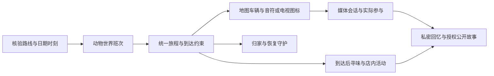

# PetSoul 地图交通与一起听看

版本：1.2 · 2026-09-22，采用地图车辆音符/电视入口并衔接接待记忆用途。配套 [总方案 v1.5](PETSOUL-2.0-MASTER-PLAN.md) 与 [寻味引擎](FOOD-DISCOVERY-ENGINE.md)。本文整合用户最新要求及附件；产品/架构方案已形成，业务代码、真实交通接入和同步播放尚未按本方案完成验收。统一契约待 R0 冻结，不给其他窗口分配任务。

## 1. 产品原则

**现实提供路线与时间，动物世界拥有自己的承运人、班次和途中生活。**

宠物是动物世界中的居民和乘客，可以自己登机、坐火车、乘船、开车；不套用现实宠物托运流程。旅途中，汽车、飞机、火车、轮船正常在地图上沿路线移动。正在听歌时，交通工具旁出现音符；正在看剧时出现小电视。主人点击图标就打开一起听/看的播放 UI，关闭后继续看地图。

用户已明确采用这一交互，撤销独立舱室/乘坐场景页面的建议。地图本身承载旅程，音乐和视频是交通工具上的活动入口；不用另一套空间概念包装这些动作，不增加底部主入口。

用户已经明确：飞机、火车、轮船、开车等要有真实交通时长；宠物世界的承运名称与班次号不能直接使用现实身份。CA344 → 喵航 Cat222 仅为用户的命名示例，不是我们查到的真实班次。

首版默认采用指定日期核验后的计划时刻，同步实际运行动态列为后续能力。两者在界面和数据里区分。驾车没有固定班次，以真实道路、出发时段的预计耗时为依据，标“预计车程”。按这些时长用现实经过时间推进，不能刷新重开、付费加速或为了攻略压短。

## 2. 当前代码：可以复用什么，必须补什么

本轮只读核对本机 HEAD 980feabc7710462a89c5df488c255d04e9e7de08；未查询最新远端、未运行真实班次或媒体服务。下表为源码证据，不能当作线上完成记录。

| 范围 | 现有基础 | 差距与处理 |
|---|---|---|
| schemas/base.py、schemas/pet.py | 多交通 mode、ScheduledTransportLeg、计划/可选实际时刻、承运人、班次、状态、进度与来源字段 | 复用并经 Web adapter 扩展；需要分离现实参考与动物世界身份 |
| transport_schedule/openai_provider.py | 模型生成交通候选，名称含 WebSearch | 实际走 /chat/completions，提示词写明无实时网络；不能作为已核验同日班次来源 |
| transport_reality/mock.py | 根据时刻算候乘/登乘/在途/抵达；可接候选班次 | 存在固定模板与回退；候选 carrier/service_number 直接进展示字段，需动物世界映射 |
| 同文件 _candidate_endpoint | 生成中转节点 | 坐标在起终点间按比例插值，不是核验的机场/车站/码头；真实模式须改为真实节点，否则只能示意 |
| route_planner/remote.py | 用路线服务补距离、duration_seconds、polyline 的路径 | 接入代码不等于已验证路线、配置与最终世界时间线一致 |
| world_simulation/timeline.py | 生成停留与移动时间线 | move_end 取下一站开始与按时长计算结果的较早值，可能压短交通；必须由交通约束重排后续活动 |
| Web 影音同行 | 当前核对的 schema、路由及 iOS 主服务未找到完整作品/锚点/会话契约 | 按待建能力处理，不以一句“正在听歌”或现有图片任务冒充播放器 |

旧网页代码或附件中提到的历史 transport_service.py 不是本轮已核实的现行实现，不能直接搬回静态“几分钟后出发”或随机现实风格班次来满足真实交通。

## 3. 两层身份：现实参考与动物世界班次

| 对象 | 保存内容 | 呈现用途 |
|---|---|---|
| TransportReference | provider、运营实例标识、运行日、实际运营方/共享代码、真实起终节点、计划/预计/实际时刻及其语义、来源/抓取与核验时间、允许使用范围 | 服务器核验、解释来源与维护更新 |
| WorldService | world_service_id、虚构公司、展示编号、关联 reference_id、映射版本、交通工具外观和虚拟票面信息 | 票面、地图、通讯、照片、活动、收藏统一使用 |
| PetJourneyLeg | 当前宠物参与哪段、段序、时间表版本、状态、座位/活动引用 | 私人旅程、上下车与世界状态，不等于现实订座 |

喵航 Cat222、爪爪铁路 Paw318、海獭轮渡 Otter08 均是拟议原创命名，不表示现实公司授权或实际服务。喵航可以接待所有动物，名字不决定乘客物种。自驾不伪造公共班次，可显示车辆昵称与本次路程。

映射写入持久化注册表并有唯一约束，不能每次刷新随机取号或简单把 CA 替换成 Cat。先把共享代码归并到同一运营实例；多段航班分段，内部唯一键包含提供方实例/运行日/起终节点或段序，不能只用“222”。同一参考实例的不同宠物共用同一 WorldService，私人座位、活动和媒体会话独立。跨日与更新后显示编号保持稳定，变更另存版本。

对用户主界面展示动物世界公司/编号；来源说明按数据许可保留必要署名，不把现实公司写成它的承运方，不复制现实 logo、票面或伪装真实机票。虚拟座位和纪念票不调用订票、支付或库存接口。

## 4. 时间依据与更新时间

### 4.1 四种明确的模式

| time_basis 建议值 | 时间依据 | 用户应看到 |
|---|---|---|
| verified_timetable | 已核对运行日的计划出发/到达时间，保存选用版本 | 按现实班次时刻推进；来源更新时间 |
| live_status | 已接入运行状态，区分计划、预计、实际字段 | 实时动态及更新时间；失去更新时明确数据陈旧 |
| routed_estimate | 实际道路/交通方案的预计耗时，记录出发时段及交通模型 | 预计车程/步行时间，不保证秒级实际抵达 |
| demo_fixture | 明确的测试或讲解资料 | 演示行程；不得混入真实班次 |

另存资料状态 verified / stale / unavailable；不要把“已过期但有旧快照”自动降成 fresh，也不能把有 source_url 或模型 confidence=high 当作已核验。

首发 verified_timetable 在确认行程时保存版本，出发前按来源有效期与运行日复核。明确发现停运或该日不开行时重新安排；尚不能核实则暂停确认、提供已核实替代或明确的估算选项，不自动编班次。已经出发的时刻表旅程按选定版本继续，展示资料更新时间；不宣称跟随现实延误。

live_status 后续接入时单独处理延误/取消/改道与重排。不能丢掉延误还声称完全实时，也不能无提示从实时模式切到时刻表模式。现实事故不生成宠物伤亡；需要切换为安全的世界内等待/改行程时明确已脱离实时镜像，保留事实资料与创作状态的区别。

### 4.2 时长、时区和事件语义

- 保存完整日期、源时区/偏移与 UTC 时间；计算用 UTC，展示分别使用出发地、目的地当地时间。夏令时重叠/不存在时刻需要源偏移或规则消歧，不能猜。
- 时刻表主交通时长为到达 UTC 减出发 UTC。过期班次不能简单把日期挪到明天；需重新核对运行日。
- 飞机离登机口、离地、落地、抵达登机口分别命名，只有取得相应字段才宣称该事件。仅有计划时刻时使用“按时刻表进入旅途/预计抵达”。
- 火车的运行日与用户上车所在自然日可能不同，保留服务日期和具体停站序。GTFS 的超过 24:00 时间按服务日规则解析；不能用普通 HH:MM 或一律加一天补正。
- 性格、亲密度、金币、打开网页与媒体播放都不能改变交通时长。当前进度由服务器时间和已确认时间线计算，浏览器只做平滑呈现。

虚构的计算示例：同一时区 14:20 出发、16:55 到达，时长 2 小时 35 分；15:35 打开还剩 1 小时 20 分。不是从打开页面起重新等待 2 小时 35 分。

### 4.3 门到门而非只算主交通

家/前一站 → 接驳 → 核验/候乘/登乘 → 主交通段 → 出站/下船 → 后续接驳 → 店铺/住处。步行、休息、换乘、不同机场/车站间转移均占时间；不可行就换下一班，不能瞬移。

主交通的已核验时刻是约束；预计接驳加必要缓冲后决定是否赶得上。缓冲是产品规划值，须标为估算，不冒充运营方实际排队或最短换乘保证。下一站至少晚于本段可行抵达，冲突时顺延/替换停留、重查店铺营业，不截短交通。行程修订保存旧版与原因，已发生事件不回写。

## 5. 各种交通的共同底座与独特体验

| 方式 | 数据接入边界 | 途中活动 |
|---|---|---|
| 飞机 | 合法可用的运营方/时刻数据，具体日期、机场和段；共享代码去重 | 听歌、看短片、看云、休息、机舱餐食、明信片 |
| 火车 | 具体车站/停站顺序/服务日时刻；运营方资料或可用 GTFS | 看窗外、一起听看、餐车、同车居民故事 |
| 轮船/轮渡 | 具体客运码头、航线、运行日、时刻；不要把货船/海运时间当客运 | 甲板看海、船舱影音、休息 |
| 自驾 | 路线服务的道路、预计耗时，分段加入停车休息 | 驾驶时音乐/音频，停车后看剧、拍照和文字交流 |
| 打车/公交/地铁/步行 | 对应交通模式、停站与接驳，可用性按地区核实 | 乘客可短时影音，步行以音频/风景为主 |

“驾驶者/乘客”是独立字段。宠物驾驶时禁用视频、打字和自拍活动；听音频不影响到达。乘客与停车休息状态可看视频。动物安全是世界规则，活动限制由正常生活逻辑表达，不引入受伤威胁。

地图的 position_basis 分为模拟线路位置、线路示意、实际车辆定位。首版默认模拟位置；有道路/铁路/客运航路几何才沿线呈现，只有节点时显示示意，不冒充精确轨迹。长途空中弧线可以是地理示意，不能声称真实飞行轨迹。没有铁路/海路不能悄悄换公路仍标火车/轮船。坐标体系跟随 Map adapter 显式转换。

## 6. 地图车辆 + 活动图标 + 播放面板

家里的“看看 TA”与通讯器旅途卡打开同一个旅途地图，并定位当前交通工具。移动标记依 mode 切换汽车、飞机、火车或轮船，可附宠物头像帮助辨认。点击车辆本体看简洁行程卡：喵航 Cat222、起终点、当地时刻、剩余时间与数据依据；不跳进舱室。

活动入口锚定在该交通工具上方或一侧，跟随地图标记移动，不飘在与车辆无关的位置：

| 地图上的状态 | 图标 | 点击结果 |
|---|---|---|
| 宠物正在听歌/音频 | 音符 | 音乐底部面板：封面、歌名/作者、宠物头像、进度、“跟着 TA 听”与独立回听 |
| 宠物正在看剧/短片 | 小电视 | 视频底部面板：片名/集数、当前进度、可播放内容、“一起看”与独立观看 |
| 没有影音活动 | 不显示音符/电视 | 仍可点车辆查看旅程，不制造一个永远亮着的假活动入口 |
| 活动暂停/准备到站 | 相应图标体现暂停或收起 | 面板明确保存/中断状态；不继续显示正在播放 |

只展示当前活动的主要图标，避免同时挤满音符、电视和无关动作。切歌、从音频转视频、睡觉或到站后按同一个 activity 更新，不能由前端随机装饰。主人设备缓冲与宠物当前活动分开：宠物可仍在听，但面板要显示“你正在缓冲/尚未加入”，不能假称双方已同步。

手机上默认从底部展开播放器，保留上方地图与移动交通工具。收起面板可继续已有音频，用紧凑播放条提供暂停/退出；关闭或收起不能无说明地切断/重启会话。视频可由用户主动全屏，返回仍回到原地图位置。地图移动与播放界面共用状态，不因为弹出面板停住车辆。

图标视觉可以小巧，实际触控区域建议至少 44×44 CSS px，提供可读名称、键盘焦点、减少动效状态，并处理地图缩放/平移后的锚定与边缘遮挡。点击图标只打开对应面板，不同时触发底图点击或车辆详情。网络失败、作品不可用、仅外链等能力在面板内清楚说明。

正在途中的真实时长和剩余时间保留；必要时简洁注明“按时刻表”“预计”“线路示意”。留言继续复用通讯器，旅途照片由现有影像系统产生。餐食只使用有依据的现实资料或明确虚构菜单，不为音符/电视 UI 增加一套车厢经营界面。

途中活动保存 activity_id、种类、起止/中断点、阶段、作品引用、来源事件和版本。活动按剩余时间与性格编排，不在每次刷新随机换歌或改成已吃完；睡觉、发呆、看窗外也是有效生活，不需要不停调用模型。

[接待中确认的习惯](RECEPTION-ONBOARDING-MEMORY.md) 可在相应用途允许时影响活动选择，例如更喜欢安静听歌；只接收已过滤的偏好投影，不读取原始倾诉。习惯影响它怎样度过路程，不改变真实交通时长。用户撤回后待生成活动/照片须重验相关记忆版本。

通讯能力至少区分 message_delivery、reply_availability、media_join。宠物登乘时可以收到留言、稍后回复；稳定乘坐时可加入影音。虚构同行频道不受现实机载 Wi-Fi 设定限制，但真实网络失败必须可见并可重试，不能伪装成宠物忙碌。

## 7. 一起听 / 一起看的三种动作

| 动作 | 主人的播放 | 宠物/共同会话 | 展示 |
|---|---|---|---|
| 跟着 TA 听/看 | 加载同版本作品，对齐当前锚点 | 继续同一会话 | 实际播放并对齐后才标同行中 |
| 自己从头听/看 | 本地独立播放 | 不改变宠物进度 | 独立回听/观看，不标同步 |
| 邀请重新一起听/看 | 经服务器接受后共同回到指定位置 | 新会话版本，服从当前交通阶段 | 重新开始；不能用客户端直接改世界 |

提供清楚的“暂时离开”和“和 TA 一起暂停”。本机静音、缓冲或暂离默认只改变主人参与状态；共同暂停/拖动/切歌经服务端检查控制权与交通阶段后改变媒体会话。用户可以留一份路上歌单，宠物依性格选择，并保留实际选择记录。

**音乐暂停，飞机照常飞；视频未看完，也要按时下车。**临近到站时由世界事件中断活动、保存播放进度，提示“这段晚上接着看”。抵达事件不等待播放器回调。回家或到住处可恢复该作品进度，不回滚旧旅程。

普通听歌会话在主人离开后可继续按宠物活动计划推进；约好一起追的短剧默认保存共同进度，宠物可转为休息等活动。这是待实现的产品策略，写入 resume_policy，不能由不同页面各自猜测。

## 8. 同步技术：三份状态，两条独立时间线

分别保存：宠物活动、媒体会话、主人客户端参与情况。服务器不需要替虚拟宠物持续拉取音视频流；它保存合法作品引用及虚拟播放锚点，主人设备进行真实播放。

媒体锚点建议：

```text
media_id + edition/version + duration_ms
state: playing / paused / ended / interrupted
anchor_position_ms + anchor_server_time + playback_rate
session_id + activity_id + session_revision + resume_policy

playing: position = clamp(anchor_position + elapsed_server_ms × rate, 0, duration)
paused/interrupted: position = anchor_position
```

队列切换/播放结束作为可恢复事件处理。长时间离线后按已持久化队列与活动窗口求得当前作品/位置；不能每次查询重新从第一首开始。交通世界时间独立，不使用媒体 duration 驱动抵达。

客户端点击加入后获取服务器时间与会话版本，加载可播放的同一媒体版本，seek 到当前进度；以实际播放事件确认加入。播放被拦截、授权失效、缓冲、版本不同或无法 seek 时保持对应状态，不先显示“已同步”。

首发可以采用命令 HTTP + 统一状态订阅/有界轮询，不强制引入 WebRTC 或新媒体微服务。事件带序号/版本，重连拉完整快照，拒绝旧版本控制命令；不同模块不能各造一个心跳和旅程状态源。同步纠偏按实测延迟配置，建议前台目标音频偏差约 1 秒、视频约 2 秒，属于待测试目标而非已达成承诺。

同一主人多标签页/设备只能有一个有效控制租约；其他设备跟随或显式接管。控制动作校验所属用户、宠物、会话、版本与幂等键，防止晚到的暂停覆盖已到站的新会话。陌生人即使看见公开旅途摘要，也不能控制宠物或读取私人歌单。首发是主人与专属宠物同行，不默认开放陌生人公共放映室。

主人参与记录来源于实际播放器状态和有界心跳：playing 且处于允许的同步偏差内才累计；缓冲、失败、独立回听、离开与心跳过期停止累计，多设备时段去重。丢失心跳不能把整段离线时间补算为陪伴；这只能证明客户端报告的参与，不能证明人一直听见或观看。

“你陪我听了两首歌”等回忆基于实际覆盖与事件规则生成，不用打开页面次数或计划播放时长冒充共同经历。共同听看不会自动发公开动态，沿用主人的可见性设置。

## 9. 内容来源与浏览器行为

96h 首发使用权利清楚的音乐与自有/获准短片；逐项记录作品版本、素材组成、允许的游戏内点播/视听搭配/互动同步、地域和期限。测试素材与公开可用素材分开。没有适用内容时可先做 R0 测试素材与失败路径，不能将测试文件标为已获公开授权。

热门歌曲或剧集按平台能力分别接入。SDK 存在不等于允许本产品用途；外部正版链接只展示“前往收听/观看”，无法读取对方位置或控制时不能标为同步。广告、会员、地域、版本差异都需要 capability，不能靠标题相同认定同步。模型只在允许使用的内容依据范围内谈情节，不能凭作品名编造具体分钟剧情。

浏览器的有声播放可能要求用户手势；用明确点击加入并处理 play() 失败。切后台、锁屏与弱网后重新取得快照并对齐，不能以 setInterval 的累计秒数为唯一依据。不预先承诺所有手机锁屏持续同步；需要 iOS Safari 和 Android Chrome 实测。播放器考虑 playsinline、可见控制、字幕/静音和减少动效；应用提供 Range/seek 所需的媒体服务能力，私有资源继续有访问控制。

## 10. 与家园、寻味、社交和收藏接成一个世界



- 家园读取同一旅程状态；宠物外出就不能同时在家守菜，抵达目的城市也不等于已经回家。
- 寻味请求使用门到门可行到达时间、剩余停留时段与行程版本，匹配当时营业/预算。延误或改行程使旧推荐过期，重新核对；不能为了赶上推荐餐厅而缩短车程。
- 乘车途中可以收藏落地后候选，不提前创建“已在店内”的 visit。机舱/餐车的虚拟餐食不成为真实商家口碑。
- 主人的现实用餐计划仍用主人自己的日期/位置/时间，不擅自套宠物行程；“复刻 TA 路线”也需重新核对实际出行日与营业信息。
- 通讯、地图、公开动态、票面、照片使用同一 leg / WorldService / 活动事件；到站奖励、物资、帖子幂等结算。到站≠归家，途中合照≠真实旅客照片。
- 虚构同车居民可参与故事；只有真正记录了世界内共同在场的角色才声称相遇，不伪造其他真实账号同行。

## 11. Claude R0 必须预留的结构与契约

建议前端独立 transport 与 companion_media 模块，复用 journey 的世界快照、communicator 和共享 API；transport 负责车辆地图标记/班次详情，companion_media 提供锚定音符/电视的活动入口、播放面板、作品与会话。后端复用 transport_schedule / transport_reality / route_planner / world_simulation，新建同行媒体领域边界；接口/仓储依照 AGENTS 分层，不重写整个后端。

| 契约 | 需要冻结的内容 |
|---|---|
| TransportReference / WorldService | 实例/运行日/真实节点、原始身份与虚构身份分离、唯一映射、源时区/UTC、语义/来源/版本/有效期 |
| JourneyLeg / Transfer | 段序、mode、驾驶者/乘客、接驳/候乘/换乘、time_basis、资料状态、计划/预计/实际时间、重排原因、位置依据 |
| TravelActivity | activity_id、leg_id、活动窗口、类型、媒体引用、可打断点、通讯/同行能力 |
| MapActivityEntry | 同一 leg 的车辆坐标/锚点、活动种类/状态、media_session_id、可见性与 action capability；图标与实际活动一致 |
| MediaAsset | 音频/视频、作品/版本、时长、来源/许可范围、in_app_sync / external_link / unavailable 与地区/期限能力 |
| CompanionSession / Command | 用户/宠物/活动归属、锚点、版本、控制租约、播放状态、暂停/恢复策略、幂等与冲突 |
| Participation / SharedMemory | 实际播放心跳、同步/独立/缓冲状态、去重参与区间、来源事件与可见性 |
| FoodDiscoveryContext | 宠物门到门可行到达时间、行程版本、可停留时段；主人现实计划独立，时刻变化使旧候选需复核 |

沿用 /api/v1/web 统一前缀，由 R0 冻结交通读取/确认、活动读取、媒体作品、会话加入/控制/退出/心跳的具体路径和权限。读取快照不隐式发起付费查询、产生新班次或重置会话；查询真实数据是受控任务。schema 默认值不得把估算标作核实或把实际时间默认为计划时间。

建议 capabilities 按 mode + 地区/线路 + 运行日区间 + 数据依据、媒体作品与动作分别声明；有 ferry 枚举不等于支持全球轮渡，有 external_link 不等于 in_app_sync。

R0 要交付：旅途地图上的 VehicleMarker / ActivityBadge / MediaSheet 固定组件接口、Transport/CompanionMedia 服务边界、上述契约、飞/铁/船/驾四类显式 fixture。车辆沿路线更新位置；音符/电视由活动状态控制，点击打开对应音频/视频面板。包含驾驶禁视频、可加载测试素材、暂停/失败/恢复/无活动样例，以及与寻味的时间输入连接。测试素材能播放只证明适配；真实同步、内容授权和真实班次留给后续模块实施验收。无需此阶段抓全球时刻或购买内容，不建立独立交通场景页。

如果接口已冻结，框架窗口先登记 SCOPE_CHANGE 和契约版本变更，通知用户涉及哪些消费者；不能覆盖其他窗口已领取实现。模块负责人继续由用户安排。

## 12. 96 小时范围、演示与降级

| 阶段 | 交付 |
|---|---|
| H0–6 / R0 | 含寻味与交通/影音的统一框架、契约、独立模块/播放器接入和明确 fixture |
| H6–36，按用户安排并行 | 一条有核验时刻的长途乘坐路线及接驳、稳定动物班次、可恢复时间线；一个可播放音频和一个短片的授权清单/会话实现 |
| H36–60 | 地图移动交通工具→点音符/电视→加入/退出/暂停/恢复→按时抵达，衔接寻味、到店、通讯和回忆 |
| H60 后 | 冻结新增方式/内容，检查移动端播放、断网/重启/并发与真实线路证据，再按授权完成香港部署 |

飞机、火车、轮船、驾车在框架中统一建模，真实支持清单按实际线路接通情况公布。首发核心目标为至少一条真实时刻的长途乘坐路线、真实道路接驳、地图移动标记与两类活动图标、一首可用音乐及一段可用视频的完整一起听看体验；其他方式接口/fixture 存在不算已真实支持。

现场不要求新注册用户等两小时才能理解产品：正式世界照常走真实时间；展示账号可提前按真实时间出发，现场直接加入已在途宠物。观众不能共同领养或控制展示宠物，可看允许公开的演示；自己的账号仍有自己的专属宠物。演示账号用于受控展示，不能公开泄露凭据。

原“五分钟注册→出发→归家”只可用于经过实际时长核验、确实能完成的短路线；较长旅程用已在途账号和明确回放展示完整过程，不能压缩正式时间或把未来抵达回放当作已发生。

范围不足时先去掉多家虚构公司、复杂车辆动效、热门影音平台、实时航班动态、第二条长途路线。保留时间真实性、稳定身份、地图上的活动入口与可播放体验；缺数据/权利则明确未完成或用标识清楚的演示，不用随机班次、盗链或假“已同步”补齐。

## 13. 关键验收反例

| 反例 | 应有结果 |
|---|---|
| 同一运行实例刷新/换设备/服务器重启、代码共享或同号不同日期 | 稳定动物身份；正确归并/区分实例，活动与旅程不重开 |
| 跨时区、跨日、GTFS 25:xx、夏令时切换 | 可复核的 UTC 时长与当地展示，缺消歧资料不猜 |
| 到达晚于下一站/错过换乘 | 重排后续路线和寻味，交通时长不被截短 |
| 模型给出班次+URL+高置信、节点仅插值、过期运行日 | 不能进入已核实班次；示意/未知/来源级别正确 |
| 暂停视频、主人退出、客户端时钟篡改、整段离线 | 交通按服务器时间继续，到达事件和奖励只执行一次 |
| 播放中缓冲/无手势被阻止/外部平台无位置 | 不显示已同步、不累计虚构陪伴；恢复后重新对齐 |
| 同用户双设备同时暂停/切歌、旧命令重发、其他账号控制 | 版本/控制租约/幂等处理，权限隔离，无重复或倒退 |
| 到站发生时剧未播完 | 保存进度、中断活动、到站；不能留在车上等视频结束 |
| 驾驶状态请求看剧/自拍 | 服务端拒绝活动变更，保持音频或停车后再用 |
| 地图缩放/拖动、活动切换/结束、点击徽标、收起播放器 | 图标跟随正确车辆，音符/电视与活动一致，结束后更新；点击只开对应面板，地图交通继续推进 |
| 旅程延误后沿用旧餐厅建议、主人另一天复刻 | 重核实际到达/营业与主人计划，不能给无法赶上的首选 |
| 只开页面或离线一小时后回来 | 不生成“陪了一小时”；参与区间有实际播放与有界心跳依据 |

记录 fixture、真实数据、播放器前台、真机弱网/后台与生产部署五类证据。时间测试可以使用可控时钟，运行中的正式产品不能开放客户端加速；测试通过不代表供应商来源已核实、媒体可公开使用或所有手机锁屏可播。

## 14. 官方资料与本方案判断的边界

- 航空实例、运营方/共享代码以及 gate/runway 的计划、预计、实际时间分别定义；本文据此设计字段，不承诺已接入该供应商。[FlightStats 状态定义](https://developer.flightstats.com/api-docs/flightstatus/v2/flightstatusresponse)
- GTFS 描述服务日、停站时刻与跨午夜时间，是格式标准；每个数据集的覆盖、许可和更新须单独核实。[GTFS Reference](https://gtfs.org/documentation/schedule/reference/)
- 道路时长取决于路由设置、出发时段和可用交通信息，应标预计值。[高德路线规划 2.0](https://lbs.amap.com/api/webservice/guide/api/newroute)、[Google Routes 交通设置](https://developers.google.com/maps/documentation/routes/config_trade_offs)
- 网页有声自动播放与后台计时存在限制，需要真实播放和恢复处理。[MDN Autoplay](https://developer.mozilla.org/en-US/docs/Web/Media/Guides/Autoplay)、[MDN Page Visibility](https://developer.mozilla.org/en-US/docs/Web/API/Page_Visibility_API)
- 第三方内容平台按产品用途和当前开发者条款核对，不预设 SDK 已授权游戏内同步使用。[Spotify 开发者政策入口](https://developer.spotify.com/policy)

以上官方资料是技术/接入边界依据。地图车辆上的音符/电视交互来自用户明确指令；班次映射、首发时刻表模式、媒体控制和开发优先级为具体设计，不是供应商承诺或已实现成果。
